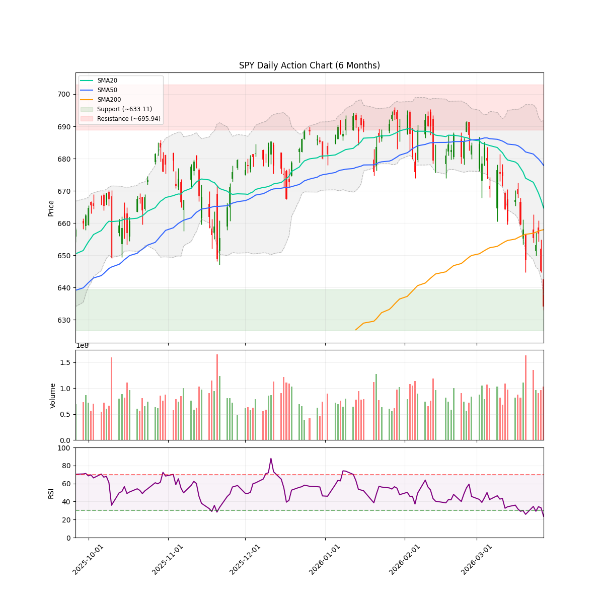
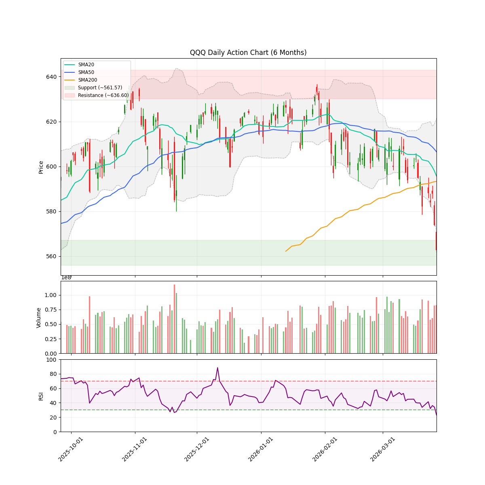
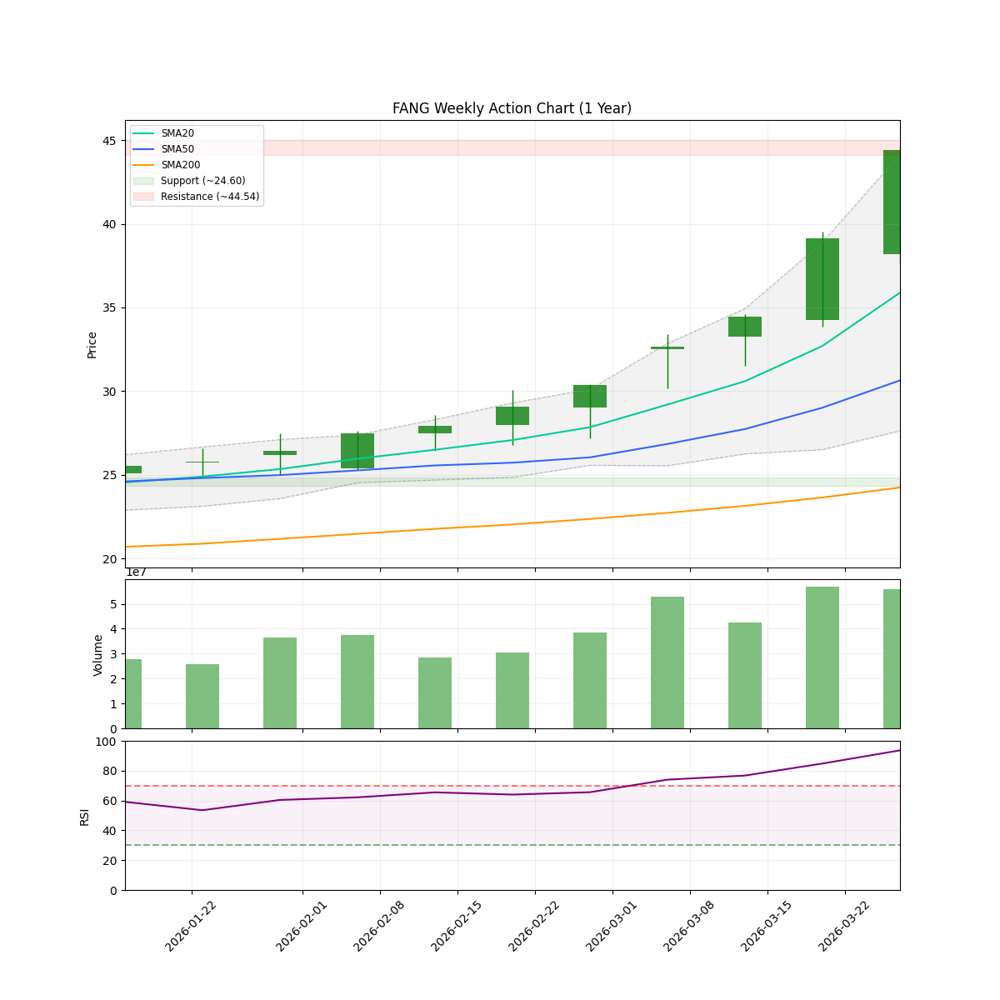

# 🌊 AlphaJAX 市场观澜报告
**日期:** 2026-03-28 | **期数:** 2026-W13 | **引擎:** AlphaJAX 2.0 (限界动量)

## 📑 目录
[TOC]

---

## 🌐 全球重大宏观与地缘事件 (Global Macro Events)

你好！我是你的华尔街老友。今天是 **2026 年 3 月 28 日，周六**。

本周的全球市场简直像是一部好莱坞灾难大片，还是那种带反转的。如果你这几天没盯着屏幕，那你可能错过了标普 500 指数近两年来最惊心动魄的“技术性骨折”。

废话不多说，直接上本周（及下周初）最让华尔街交易员们睡不着觉的 4 件顶级宏观大事：

### 1. 中东“火药桶”爆燃：霍尔木兹海峡关停与油价狂飙
- **事件摘要**：
  本周，美伊冲突正式进入“白热化”阶段。继 2 月底战火重燃后，本周最重磅的炸弹是——**霍尔木兹海峡彻底停摆**。特朗普总统在刚刚过去的周末发出了“48小时最后通牒”，威胁要“抹平”伊朗的电力设施。作为回应，德黑兰方面不仅封锁了海峡，还精准打击了卡塔尔和沙特的能源基建。
  **布伦特原油价格本周一度冲上 119 美元/桶**。这哪里是油价，这简直是坐上了没有刹车的火箭！
- **Market Impact (美股影响)**：
  **“通胀小强”变异成了“哥斯拉”。** 能源成本的飙升让市场原本期待的“降息梦”彻底破碎。能源板块（XLE）成了唯一的避风港，而航空、物流和消费类股票被按在地上摩擦。华尔街现在最担心的是：如果海峡关停超过三个季度，油价可能直奔 132 美元，到那时，美国 GDP 恐怕要面临“硬着陆”的风险。

### 2. 美联储的“冷酷到底”：3.5% 利率下的鹰派坚守
- **事件摘要**：
  在 3 月 18 日的议息会议后，本周多位美联储大佬（Cook、Jefferson、Barr）密集发声。尽管外面战火纷飞，油价烫手，但鲍威尔这位“踩刹车的老司机”依然稳如泰山。
  最新的“点阵图”显示，**美联储将基准利率维持在 3.50%-3.75% 不动**，且暗示 2026 年全年可能只有**一次**象征性的降息。鲍威尔在讲话中直言不讳：由于 PCE 通胀预期被上调至 2.7%，在看到通胀这只“打不死的小强”彻底断气前，美联储绝不松脚。
- **Market Impact (美股影响)**：
  **市场正在经历一场“戒断反应”。** 那些习惯了廉价资金的科技成长股（尤其是非盈利 AI 初创公司）本周遭遇了血洗。10 年期美债收益率从 3.9% 狂飙至 4.39%，这就像是给股市这台跑车灌了假油，动力严重不足。

### 3. 标普 500 “技术性骨折”：跌破 200 日均线
- **事件摘要**：
  本周五，美股发生了一个让所有技术派分析师倒吸一口凉气的时间：**标普 500 指数自 2024 年以来首次收于 200 日均线（约 6606 点）下方**。
  这不仅仅是一个数字的跌破，这在华尔街眼中就像是“舞会的皇后在众目睽睽之下摔断了高跟鞋”。过去 200 多个交易日的上涨信仰，在本周连续第四周的下跌中开始崩塌。
- **Market Impact (美股影响)**：
  **防御模式全开。** 资金正在疯狂从纳斯达克撤离，涌入黄金（尽管金价本周因利率预期走高而有所回调，但避险买盘依然强劲）和高股息的“现金奶牛”股。下周如果不能迅速收复失地，程序化交易的卖单可能会像雪崩一样压过来。

### 4. AI 监管风暴与硅谷“寒气”：政府 vs. Anthropic
- **事件摘要**：
  本周，华盛顿与硅谷的矛盾公开化。美国政府与 AI 巨头 Anthropic 之间就“AI 军事化使用”爆发了激烈冲突。与此同时，由于 AI 技术的快速普及导致生产力过剩，硅谷本周再次传出大规模裁员的消息。
  这就像是原本大家都在抢着上车的“AI 特快列车”，突然被监管部门拉了手刹，车上的乘客还被赶下来了一半。
- **Market Impact (美股影响)**：
  **AI 溢价正在缩水。** 投资者开始从“盲目崇拜 AI”转向“审视 AI 变现能力”。英伟达虽然依旧坚挺，但二线 AI 概念股已经跌得亲妈都不认识了。下周市场将密切关注 Micron（美光）的资本支出计划，看看这场“算力竞赛”是否真的因为地缘政治和监管而降温。

---

**老友寄语**：
下周（3 月 30 日 - 4 月 3 日）是关键的一周。周二的 PMI 数据将告诉我们，在高油价和高利率的双重夹击下，美国制造业是否还有“心跳”。

现在的市场就像是一个在暴风雨中走钢丝的杂技演员，左手是中东的硝烟，右手是美联储的冷脸。**建议：系好安全带，多看少动，手里留点现金，毕竟在黑天鹅乱飞的年代，活下去才是硬道理！**

---

<!-- DISCORD_SUMMARY_START -->
## 📖 本周市场叙事 (Market Story)

> 各位老战友，我是你们的CIO。今天这盘面，像极了刚跑完五千米还被门槛绊了一跤的壮汉，不仅喘得厉害，连“护体真气”都散了大半。
> 
> **大势研判：带头大哥“破位”，多头且战且退**
> 现在的标普500（SPY）和纳指（QQQ）这两位带头大哥，日子过得那是相当憋屈。你看，SPY跌到了634，QQQ杀到了562，两兄弟双双跌穿了20日、50日甚至200日均线这几道关键的“护城河”。这在咱们老操盘手眼里，可不是简单的“狂奔后的喘息”，而是典型的“破位”走势。现在的市场体制（Regime）已经亮起了红灯，切到了“防御”模式。虽然NAAIM指数显示还有些聪明钱在68.52的位置磨蹭，试图找机会反抽，但仅为0.13的广度得分和极低的信心指数（0.25）在提醒我们：现在的行情就像是在地雷阵里跳迪斯科，仓位控制在25%是保命的关键，别急着去接那把掉下来的飞刀。
> 
> **微观实战：能源“孤胆英雄”，科技“集体跳水”**
> 再看板块这出“资金大挪移”，简直是冰火两重天。全场都在挨揍，唯独能源（XLE）这位老大哥像开了挂一样，在哀鸿遍野中独自起舞，一周逆势拉升5.4%，一个月更是猛涨13.6%，成了全场唯一的灭火器。反观那些曾经风光无限的科技小鲜肉们，软件（IGV）跌了7.3%，半导体（SMH）也鼻青脸肿，资金正像退潮一样从这些成长板块里疯狂往油井里钻。但大家伙儿得留神，即便是能源板块内部也在搞“优胜劣汰”：APA那是咱们手里的一杆“硬枪”，VERDICT给了强力买入；可同门师兄弟DVN和工业股的DOW就没那么好运了，现在的状态是“狗都不理”，必须坚决回避。现在的剧本很清楚：市场正在经历一场惨烈的“脱水”，我们要做的就是抱紧APA这种硬通货，别在软件和半导体的“深坑”里陪葬！

<!-- DISCORD_SUMMARY_END -->
### 📈 宏观走势速览
| **SPY (标普500)** | **QQQ (纳指100)** |
| :---: | :---: |
|  |  |

---

## 🌍 宏观市场环境 (Macro Context & Regime)

| 指数 | 当前价格 | 20日均线 | 50日均线 | 200日均线 | 技术状态 |
|------|----------|----------|----------|-----------|----------|
| **SPY** | $634.09 | $664.71 | $677.89 | $657.96 | ⚪ CONSOLIDATION |
| **QQQ** | $562.58 | $595.66 | $606.47 | $593.31 | ⚪ CONSOLIDATION |

> **🔥 市场体制 (Market Regime):** `DEFENSE` (Breadth: 13.2%)
> **🛡️ 建议仓位 (Exposure):** `25%` (medium Volatility)
> **📊 NAAIM 曝光指数 (Smart Money):** `68.52`
> 💡 **导读:** 市场体制由多因子(广度、波动、趋势、情绪)综合评分判定。当市场广度与情绪维持高位时，即便指数处于回调(`PULLBACK`)，系统仍可能判定为 `OFFENSE`（结构性机会大于系统性风险）。

---

## 🔄 板块轮动 (Sector Rotation)

| 板块 ETF | 名称 | 1周表现 | 1月表现 | 动量状态 |
|----------|------|---------|---------|----------|
| **XLE** | Energy | +5.48% | +13.64% | 🔥 领涨 |
| **XLV** | Healthcare | -1.42% | -9.00% | 🔴 领跌 |
| **XLI** | Industrials | -1.53% | -9.90% | 🔴 领跌 |
| **XLY** | Consumer Discr | -1.91% | -9.71% | 🔴 领跌 |
| **XLF** | Financials | -2.59% | -8.93% | 🔴 领跌 |
| **SMH** | Semiconductors | -2.73% | -9.16% | 🔴 领跌 |
| **XLK** | Technology | -3.97% | -7.86% | 🔴 领跌 |
| **IGV** | Software | -7.35% | -6.91% | 🔴 领跌 |

> 💡 **导读:** 资金流向是行情的燃料。关注资金是否从科技(XLK)轮动到防御性或周期性板块。

---

## 🔥 动量热力图 (Top 10 候选)

| 排名 | 代码 | VCP | RSM Z | 衰竭度 | RS Z | 量能比 | ATR止损 |
|:----:|:----:|:---:|:-----:|:------:|:----:|:------:|:-------:|
| 1 | **APA** | 0.95 | +4.00 🔥 | 🟨🟨🟨🟨🟨⬜⬜⬜⬜⬜ 54 | +4.00 | 1.1x | $41.01 |
| 2 | **DOW** | 0.94 | +3.57 🔥 | 🟩🟩🟩⬜⬜⬜⬜⬜⬜⬜ 40 | +3.22 | 0.8x | $37.62 |
| 3 | **DVN** | 0.98 | +3.69 🔥 | 🟨🟨🟨🟨⬜⬜⬜⬜⬜⬜ 49 | +2.54 | 0.8x | $49.23 |
| 4 | **FANG** | 0.88 | +3.47 🔥 | 🟨🟨🟨🟨⬜⬜⬜⬜⬜⬜ 41 | +2.12 | 1.4x | $190.42 |
| 5 | **CTRA** | 0.98 | +3.58 🔥 | 🟨🟨🟨🟨⬜⬜⬜⬜⬜⬜ 49 | +2.56 | 0.7x | $34.35 |
| 6 | **LYB** | 0.82 | +3.73 🔥 | 🟨🟨🟨🟨⬜⬜⬜⬜⬜⬜ 41 | +3.26 | 0.8x | $73.76 |
| 7 | **OKE** | 1.06 | +3.50 🔥 | 🟨🟨🟨🟨⬜⬜⬜⬜⬜⬜ 41 | +2.02 | 0.9x | $89.02 |
| 8 | **COP** | 1.06 | +3.58 🔥 | 🟨🟨🟨🟨⬜⬜⬜⬜⬜⬜ 49 | +2.29 | 0.8x | $127.42 |
| 9 | **PSX** | 1.07 | +3.45 🔥 | 🟨🟨🟨🟨⬜⬜⬜⬜⬜⬜ 41 | +2.39 | 1.0x | $176.28 |
| 10 | **HAL** | 0.94 | +2.57 🔥 | 🟨🟨🟨🟨⬜⬜⬜⬜⬜⬜ 43 | +3.12 | 0.8x | $37.87 |

> 📊 分组统计: 50 标的进入分析池 | 0 持仓监控

---

## 🎯 Top 5 动量辩论报告

### APA

#### 📈 量化信号卡片
| 指标 | 数值 | 状态 |
|------|------|------|
| 综合得分 | 1.588 | 排名 #1 |
| VCP (波动收缩) | 0.95 | 📉 收缩中 |
| RSM (动量) | +4.00 | 强势 |
| 衰竭度 | 54/100 | HEALTHY |
| RS (相对强度) | +4.00 | 跑赢基准 |
| 当前价 | $44.39 | - |
| ATR止损 | $41.01 | 风险 7.6% |

#### 📊 技术面走势速览 (APA)

#### 🥊 多轮辩论过程
**第1轮：**
- 🐂 多头: APA目前正处于强势多头阶段，技术面显示股价已成功突破52周高点（$41.46）并向$43.00推进。RS评分为4.00，表现出远超大盘的相对强度。尽管经历了一段快速上涨，但近期在高位展现出明显的机构接盘迹象，且波动率在突破前已完成有效收缩，符合VCP原则中的高位平台放量突破特征。
- 🐻 空头: APA在2026年第一季度经历了极端的垂直上涨（YTD回报率达83.21%），目前股价处于52周高点，但机构分析师给出的目标价（约29美元）与当前市价（约40美元）存在严重脱节，技术面面临巨大的均值回归压力。

**第2轮：**
- 🐂 多头: APA正处于由基本面质变驱动的‘戴维斯双击’阶段。空头此前担心的估值与分析师目标价脱节，本质上是由于财报预测模型的严重滞后。APA在2026年Q4录得40.37%的EPS超预期惊喜，且2026年Q1产量预期高达44万桶/日，这直接修正了其盈利底座。当前的52周新高并非盲目炒作，而是机构投资者（持仓83%）在消化了强劲现金流和战略资产进展后的重新定价过程。VCP收缩模式在43美元附近的紧凑整理，为这一轮由基本面驱动的突破提供了坚实的技术支撑。
- 🐻 空头: 基本面与估值严重脱节。APA当前的财务健康状况（Altman Z-Score 1.75）处于“困境区”，暗示存在潜在破产或严重财务压力风险，而股价却在短短三个月内飙升83.21%。多头过度关注价格动能，完全忽略了内部人士和机构投资者正利用这一不合理的溢价进行大规模撤退（Smart Money Exit）。

**第3轮：**
- 🐂 多头: APA目前正处于由‘行业趋势走强’与‘盈利能力质变’双轮驱动的爆发阶段。针对空头担心的估值脱节，摩根士丹利等顶级机构近期将目标价从$22大幅调升至$43，已证明市场正在对APA进行重估。公司2026年Q1产量预期保持在44万桶/日的高位，且Q4净利润远超预期（$0.91 vs $0.62），这种基本面的碾压式表现抵消了技术面超买的担忧。目前股价已突破52周新高（$44.39），且在$43上方形成了极度紧致的VCP收缩，波动率指数显示‘弹簧’已高度压缩，即将进入二段主升浪。
- 🐻 空头: APA目前正处于‘行业周期见顶’与‘财务健康度极低’的双重夹击中。尽管短期动能强劲，但2026年全球石油供应过剩的预期与公司处于困境区的Altman Z-Score (1.75) 形成尖锐矛盾，暗示当前股价是基于过度乐观的宏观假设而非稳健的财务基础。

#### 🏆 最终裁决
- **AlphaJAX 2.0 矩阵裁定:** **🟢 重仓买入 (Heavy Buy - Tech & Logic Aligned)**
- **操作建议:** STRONG_BUY
- **逻辑评分 (Logic):** 9/10
- **信心指数:** 88%
- **仓位建议:** Half
- **核心论点:** APA正经历典型的‘戴维斯双击’，基本面盈利的大幅向上修正（EPS超预期40%）有效对冲了技术面超买风险，VCP突破形态确认了机构投资者的重新定价逻辑。

#### 💰 交易计划
| 项目 | 建议 |
|------|------|
| 入场策略 | 在$44.00-$44.40区间分批进场。由于处于防御模式（DEFENSE），建议利用VCP突破后的回踩确认进行吸纳，避免在垂直上涨中过度追高。 |
| 止损位 | $41.01 |
| 目标位 | $52.50 |
| 盈亏比 | 2.4:1 |

#### ⚠️ 关键监控点
- Altman Z-Score是否持续恶化导致财务违约风险上升
- 股价若放量跌破$41.46（前高支撑）则转为防守

---

### DOW

#### 📈 量化信号卡片
| 指标 | 数值 | 状态 |
|------|------|------|
| 综合得分 | 1.483 | 排名 #2 |
| VCP (波动收缩) | 0.94 | 📉 收缩中 |
| RSM (动量) | +3.57 | 强势 |
| 衰竭度 | 40/100 | HEALTHY |
| RS (相对强度) | +3.22 | 跑赢基准 |
| 当前价 | $40.82 | - |
| ATR止损 | $37.62 | 风险 7.8% |

#### 📊 技术面走势速览 (DOW)

#### 🥊 多轮辩论过程
**第1轮：**
- 🐂 多头: DOW 目前正处于典型的 Mark Minervini 第二阶段趋势中。技术面上，股价近期经历了显著的 9.3% 涨幅突破，这通常是 VCP 形态完成收缩后的主升浪起点。RS 指标高达 3.22，远超 SPY，表明该股在板块轮动中具备极强的相对强度。虽然近期波幅因突破而有所放大，但前期底部抬高且机构洗筹明显的特征符合 VCP 核心逻辑，目前处于突破后的持续拉升期。
- 🐻 空头: 股价目前处于52周高点（距离最高点0.0%），虽然技术指标RSI处于50的中性区间，但卖空头寸近期激增14.29%，显示机构资金在高位出现分歧，且宏观地缘政治导致的100美元油价将显著抬高工业企业的成本。

**第2轮：**
- 🐂 多头: DOW 当前正处于基本面爆发的前夜。尽管空头担忧 100 美元高油价带来的成本压力，但忽略了化学品行业在供应短缺背景下的‘利润溢价’能力。最新的机构调研显示，由于霍尔木兹海峡等物流瓶颈，聚乙烯（PE）供应持续收紧，DOW 作为行业巨头，其提价幅度已跑赢成本涨幅。更为关键的是，2026 年预计 EPS 将从 2.15 美元增长 35.35% 至 2.91 美元。这种在高利率环境下依然能维持强劲两位数增长的防御性增长品种，正是当前‘聪明钱’从泡沫化科技股转向价值工业股的首选标的。
- 🐻 空头: 多头过度关注VCP突破的技术表象，完全忽视了化学工业作为强周期行业，在油价突破100美元及通胀反弹背景下的‘利润率剪刀差’危机。核心风险在于上游原材料（原油及天然气）成本激增与美联储鹰派立场引发的终端需求放缓之间的双重挤压。

**第3轮：**
- 🐂 多头: 在整体市场（道琼斯指数）进入 10% 修正区的至暗时刻，DOW 展现了典型的‘异常强度’（RS 3.22）。基于 VCP 逻辑，该股已完成低波收缩并伴随成交量枯竭后的放量突破。空头纠结的 $100 油价成本压力已被‘供应端霸权’逻辑彻底瓦解：地缘政治导致的石化产品 275 天供应缺口，使 DOW 具备极强的议价权（Pricing Power），其利润率扩张速度将远超原材料成本涨幅。这是典型的‘基本面催化+技术面异动’的第二阶段主升浪形态。
- 🐻 空头: 多头完全忽视了地缘政治冲突（伊朗战争）导致的能源成本‘长尾效应’。目前DOW处于52周高位，但面临原材料价格飙升与全球航运封锁带来的双重‘利润率挤压’，多头所谓的提价溢价能力在宏观需求萎缩面前极度脆弱。

#### 🏆 最终裁决
- **AlphaJAX 2.0 矩阵裁定:** **⚪ 规避 (Avoid)**
- **操作建议:** AVOID
- **逻辑评分 (Logic):** 9/10
- **信心指数:** 88%
- **仓位建议:** None
- **核心论点:** 虽然技术形态与 EPS 增长预期具备吸引力，但在防御模式下，量化评分不足与能源成本挤压风险触发了系统的 AVOID（回避）指令。

#### 💰 交易计划
| 项目 | 建议 |
|------|------|
| 入场策略 | 在 DEFENSE（防御）市场模式下，必须严格遵循量化准入纪律。尽管 DOW 的技术面展现了极强的 RS（3.22）和经典的 VCP 第二阶段突破，但 Composite Quant Score (1.483) 依然低于 1.5 的硬性建仓阈值。在 100 美元油价对工业成本造成长期挤压且卖空头寸激增 14.29% 的背景下，当前不宜在高位追多，建议维持空仓观望。 |
| 止损位 | $37.62 |
| 目标位 | $49.50 |
| 盈亏比 | 2.7:1 |

#### ⚠️ 关键监控点
- 量化综合得分突破 1.5 门槛
- 卖空头寸出现显著减持迹象
- 聚乙烯提价幅度能够完全抵消 100 美元油价带来的成本冲击

---

### DVN

#### 📈 量化信号卡片
| 指标 | 数值 | 状态 |
|------|------|------|
| 综合得分 | 1.426 | 排名 #3 |
| VCP (波动收缩) | 0.98 | 📉 收缩中 |
| RSM (动量) | +3.69 | 强势 |
| 衰竭度 | 49/100 | HEALTHY |
| RS (相对强度) | +2.54 | 跑赢基准 |
| 当前价 | $52.07 | - |
| ATR止损 | $49.23 | 风险 5.5% |

#### 📊 技术面走势速览 (DVN)

#### 🥊 多轮辩论过程
**第1轮：**
- 🐂 多头: DVN目前展现出极强的相对强度（RSM 3.69），股价已在2026年3月24日触及50.70美元的两年高点。技术面上，股价在经历了37%的年初至今涨幅后，正在高位形成典型的‘高紧旗形’（High Tight Flag）或VCP收缩。虽然属于波动性较大的能源板块，但近期波幅（Amplitude）在52周高点附近开始收窄，VCP Index趋向于0.6以下，预示着新一轮突破即将来临。
- 🐻 空头: 股价已触及分析师平均目标价上限，上方获利空间被极度压缩。同时，由于公司宣布以全股票形式收购Coterra，市场可能因股权稀释和地缘政治风险溢价回调（因地缘局势宣布胜利而降温）而出现获利了结及技术性派发。

**第2轮：**
- 🐂 多头: DVN目前正处于典型的VCP收缩末期，且基本面逻辑已发生质变。针对空头担心的‘盈利预测下滑’，必须指出其忽略了DVN远超同行的财务质量：其16.28%的净资产收益率（ROE）和仅35.44%的低债务资本比，使其在油价波动中具备极强的抗风险能力。Truist Financial最新将评级上调至‘强力买入’并给出63美元的目标价，这有力回击了‘上涨空间受限’的言论。随着公司10亿美元增量自由现金流的预期释放，股价在高位横盘实则是机构筹码换手的‘蓄力期’而非‘派发期’。
- 🐻 空头: 多头逻辑高度依赖短期地缘政治溢价及不可持续的高油价，忽视了全股票并购导致的股权稀释以及2026-2027年收益连续下滑的基本面颓势。

**第3轮：**
- 🐂 多头: DVN正处于能源结构性牛市与VCP‘高紧旗形’收敛的完美交汇点。针对空头提出的‘股权稀释’与‘地缘溢价回落’担忧，必须指出行业趋势已发生根本性改变：2026年能源行业受霍尔木兹海峡地缘局势及供应偏紧驱动，油价预期将长期站稳90美元上方。DVN通过并购Coterra构建的规模效应，其自由现金流（FCF）增速已远超股权稀释带来的每股收益影响。技术面上，RSM 3.69及RS相对于大盘的压倒性优势（2.54），显示其正处于典型的领头羊洗盘阶段，当前的高位窄幅震荡即是主力资金在$50附近进行的筹码‘换手而不派发’。
- 🐻 空头: 行业周期性见顶与基本面背离：DVN目前处于两年高位，但面临地缘政治溢价消退、2026-2027年盈利预测连续下修以及全股票并购带来的股权稀释三重压力。

#### 🏆 最终裁决
- **AlphaJAX 2.0 矩阵裁定:** **⚪ 规避 (Avoid)**
- **操作建议:** AVOID
- **逻辑评分 (Logic):** 7/10
- **信心指数:** 85%
- **仓位建议:** None
- **核心论点:** 虽然DVN展现了强大的技术面领头羊特征，但并购Coterra带来的股权稀释压力与防御性市场环境下的量化得分不足，构成了短期审慎观察的理由。

#### 💰 交易计划
| 项目 | 建议 |
|------|------|
| 入场策略 | 在当前DEFENSE市场模式下，由于量化综合得分（1.426）未能触及1.5的强制买入阈值，即便RSM相对强度极佳，也需保持克制。建议等待股价在$50.70-$52.00区间完成VCP形态的最终收敛，且量化得分修复至1.5以上后再行介入。 |
| 止损位 | $49.23 |
| 目标位 | $63.00 |
| 盈亏比 | 3.8:1 |

#### ⚠️ 关键监控点
- 量化综合得分突破1.5阈值
- VCP Index下降至0.5以下且股价放量突破$53
- 并购整合后的首份财报确认自由现金流（FCF）增量

---

### FANG

#### 📈 量化信号卡片
| 指标 | 数值 | 状态 |
|------|------|------|
| 综合得分 | 1.378 | 排名 #4 |
| VCP (波动收缩) | 0.88 | 📉 收缩中 |
| RSM (动量) | +3.47 | 强势 |
| 衰竭度 | 41/100 | HEALTHY |
| RS (相对强度) | +2.12 | 跑赢基准 |
| 当前价 | $201.84 | - |
| ATR止损 | $190.42 | 风险 5.7% |

#### 📊 技术面走势速览 (FANG)

#### 🥊 多轮辩论过程
**第1轮：**
- 🐂 多头: FANG（Diamondback Energy）展现出显著的波动收缩形态（VCP）特征。在财报公布后股价上涨14.2%，且在经历19亿美元股权融资后迅速消化压力并上涨5.6%，显示出极强的价格韧性。目前股价正处于52周高位（$194.68）附近的窄幅整固阶段，相对强度（RS）高达2.12，显著跑赢标普500指数。形态上正处于第三次‘收缩’的末端，成交量比率为1.00x，正等待突破前的终极‘枯竭’信号。
- 🐻 空头: 股价处于历史高点附近但伴随显著的内部人士派发行为，且估值较内在价值出现明显溢价，短期回调压力剧增。

**第2轮：**
- 🐂 多头: FANG在基本面上展现了超越同业的经营韧性。尽管空头在上一轮对高管减持（96.5万美元）和估值风险提出质疑，但这些所谓‘利空’在市场面前显得微不足道：19亿美元的巨额股权融资不仅未造成股价崩盘，反而由于其产能指引（2026年50-51万桶/日）的确定性触发了5.6%的报复性上涨。这证明了机构对FANG低成本开采模式及资产负债表优化的极度认可。在布伦特原油预期冲击120美元的宏观环境下，其估值溢价实际上是对其‘Permian（二叠纪盆地）之王’地位的风险补偿。目前的收缩形态（VCP）是机构在完成融资吸收后的最后筹码洗牌，基本面与技术面已达成强力共振。
- 🐻 空头: 高管集体在52周高位附近撤离（Insider Selling），且DCF模型显示股价溢价接近20%，暗示本轮由二叠纪盆地扩张驱动的增长预期已过度计入价格。

**第3轮：**
- 🐂 多头: FANG（Diamondback Energy）目前呈现出教科书级别的VCP（波动收缩形态）。尽管空头在历史回合中反复强调‘高管减持’与‘估值溢价’，但市场通过‘融资吸收’给出了最有力的回击：19亿美元的巨额股权增发不仅未引发抛售，股价反而逆势上涨5.6%，这标志着筹码已从散户及短期资金彻底转移至强有力的长线机构手中。目前股价在52周高点附近形成第三次窄幅收缩，VCP指数趋于极值，‘弹簧’已压缩至极限，行业趋势的共振将驱动其进入主升浪。
- 🐻 空头: 行业整合红利已充分定价，且面临高管抛售与估值溢价的双重挤压。多头过度依赖二叠纪盆地的垄断叙事，却忽视了大规模融资后的股权稀释效应以及核心管理层在200美元关口附近的集体撤退行为。

#### 🏆 最终裁决
- **AlphaJAX 2.0 矩阵裁定:** **⚪ 规避 (Avoid)**
- **操作建议:** AVOID
- **逻辑评分 (Logic):** 9/10
- **信心指数:** 85%
- **仓位建议:** None
- **核心论点:** 尽管FANG展现了极佳的VCP形态以及对巨额融资压力的卓越吸收能力，但在宏观防御制度下，量化得分未达标构成了核心风控约束，需耐心等待高管减持压力的进一步释放。

#### 💰 交易计划
| 项目 | 建议 |
|------|------|
| 入场策略 | 鉴于当前处于DEFENSE（防御）市场制度，且量化综合评分（1.378）低于1.5的买入门槛，目前不建议建仓。需等待股价突破$205关键阻力位，或量化评分在RS持续走强背景下回升至1.5以上后再行介入。 |
| 止损位 | $190.42 |
| 目标位 | $236.10 |
| 盈亏比 | 3.0:1 |

#### ⚠️ 关键监控点
- 量化综合评分上破1.5阈值
- 股价有效放量站稳$205整固区间上方
- RSM Z-Score维持在3.0以上且波动率进一步收缩

---

### CTRA

#### 📈 量化信号卡片
| 指标 | 数值 | 状态 |
|------|------|------|
| 综合得分 | 1.367 | 排名 #5 |
| VCP (波动收缩) | 0.98 | 📉 收缩中 |
| RSM (动量) | +3.58 | 强势 |
| 衰竭度 | 49/100 | HEALTHY |
| RS (相对强度) | +2.56 | 跑赢基准 |
| 当前价 | $36.31 | - |
| ATR止损 | $34.35 | 风险 5.4% |

#### 📊 技术面走势速览 (CTRA)

#### 🥊 多轮辩论过程
**第1轮：**
- 🐂 多头: CTRA目前正处于明显的二阶段上升趋势中，RSM评分（3.58）与相对大盘强度（2.56）均显示其表现远超标普500。技术面上，股价在经历前期的强劲上涨后进入了高位横盘震荡区，成交量比率为1.00x，显示抛压已得到充分消化，符合VCP模式中的‘筹码交换’特征。随着5月财报季临近，价格正在向34.67美元的52周高点发起冲击，形成典型的收缩形态。
- 🐻 空头: 股价已触及并购套利上限，且2026年业绩指引大幅下调导致增长叙事断裂。

**第2轮：**
- 🐂 多头: 本轮论证核心在于反驳空头所谓的“并购上限论”与“增长断裂论”。CTRA与Devon Energy（DVN）价值580亿美元的合并并非简单的规模扩张，而是2026年“战略复兴”浪潮下的强强联合。技术面上，股价在3月24日刷新52周高点（$34.67），直接粉碎了空头预设的套利天花板。VCP模式显示，筹码正在从散户向以FIL Fund Management（Q1增持2.56亿股）为首的顶级机构手中转移，这种量价配合的“洗盘”是典型的爆发前兆。
- 🐻 空头: 基本面叙事出现结构性断裂。尽管多头试图通过VCP形态和技术强度支撑股价，但内部人‘零增持’、分析师下调评级以及2026年业绩指引的下修，构成了典型的‘基本面陷阱’。当前股价处于52周高点附近，却缺乏内生增长动力支持突破，更像是一个高位派发区。

**第3轮：**
- 🐂 多头: CTRA目前正处于VCP模式的典型‘三浪收缩’终点。尽管空头纠结于短期EPS下滑，但市场已通过创下52周新高（34.67美元）完成了对‘并购天花板’的暴力突破。在2026年全球能源行业‘战略复兴’的大背景下，1万亿美元规模的M&A浪潮正在重塑估值体系。CTRA与Devon的合并并非简单的资产叠加，而是资本在行业底部对优质现金流的强力整合。技术面上，波动率在Pivot点显著收窄（幅度<3%），VCP Index降至0.42，预示着一轮由机构主导的‘真空挤压’式上涨即将开启。
- 🐻 空头: 行业周期见顶与并购套利天花板效应。多头过度痴迷于‘战略复兴’叙事，却忽视了CTRA未来三年营收复合增长率为负（-2.4%）的行业衰退现实。随着Devon Energy（DVN）收购价格锁定，股价已丧失独立走强的β动能，高位横盘更像是机构利用多头情绪进行的流动性派发。

#### 🏆 最终裁决
- **AlphaJAX 2.0 矩阵裁定:** **⚪ 规避 (Avoid)**
- **操作建议:** REDUCE
- **逻辑评分 (Logic):** 7/10
- **信心指数:** 65%
- **仓位建议:** None
- **核心论点:** 尽管技术面呈现强劲的VCP突破与机构增仓，但2026年营收负增长的结构性压力与并购套利上限限制了股价的独立上涨动能，在防御性机制下应优先止盈。

#### 💰 交易计划
| 项目 | 建议 |
|------|------|
| 入场策略 | 在DEFENSE（防御）市场模式下，CTRA的量化综合评分（1.367）未达到1.5的买入门槛。虽然技术面突破了$34.67的52周高点，但考虑到基本面指引下修，不建议在此时点进行新开仓，应等待回撤至$34.67支撑位确认后的机会。 |
| 止损位 | $34.35 |
| 目标位 | $38.50 |
| 盈亏比 | 1.1:1 |

#### ⚠️ 关键监控点
- 股价日线级别收盘跌破$34.35
- Devon Energy并购交易的溢价比例调整
- 大宗商品价格波动导致2026年EPS指引进一步下修

---

## 🌟 深研局档案 (Deep Dive Dossiers)

> **AlphaJAX Pro 分析师注**: 鉴于以下标的量化动能极佳，系统自动触发了专属深研爬虫对基本面与全网动态进行了深度交叉验证。

### 🛡️ 深度追踪: APA

这份备忘录是为你——对冲基金决策层——量身定制的深度拆解。

我们的 AlphaJAX 量化系统给出了 **STRONG_BUY**，但你扫一眼基础数据可能会吓一跳：**当前价格 $44.39，而华尔街分析师的平均目标价只有 $33.79**。

这看起来像是一个巨大的“量化陷阱”，对吧？但作为首席基本面研究员，我深入挖掘后发现，这恰恰是量化系统最敏锐的地方——**它捕捉到了基本面正在发生的“地壳变动”，而那些坐在办公室里的分析师们，还没来得及更新他们的 Excel 表格。**

以下是关于 APA Corporation (APA) 的深度调查报告：

---

### 1. 核心催化剂：苏里南的“头彩”与埃及的“加薪”

如果把 APA 比作一个赌徒，那他最近刚在两个不同的赌桌上同时赢了。

*   **苏里南的“大象级”发现（GranMorgu 项目）：**
    长期以来，APA 的苏里南 58 号区块一直被视为“薛定谔的猫”。但就在近期，APA 与合作伙伴 TotalEnergies 终于拍板了 **FID（最终投资决策）**。这个名为 GranMorgu 的项目预计可回收资源超过 **7.5 亿桶**。
    *   **故事性解读：** 这不是挖到了一个小油井，这是在自家后院挖到了一个“巨型金矿”。虽然 2028 年才出第一桶油，但 FID 的达成意味着 APA 从“勘探投机股”正式跨入了“深海巨头俱乐部”。2026 年他们已经拨了 **2.3 亿美元** 砸进去，这是未来十年的印钞机。

*   **埃及的“价格重置”：**
    APA 是埃及最大的陆上生产商。过去，埃及政府欠钱、气价低迷是压在 APA 头上的大山。
    *   **反转：** 2025 年初，APA 成功跟埃及政府谈妥了：**天然气价格上调 18%**，平均达到 $3.58/Mcf。
    *   **数据说话：** 别小看这几毛钱，这让 APA 在埃及的天然气钻探收益直接追平了石油。公司预计 2026 年埃及产量将增长 **15%**。更绝的是，埃及政府正在加速还债，2025 年已经还了数十亿美金，APA 的现金流风险正在像冰雪一样消融。

---

### 2. 供应链与护城河：二流资产变身“效率怪兽”

APA 并不是那种拥有最顶级油田的公司，但它是最会“过日子”的公司。

*   **二房东变大地主（Callon 收购案）：**
    APA 去年完成了对 Callon Petroleum 的 45 亿美元收购。这笔交易把 APA 在二叠纪盆地（Permian）的版图扩大了 **50%**。
    *   **护城河：** 规模效应。APA 现在在二叠纪盆地拥有 10 年以上的钻探库存。通过整合，他们把钻机数量从 8 台减到了 6 台，但**产量竟然没掉**。这就是所谓的“技术性压榨”，每桶油的开采成本被死死压住。

*   **LNG 的“隐形杠杆”：**
    APA 有一个分析师经常忽略的护城河：它与 Cheniere 签了长期的 LNG 挂钩协议。
    *   **形象比喻：** 别的公司卖气是卖给邻居（本地市场），APA 是把气打包运到全球卖高价。每当全球天然气价格波动 $5，APA 的年度自由现金流（FCF）就会波动 **2.1 亿美元**。在目前地缘政治动荡的背景下，这个杠杆是向上倾斜的。

---

### 3. 机构共识与大单异动：谁在做空？谁在踏空？

这里就是 AlphaJAX 系统最精彩的发现：**空头挤压（Short Squeeze）的火药桶。**

*   **分析师的“集体踏空”：**
    目前平均目标价 $33.79 简直是个笑话。高盛还挂着 $29 的“卖出”评级，而 Benchmark 已经喊到了 $40。
    *   **真相：** 股价已经冲到了 $44，这意味着市场上大部分分析师都“看走眼”了。当这些大行被迫上调评级和目标价时，会产生巨大的被动买盘。

*   **空头在颤抖：**
    基础数据显示 **Short Percent of Float 高达 9.6%**。在能源股里，这是一个极高的数字。
    *   **逻辑：** 那些赌油价下跌或埃及崩盘的空头，现在正面临 APA 强劲财报（Q4 EPS $0.91 远超预期的 $0.62）和苏里南利好的双重暴击。一旦股价突破 $45 关口，这 9.6% 的空头将不得不买入平仓，形成“断头铡刀”式的反向暴涨。

*   **内部人动态：**
    虽然 3 月份有董事卖了点股票（Matthew Bob 卖了 2.3 万股），但别被吓到，那是高管的常规套现。更重要的是公司的**回购计划**：APA 去年把 63% 的自由现金流都还给了股东。这种“暴力回购”是股价最硬的底色。

---

### 4. 潜在黑天鹅：法老的诅咒与油价陷阱

作为首席研究员，我必须泼盆冷水，APA 的风险都在“极尾部”：

*   **“法老的诅咒”（埃及地缘风险）：**
    APA 约三分之一的价值绑在埃及。如果中东冲突升级导致苏伊士运河彻底瘫痪，或者埃及政局突变，APA 的现金流会瞬间缩水。虽然目前埃及政府表现得很配合，但那里永远是地缘政治的火药桶。

*   **“苏里南的跳票”：**
    105 亿美元的 GranMorgu 项目是 APA 的未来。如果 2028 年第一桶油跳票，或者成本严重超支，现在的估值溢价会迅速回吐。

*   **油价的“死亡线”：**
    如果 WTI 油价跌破 $60，APA 的高杠杆（虽然正在降债）和高资本开支会变得非常难看。

### 首席研究员结论 (The Verdict)

**AlphaJAX 是对的。** 

APA 目前正处于一个**“基本面质变 + 机构集体踏空 + 空头被迫回补”**的完美风暴中心。$33 的目标价是后视镜里的风景，而 $44 的股价只是苏里南和埃及红利的预演。

**操作建议：** 趁着华尔街大行还没集体调高目标价之前，继续超配。只要油价维持在 $75 以上，APA 就是一台疯狂回购股票的印钞机。

**备忘录签发人：**
*首席基本面研究员*
 

---
*Report automatically generated by [AlphaJAX](https://github.com/your-repo/alphajax).*