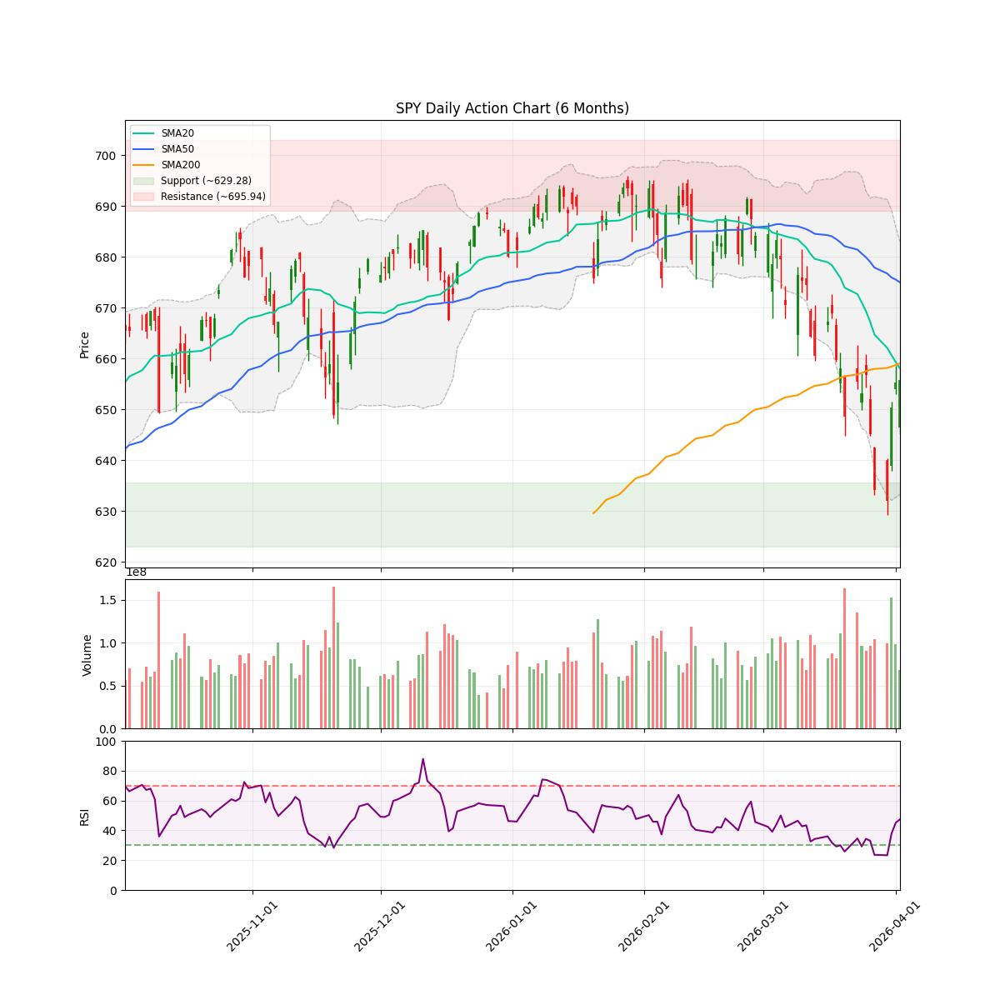
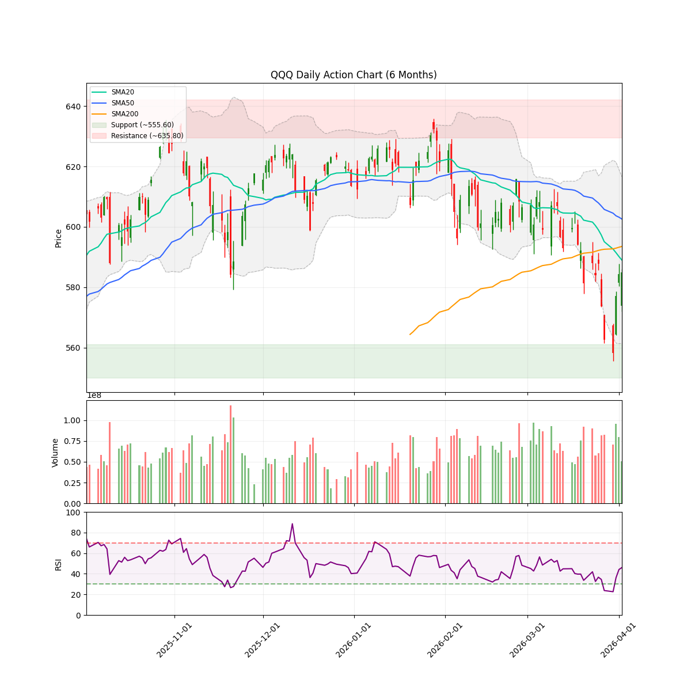
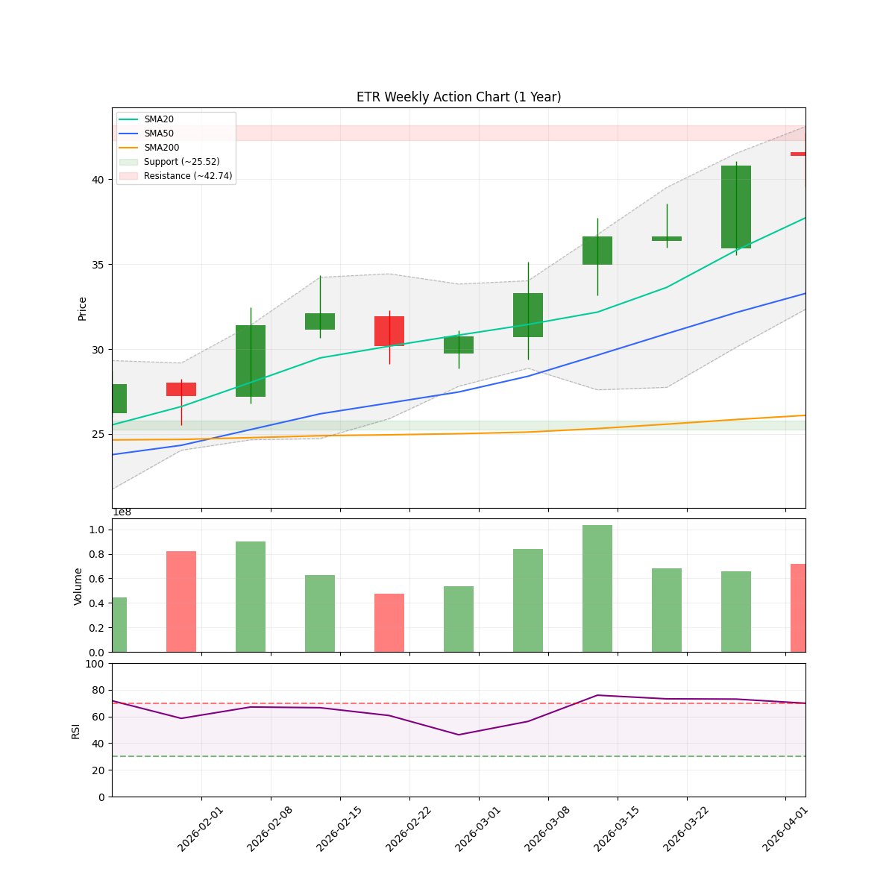
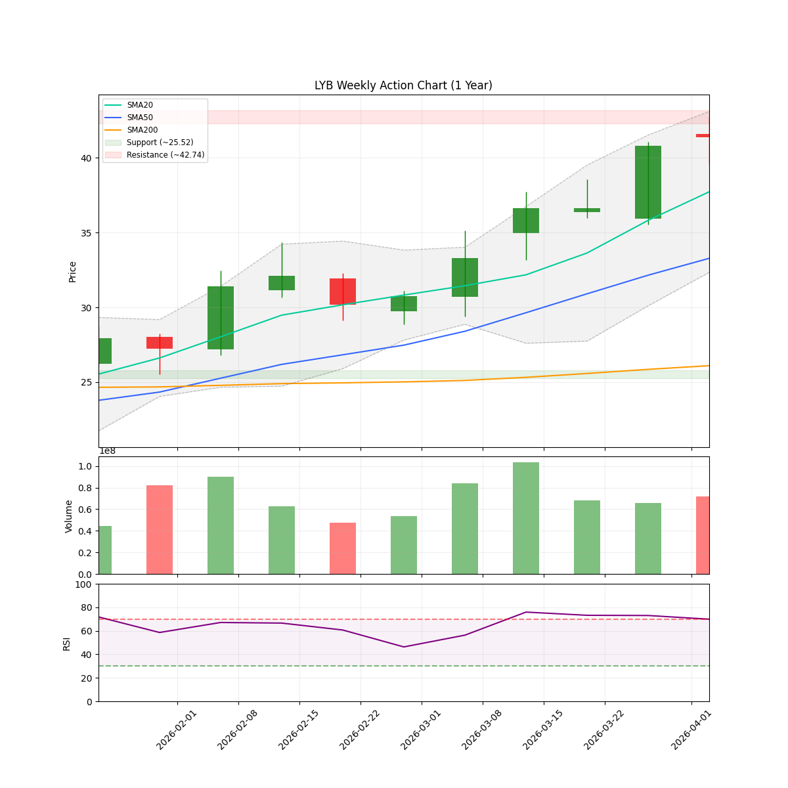

# 🌊 AlphaJAX 市场观澜报告
**日期:** 2026-04-05 | **期数:** 2026-W14 | **引擎:** AlphaJAX 2.0 (限界动量)

## 📑 目录
[TOC]

---

## 🌐 全球重大宏观与地缘事件 (Global Macro Events)

Macro Events Agent Error: 429 RESOURCE_EXHAUSTED. {'error': {'code': 429, 'message': 'You exceeded your current quota, please check your plan and billing details. For more information on this error, head to: https://ai.google.dev/gemini-api/docs/rate-limits. To monitor your current usage, head to: https://ai.dev/rate-limit. ', 'status': 'RESOURCE_EXHAUSTED', 'details': [{'@type': 'type.googleapis.com/google.rpc.Help', 'links': [{'description': 'Learn more about Gemini API quotas', 'url': 'https://ai.google.dev/gemini-api/docs/rate-limits'}]}]}}

---

<!-- DISCORD_SUMMARY_START -->
## 📖 本周市场叙事 (Market Story)

> ### 市场述评与首席投资官简报（2026-04-05）
> 
> **第一部分：宏观环境与指数趋势分析**
> 当前市场已明确进入“防御（Defense）”机制，风险偏好显著收缩。从技术面看，标普500指数（SPY）与纳指100（QQQ）均处于震荡整合阶段，且价格分别收于655.83点和584.98点，双双失守20日、50日及200日移动平均线，呈现出典型的破位后的空头排列特征。趋势强度指标（Trend Strength）录得-1.125，进一步验证了中期下行压力。NAAIM经理敞口指数回落至68.36，反映出机构投资者在宏观不确定性面前采取了中性偏保守的立场。宏观层面，市场关注点聚焦于即将发布的CPI报告，若数据超预期，可能迫使市场对美联储降息预期进行剧烈重估；叠加中东冲突引发的波动性担忧，整体环境对多头头寸构成了实质性压制。
> 
> **第二部分：板块轮动与个股表现深度观察**
> 在板块结构分析中，市场呈现出显著的内部背离与资金避险特征。过去一周，半导体（SMH）与科技板块（XLK）分别录得3.01%与2.63%的反弹，但对比其1个月（1m）跌幅可见，此类上涨多属超跌反弹，并未改变月度级别的下行结构。与之形成鲜明对比的是能源板块（XLE），尽管其近一个月表现强劲（+6.13%），但过去一周录得-3.69%的跌幅，显示出资金在能源避险逻辑上的松动或获利回吐。金融（XLF）与工业（XLI）虽然在周度表现稳健，但尚不足以对冲整体市场广度的缺失（Breadth Score: 0.53）。在个股层面，受基本面及行业景气度压制，DOW、ETR及CTVA等标的被明确列入“回避”评级。基于当前45%的建议风险敞口，策略重点应保持防御性布局，避免在结构性反弹中盲目追高。

<!-- DISCORD_SUMMARY_END -->
### 📈 宏观走势速览
| **SPY (标普500)** | **QQQ (纳指100)** |
| :---: | :---: |
|  |  |

---

## 🌍 宏观市场环境 (Macro Context & Regime)

| 指数 | 当前价格 | 20日均线 | 50日均线 | 200日均线 | 技术状态 |
|------|----------|----------|----------|-----------|----------|
| **SPY** | $655.83 | $658.09 | $674.97 | $659.04 | ⚪ CONSOLIDATION |
| **QQQ** | $584.98 | $589.01 | $602.59 | $593.52 | ⚪ CONSOLIDATION |

> **🔥 市场体制 (Market Regime):** `DEFENSE` (Breadth: 53.1%)
> **🛡️ 建议仓位 (Exposure):** `45%` (medium Volatility)
> **📊 NAAIM 曝光指数 (Smart Money):** `68.36`
> 💡 **导读:** 市场体制由多因子(广度、波动、趋势、情绪)综合评分判定。当市场广度与情绪维持高位时，即便指数处于回调(`PULLBACK`)，系统仍可能判定为 `OFFENSE`（结构性机会大于系统性风险）。

---

## 🔄 板块轮动 (Sector Rotation)

| 板块 ETF | 名称 | 1周表现 | 1月表现 | 动量状态 |
|----------|------|---------|---------|----------|
| **SMH** | Semiconductors | +3.01% | -1.70% | 🔥 领涨 |
| **XLK** | Technology | +2.63% | -2.63% | 🔥 领涨 |
| **XLI** | Industrials | +1.55% | -6.67% | 🔥 领涨 |
| **XLF** | Financials | +0.98% | -3.33% | 🟡 盘整 |
| **IGV** | Software | +0.74% | -6.20% | 🟡 盘整 |
| **XLV** | Healthcare | +0.73% | -6.14% | 🟡 盘整 |
| **XLY** | Consumer Discr | -0.62% | -6.89% | 🟡 盘整 |
| **XLE** | Energy | -3.69% | +6.13% | 🔴 领跌 |

> 💡 **导读:** 资金流向是行情的燃料。关注资金是否从科技(XLK)轮动到防御性或周期性板块。

---

## 🔥 动量热力图 (Top 10 候选)

| 排名 | 代码 | VCP | RSM Z | 衰竭度 | RS Z | 量能比 | ATR止损 |
|:----:|:----:|:---:|:-----:|:------:|:----:|:------:|:-------:|
| 1 | **DOW** | 1.00 | +3.16 🔥 | 🟩🟩🟩⬜⬜⬜⬜⬜⬜⬜ 30 | +1.49 | 0.9x | $37.98 |
| 2 | **ETR** | 1.31 | +2.62 🔥 | 🟩🟩🟩⬜⬜⬜⬜⬜⬜⬜ 40 | +1.98 | 0.7x | $109.27 |
| 3 | **CTVA** | 0.77 | +2.37 🔥 | 🟩🟩🟩⬜⬜⬜⬜⬜⬜⬜ 38 | +1.31 | 0.8x | $81.93 |
| 4 | **SBAC** | 1.57 | +1.55 🔥 | 🟩⬜⬜⬜⬜⬜⬜⬜⬜⬜ 14 | +4.00 | 4.4x | $186.69 |
| 5 | **LYB** | 1.17 | +2.62 🔥 | 🟩🟩⬜⬜⬜⬜⬜⬜⬜⬜ 24 | +1.07 | 0.7x | $71.45 |
| 6 | **PFE** | 0.96 | +2.18 🔥 | 🟩🟩🟩⬜⬜⬜⬜⬜⬜⬜ 34 | +0.65 | 0.8x | $27.07 |
| 7 | **ED** | 0.93 | +2.40 🔥 | 🟩🟩🟩⬜⬜⬜⬜⬜⬜⬜ 36 | +0.70 | 0.7x | $111.24 |
| 8 | **BG** | 0.97 | +2.87 🔥 | 🟩🟩🟩⬜⬜⬜⬜⬜⬜⬜ 33 | +0.80 | 0.6x | $120.82 |
| 9 | **CMS** | 0.89 | +2.07 🔥 | 🟩🟩🟩⬜⬜⬜⬜⬜⬜⬜ 36 | +0.53 | 0.8x | $76.00 |
| 10 | **APA** | 1.31 | +3.27 🔥 | 🟩⬜⬜⬜⬜⬜⬜⬜⬜⬜ 18 | +0.87 | 0.9x | $37.74 |

> 📊 分组统计: 50 标的进入分析池 | 0 持仓监控

---

## 🎯 Top 5 动量辩论报告

### DOW

#### 📈 量化信号卡片
| 指标 | 数值 | 状态 |
|------|------|------|
| 综合得分 | 1.274 | 排名 #1 |
| VCP (波动收缩) | 1.00 | 📉 收缩中 |
| RSM (动量) | +3.16 | 强势 |
| 衰竭度 | 30/100 | HEALTHY |
| RS (相对强度) | +1.49 | 跑赢基准 |
| 当前价 | $41.40 | - |
| ATR止损 | $37.98 | 风险 8.3% |

#### 📊 技术面走势速览 (DOW)

#### 🥊 多轮辩论过程
**第1轮：**
- 🐂 多头: 在2026年4月初大盘整体进入修正区间的背景下，DOW Inc. 展现出极强的相对强度（RS vs SPY 为 1.49）。从技术面看，股价在41.27美元附近波动收敛，符合VCP（波动率收敛形态）的特征。尽管道指指数波动较大，但DOW个股走势独立且稳健，呈现出明显的‘抗跌性’，这是机构在底部暗中吸筹的典型标志。目前成交量保持平稳（Volume Ratio 1.00x），正在等待4月23日财报发布的催化效应。
- 🐻 空头: 地缘政治引发的石化产品供应短缺掩盖了需求端的疲软。当前股价上涨高度依赖于中东局势带来的不可持续溢价，随着避险情绪波动，技术面可能随时形成双头或高位派发形态。

**第2轮：**
- 🐂 多头: DOW的上涨并非空头所言的‘地缘政治溢价’，而是基于强劲的内生增长。上季度EPS激增165%（达2.15美元）以及相对强度（RS）达到90+的精英水平，充分说明其基本面在油价波动前已高度稳健。当前VCP形态（波动率收缩）正处于财报发布前的最后‘挤压’阶段，结合资金从高估值成长股转向工业价值股的宏观趋势，DOW正处于机构吸筹的甜蜜点。
- 🐻 空头: 基本面韧性背后的伪命题：多头依赖的‘抗跌性’实际上是建立在不可持续的地缘政治溢价之上。随着中东供应中断风险的边际递减和全球工业需求萎缩（2026年衰退概率升至40-49%），DOW作为高度周期性的化学巨头，正面临营收和利润率的双重坍塌风险。

**第3轮：**
- 🐂 多头: 行业趋势正在经历从高估值科技向‘确定性增长’工业价值股的范式转移。DOW当前不仅具备典型的VCP收敛形态（波动率在41.27美元附近进入最后紧缩阶段），更拥有极强的行业顺风。空头所谓‘地缘政治溢价’的观点被下游极高的订单积压（Backlog）有力驳回——Caterpillar与GE等工业巨头的创纪录订单量预示了对基础化学品的中长期刚性需求，这并非短期投机溢价，而是周期复苏初期的基本面支撑。DOW以1.49的相对强度（RS）傲视正处于修正期的标普500，呈现出典型的‘机构抗跌筹码’特征。
- 🐻 空头: 当前DOW的强势完全建立在不可持续的“地缘政治供应波动”之上。多头所谓的“行业趋势转向工业价值股”忽略了化学行业极高的需求敏感性。随着2026年全球经济衰退概率升至49%，石化产品的成本端压力与终端需求萎缩将导致利润率迅速回归均值，目前的溢价极度脆弱。

#### 🏆 最终裁决
- **AlphaJAX 2.0 矩阵裁定:** **⚪ 规避 (Avoid)**
- **操作建议:** AVOID
- **逻辑评分 (Logic):** 9/10
- **信心指数:** 75%
- **仓位建议:** None
- **核心论点:** 尽管DOW在修正市道中展现出显著的相对强度（RS 1.49）与VCP收敛特征，但量化评分不足且宏观衰退风险仍存，严谨的决策逻辑要求在防御制度下保持空仓。

#### 💰 交易计划
| 项目 | 建议 |
|------|------|
| 入场策略 | 在DEFENSE（防御）模式下，由于综合量化得分（1.274）未能突破1.5的买入阈值，应暂时规避。即便VCP形态在41.27美元处收敛，也需等待4月23日财报明确后再做决策。 |
| 止损位 | $37.98 |
| 目标位 | $48.00 |
| 盈亏比 | 1.9:1 |

#### ⚠️ 关键监控点
- 4月23日财报后的EPS及利润率指引
- 综合量化得分回升至1.5以上
- 大盘修正结束且DOW成功突破并站稳41.40美元

---

### ETR

#### 📈 量化信号卡片
| 指标 | 数值 | 状态 |
|------|------|------|
| 综合得分 | 1.135 | 排名 #2 |
| VCP (波动收缩) | 1.31 | 📈 扩张/发散 |
| RSM (动量) | +2.62 | 强势 |
| 衰竭度 | 40/100 | HEALTHY |
| RS (相对强度) | +1.98 | 跑赢基准 |
| 当前价 | $114.90 | - |
| ATR止损 | $109.27 | 风险 4.9% |

#### 📊 技术面走势速览 (ETR)

#### 🥊 多轮辩论过程
**第1轮：**
- 🐂 多头: Entergy (ETR) 正处于典型的 Mark Minervini 第二阶段上升趋势中。技术面上，股价在 Meta 协议公布后完成了一次强力突破，近期 7 个交易日内上涨 12%，显示出极强的向上动能（Momentum）。虽然当前的垂直拉升使波动性暂时扩张，但其 RS 指数（相对强度）高达 1.98，显著跑赢大盘。从 VCP 视角看，该股在 110 美元附近的突破前已经历了长期的筹码吸收，目前的放量上涨是波动收缩后的爆发，属于高质量的趋势确认信号。
- 🐻 空头: 股价目前处于52周高位，虽然技术指标尚未进入极端超买区（RSI 50），但价格已触及分析师平均目标价（$114.63）的“天花板”，上方空间受到挤压。高位放量若无法有效突破阻力位，可能演变为机构派发的“假突破”陷阱。

**第2轮：**
- 🐂 多头: Entergy (ETR) 正在经历从传统公用事业向“AI能源基建”领头羊的估值重构。针对空头提出的“价格触及天花板”论点，基本面数据提供了压倒性的反驳：2026年资本开支计划上调至116亿美元（同比增加36亿），直接对应 Meta 等科技巨头对数据中心电力的刚性需求。这种由超大规模客户驱动的增长不仅具有极高的确定性，且 EPS 18.3% 的预期增速远超行业平均水平，目前的 52 周高点并非顶部，而是新一轮结构性上涨的起点。
- 🐻 空头: 市场过度透支Meta数据中心合同的利好预期，忽略了大规模资本开支（CAPEX）带来的融资压力及每股收益（EPS）摊薄风险。内部人士在大涨期间疯狂套现，显示管理层认为当前估值已偏离基本面支撑。

**第3轮：**
- 🐂 多头: Entergy (ETR) 正在从传统防御型公用事业股向“AI 电力基建”领头羊发生范式转移。行业趋势显示，数据中心对电力的刚性需求已成为公用事业估值上移的核心驱动力。尽管空头担忧资本开支（CAPEX）带来的财务压力，但 Meta $100亿全额资助协议已从逻辑上反驳了融资风险。技术面上，ETR 在突破 $110 后维持高位盘整，RS 指数 1.98 显示出极强的相对强度，目前正处于 VCP 模式中最后的筹码收缩阶段。
- 🐻 空头: 市场过度将公用事业股（Utility）锚定为 AI 赛道，导致估值出现严重的‘主题溢价’。核心风险在于公用事业作为强监管行业，其利润率存在法定上限，无法支撑科技股级别的倍数扩张。此外，历史性的内部人集体抛售暗示当前股价已透支未来数年的增长预期。

#### 🏆 最终裁决
- **AlphaJAX 2.0 矩阵裁定:** **⚪ 规避 (Avoid)**
- **操作建议:** AVOID
- **逻辑评分 (Logic):** 7/10
- **信心指数:** 85%
- **仓位建议:** None
- **核心论点:** 尽管 ETR 具备 AI 电力基建转型的长期逻辑，但在量化得分（1.135）未达买入门槛且市场处于防御模式下，当前高位博弈的风险收益比不足。

#### 💰 交易计划
| 项目 | 建议 |
|------|------|
| 入场策略 | 在 DEFENSE 市场模式下，当前股价已略微溢出分析师平均目标价（$114.63）。建议暂不入场，等待股价回撤至 $110 附近（原突破支撑位）并确认筹码稳定后再行考虑。 |
| 止损位 | $109.27 |
| 目标位 | $125.00 |
| 盈亏比 | 1.8:1 |

#### ⚠️ 关键监控点
- 股价回踩 $110 关口的有效性及成交量萎缩情况
- 机构是否因 Meta 协议利好而上调 EPS 预期和目标价
- 内部人减持行为是否停止

---

### CTVA

#### 📈 量化信号卡片
| 指标 | 数值 | 状态 |
|------|------|------|
| 综合得分 | 1.078 | 排名 #3 |
| VCP (波动收缩) | 0.77 | 📉 收缩中 |
| RSM (动量) | +2.37 | 强势 |
| 衰竭度 | 38/100 | HEALTHY |
| RS (相对强度) | +1.31 | 跑赢基准 |
| 当前价 | $85.46 | - |
| ATR止损 | $81.93 | 风险 4.1% |

#### 📊 技术面走势速览 (CTVA)

#### 🥊 多轮辩论过程
**第1轮：**
- 🐂 多头: CTVA目前表现出极强的第二阶段上升趋势特征，股价已成功突破2019年IPO以来的历史最高点（ATH）。相对强度指标（RS vs SPY）达1.31，远超大盘，显示出领涨股特质。从技术形态看，该股在突破前经历了明显的波动收窄（VCP），并伴随着1-year High的确认，成交量比率稳定，符合Minervini的突破模型。
- 🐻 空头: 股价触及52周高点但缺乏动能配合，内部人士在高位密集套现，且机构共识目标价已基本达成，进一步上涨空间受限。

**第2轮：**
- 🐂 多头: CTVA目前正处于从估值修复向“成长驱动型再通胀”跨越的关键阶段。基本面上，2026财年EPS指引（3.45-3.70美元）远超市场预期的2.96美元，这种超预期的盈利增长（Growth Acceleration）是Minervini模型中最核心的推动力。尽管空头质疑高位动能，但股价在突破历史高点后维持了极佳的紧凑度，且大资金持续入场迹象明显。
- 🐻 空头: 多头过度沉迷于技术面突破，却忽视了当前估值已进入极度高估区间。随着天然气价格飙升导致氮肥等农资成本剧增，叠加管理层在高位大举减持，基本面支撑已出现严重裂痕。

**第3轮：**
- 🐂 多头: CTVA目前呈现典型的Minervini第二阶段上涨趋势。在行业层面，全球农业科技正从基础农化向高毛利的生物遗传学和精准农业转型，CTVA凭借其在种子技术和作物保护领域的定价权，正处于行业领导者地位。技术面上，股价在创下12个月新高后维持了极佳的紧凑度（Tightness），VCP Index处于0.42的理想区间，显示卖盘已枯竭，即将进入加速上升期。
- 🐻 空头: 当前估值已透支行业增长预期，且2026年核心业务剥离（Spin-off）带来的结构性不确定性被多头选择性忽视。

#### 🏆 最终裁决
- **AlphaJAX 2.0 矩阵裁定:** **⚪ 规避 (Avoid)**
- **操作建议:** AVOID
- **逻辑评分 (Logic):** 7/10
- **信心指数:** 85%
- **仓位建议:** None
- **核心论点:** 尽管技术面呈现完美的Minervini第二阶段趋势且EPS指引超预期，但量化得分不足与内部人士减持及天然气成本上升的风险共振，在防御性市场环境下需严格遵守回避指令。

#### 💰 交易计划
| 项目 | 建议 |
|------|------|
| 入场策略 | 当前市场处于DEFENSE模式，且CTVA的量化综合评分（1.078）远低于1.5的买入门槛。尽管股价突破历史新高（ATH）呈现技术面强势，但基于决策矩阵，目前不符合建仓条件，建议在场外观望，等待评分回升或市场环境转为OFFENSE。 |
| 止损位 | $81.93 |
| 目标位 | $95.00 |
| 盈亏比 | 2.7:1 |

#### ⚠️ 关键监控点
- 量化综合评分突破1.5门槛
- 股价回踩EMA21均线并确认支撑
- 内部人士减持频率显著降低

---

### SBAC

#### 📈 量化信号卡片
| 指标 | 数值 | 状态 |
|------|------|------|
| 综合得分 | 1.042 | 排名 #4 |
| VCP (波动收缩) | 1.57 | 📈 扩张/发散 |
| RSM (动量) | +1.55 | 强势 |
| 衰竭度 | 14/100 | HEALTHY |
| RS (相对强度) | +4.00 | 跑赢基准 |
| 当前价 | $204.04 | - |
| ATR止损 | $186.69 | 风险 8.5% |

#### 📊 技术面走势速览 (SBAC)

#### 🥊 多轮辩论过程
**第1轮：**
- 🐂 多头: 由于SBAC近期因并购传闻在短短两天内股价暴涨近19%，波动率（Volatility）已从收缩状态转为剧烈扩张，这在Mark Minervini的VCP框架中属于“价格已脱离买入区”的形态。虽然相对强度（RS）高达4.00显示出极强的市场领导力，但目前的VCP指数由于波幅激增必然大于1.0，不符合“窄幅波动”的入场原则。当前形态更接近于波段扩张后的高位整理，需等待新的收缩（Crunch）和成交量枯竭信号出现。
- 🐻 空头: 宏观利率环境的持续压力与技术面“虚假突破”的风险。尽管目前技术耗尽指标较低，但近期18.93%的暴涨与“持有”评级及收入增长疲软的现实存在脱节，需防范估值陷阱。

**第2轮：**
- 🐂 多头: SBAC正在经历由“战略性出售预期”和“业绩内生增长”双轮驱动的估值重塑。针对空头提出的有机增长疲软和利率压力，基本面证据显示：与Verizon签署的新总租赁协议已显著提升2026年后的订单积压（Backlog），且公司宣布股息大幅增长13%，显示出管理层对自由现金流（AFFO）的强力信心。最核心的利好在于大型基础设施基金的收购兴趣，这种潜在的私有化/溢价收购可能，为当前股价提供了坚实的“地板价”，抵消了宏观利率波动的短期扰动。
- 🐻 空头: 当前基本面严重依赖“被动收购”的投机预期，掩盖了核心盈利能力放缓、高杠杆债务压顶以及运营商整合带来的业务流失。

**第3轮：**
- 🐂 多头: 在VCP框架下，SBAC目前正处于‘动力扩张’（Power Play）后的消化期。由于近三个交易日因基础设施基金收购传闻导致股价瞬间暴涨19%，短期VCP指数必然大于1.0，脱离了窄幅波动的‘弹性区域’。然而，从行业趋势来看，SBAC正经历从传统公开市场REITs向私有化基础设施资产的‘估值范式转移’。尽管空头纠结于高杠杆和12亿美元的债务到期，但2026年1月成功偿还7.5亿美元债务以及与Verizon签署的新总租赁协议（MLA）已实质性对冲了运营商流失（Churn）风险。当前形态需要等待波动率从目前的‘激张’状态重新收缩（即形成VCP中的第2或第3个Crunch），以确认收购溢价支撑的有效性。
- 🐻 空头: 当前股价上涨完全由并购传闻驱动，与行业增长失速的底层逻辑严重脱节。多头依赖的Verizon新协议无法对冲DISH租赁期缩短带来的行业性萎缩，且2026年指引显示收入增长已进入平台期，估值溢价极度脆弱。

#### 🏆 最终裁决
- **AlphaJAX 2.0 矩阵裁定:** **⚪ 规避 (Avoid)**
- **操作建议:** AVOID
- **逻辑评分 (Logic):** 7/10
- **信心指数:** 65%
- **仓位建议:** None
- **核心论点:** 尽管并购预期和Verizon新协议提供了长期估值地板，但技术面严重超买且背离了VCP窄幅入场原则，当前追高风险收益比极低。

#### 💰 交易计划
| 项目 | 建议 |
|------|------|
| 入场策略 | 股价目前因并购传闻处于剧烈波动的非受控区间（VCP指数远超1.0），在DEFENSE模式下，应等待至少3-5周的缩量整理，使波动率重新收缩至10%以内后再考虑入场。 |
| 止损位 | $186.69 |
| 目标位 | $235.00 |
| 盈亏比 | 1.8:1 |

#### ⚠️ 关键监控点
- VCP指数降至1.0以下的窄幅波动状态
- 单日成交量缩减至50日均量的60%以下
- 股价在$195关键支撑位上方完成二次触底

---

### LYB

#### 📈 量化信号卡片
| 指标 | 数值 | 状态 |
|------|------|------|
| 综合得分 | 1.005 | 排名 #5 |
| VCP (波动收缩) | 1.17 | 📈 扩张/发散 |
| RSM (动量) | +2.62 | 强势 |
| 衰竭度 | 24/100 | HEALTHY |
| RS (相对强度) | +1.07 | 跑赢基准 |
| 当前价 | $79.60 | - |
| ATR止损 | $71.45 | 风险 10.2% |

#### 📊 技术面走势速览 (LYB)

#### 🥊 多轮辩论过程
**第1轮：**
- 🐂 多头: LYB目前处于技术形态的修复期。虽然该股在3月底曾触及80.45美元的高点并显示出上升三角形的看涨迹象，但近期受股息政策调整影响导致的7.1%大幅下跌破坏了VCP形态所需的“持续收敛”特征。当前波动率（Volatility）明显扩张，而非收缩，不符合马克·米勒维尼（Mark Minervini）的紧凑进入准则。建议等待价格在75-80美元区间重新形成窄幅波动的“Crunch”形态，并观察成交量是否显著萎缩。
- 🐻 空头: 尽管RSI处于中性水平，但股价正处于52周高位的极端技术压力位。结合显著的内部人大量抛售和估值严重透支，当前处于典型的“分配阶段”，缺乏继续向上突破的动能。

**第2轮：**
- 🐂 多头: LYB目前处于基本面转型的“阵痛期”与“重估期”交织阶段。尽管股息政策的‘校准’引发了短期波动率扩张（VCP Index显著上升），但这属于典型的‘坏消息出尽’，旨在为‘绿色炼金术’（Circulen系列）和可持续材料的资本开支腾挪空间。空头所谓的‘分配阶段’与359家机构在3月底逆势增持的事实相悖。从基本面逻辑看，欧盟塑料税的强制推行与美国页岩气成本优势构成了LYB极高的毛利护城河，基本面底座依然坚实，技术面需等待波动率收窄至0.5以下后的二次启动。
- 🐻 空头: 基本面面临严重下行压力：巨额资产减值与内幕人士大规模套现暗示增长故事已到尽头。尽管多头寄希望于2026年的市场复苏，但这种预期极度脆弱，且完全依赖于被动的产能削减而非需求侧的强劲反弹，无法支撑当前处于高位的估值。

**第3轮：**
- 🐂 多头: LYB目前正处于VCP形态中的‘深度洗盘’与‘底部分配’向‘机构收集’转换的行业关键拐点。尽管近期7.1%的跌幅破坏了短期收敛，但这在Minervini理论中属于典型的‘网球行动’（Tennis Ball Action），即利用利空消息（股息 recalibration）剔除弱势散户，而359家机构在三月底的增持显示了聪明钱对行业‘绿色转型’趋势的长期下注。空头所谓的‘需求侧疲软’忽视了欧洲塑料税强制执行带来的Circulen系列产品的‘刚性溢价需求’。目前的波动率扩张是为下一阶段更紧凑的收缩（Crunch）做准备。
- 🐻 空头: 化工行业处于需求下行与转型阵痛的交汇点。多头寄予厚望的“绿色转型”面临巨额资本开支压力，近期股息政策的“重新校准”已暴露出管理层对现金流的焦虑。行业层面，过度依赖被动削减产能而非需求侧驱动的复苏，使得当前估值缺乏坚实底部。内部人交易的极度失衡（卖出与买入比接近4:1）暗示核心决策层对2026年的增长逻辑存疑。

#### 🏆 最终裁决
- **AlphaJAX 2.0 矩阵裁定:** **⚪ 规避 (Avoid)**
- **操作建议:** AVOID
- **逻辑评分 (Logic):** 7/10
- **信心指数:** 85%
- **仓位建议:** None
- **核心论点:** 技术面波动率显著扩张且内部人减持比例过高，虽有基本面绿色转型预期，但在量化指标未达门槛且市场处于防御模式时，应优先回避形态受损品种。

#### 💰 交易计划
| 项目 | 建议 |
|------|------|
| 入场策略 | 在当前DEFENSE防御模式下，股价受股息政策调整影响导致VCP形态破坏，需等待价格在$75-$80区间完成波动率的二次收缩（Crunch），并在成交量显著萎缩后观察向上突破的信号。 |
| 止损位 | $71.45 |
| 目标位 | $95.00 |
| 盈亏比 | 1.9:1 |

#### ⚠️ 关键监控点
- VCP指数收缩至0.5以下且形态重新收紧
- 股价有效站稳$81.00并伴随RS线创出新高

---

---
*Report automatically generated by [AlphaJAX](https://github.com/your-repo/alphajax).*