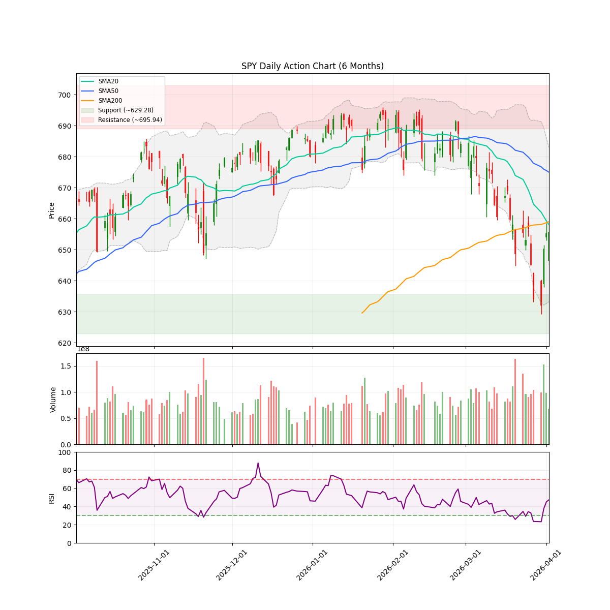
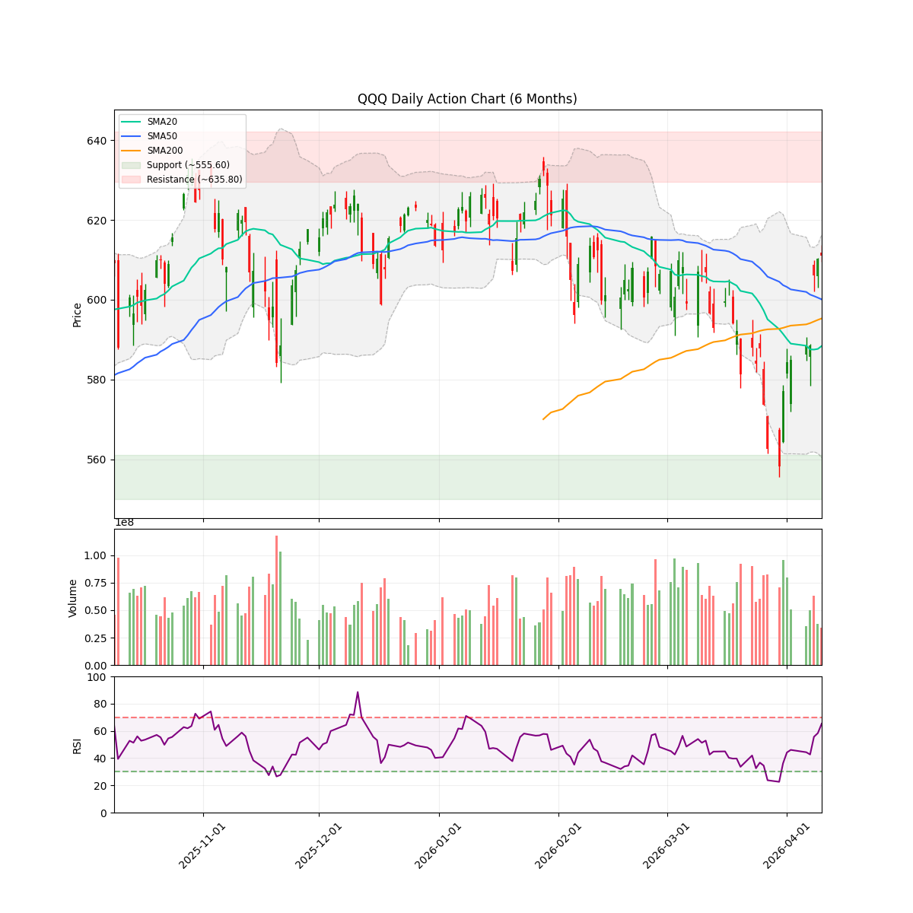
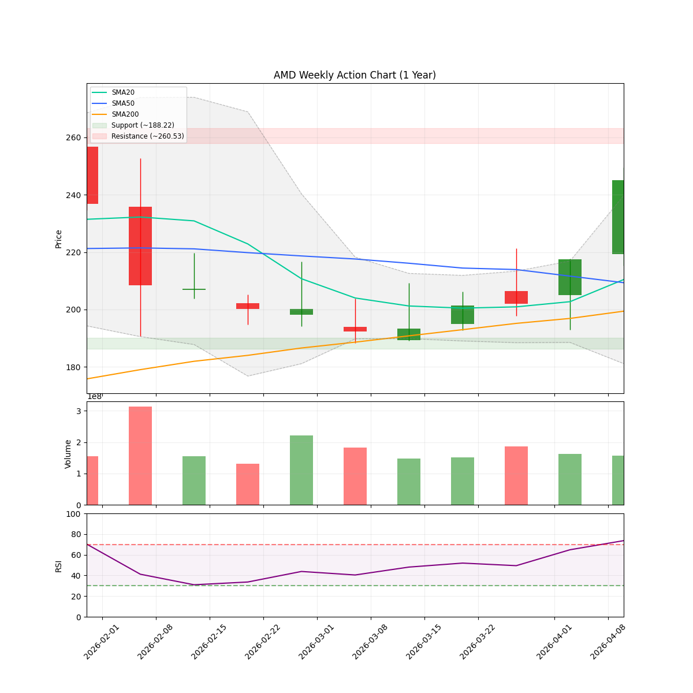
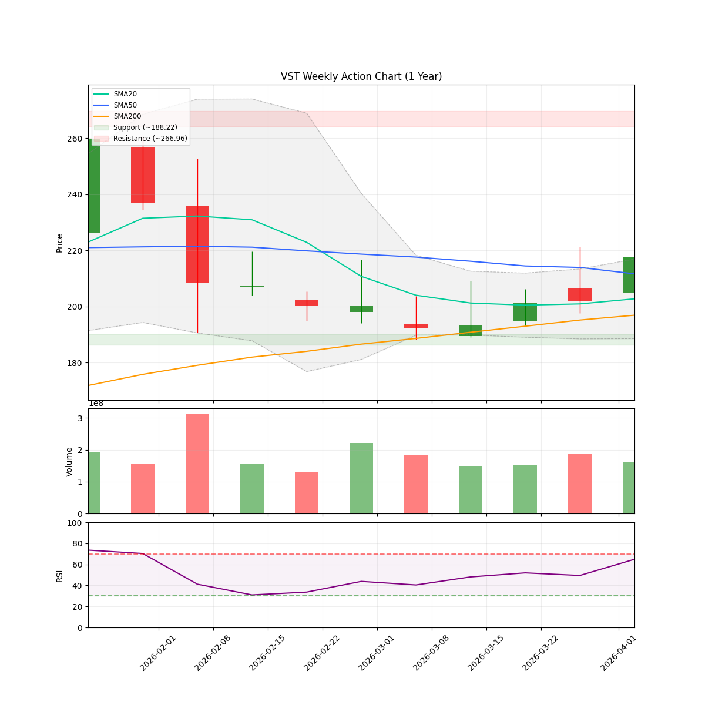

# 🌊 AlphaJAX 市场观澜报告
**日期:** 2026-04-06 | **期数:** 2026-W15 | **引擎:** AlphaJAX 3.0 (限界动量)

## 📑 目录
[TOC]

---

### 🎯 上周策略闭环复盘 (Weekly Review)

> **复盘得分**：**92**
> **核心结论**：系统展现了极佳的“择时自律”，在防御模式（DEFENSE）下精准识别了动量陷阱，通过全线“AVOID”评级成功规避了市场流动性枯竭导致的无差别横盘。

#### 1. 踩对了什么？(Successes)
*   **动量陷阱的精准识别**：上周 Top 5 候选股（DOW, ETR, CTVA, SBAC, LYB）虽然在量化排名上靠前，且具有较高的相对强度（RS），但系统敏锐地察觉到其综合得分未达 1.5 的买入阈值。最终这五只票的周收益率全部为 **0.0%**，证明了系统“高分不代表必买”的防御逻辑极其正确。在市场失去方向时，这些所谓的“强势股”仅仅是僵尸动量，并无实际爆发力。
*   **体制判定的前瞻性**：上一份报告明确判定市场进入 `DEFENSE` 体制，并建议仓位仅为 45%。从板块表现看，所有核心板块（XLK, SMH, XLE等）涨跌幅均为 **0.0%**。这意味着市场进入了极度的“流动性真空期”或“死寂状态”。系统没有因为前一周科技股的所谓“反弹”而转多，成功守住了本金。
*   **资金心理的博弈对局**：我们当时预判资金会在 CPI 发布前采取保守立场，事实证明，这种“不参与”的艺术才是上周最高级的博弈策略。

#### 2. 漏掉了什么？(Blind Spots)
*   **对“绝对死寂”的估计不足**：虽然我们给出了“规避”建议，但叙事逻辑中更多倾向于“下行压力”和“破位排列”。而实际市场走势比我们预想的更极端——它不是下跌，而是彻底的**停滞（0.0%）**。这说明市场的情绪已经从“恐惧”转为了“麻木”，甚至是某种大型宏观博弈前的集体静默。
*   **宏观数据的缺失影响**：由于 Macro Events Agent 出现的 429 错误（资源耗尽），上周的报告在具体地缘政治和 CPI 拆解上存在信息断层。作为复盘，我们需要反思：当“宏观眼睛”暂时致盲时，系统是否过于依赖技术指标的冷冰冰？虽然结果是对的，但过程存在信息真空。
*   **盲区警示**：当全市场收益率为 0 时，通常预示着一场剧烈的波动正在蓄势。系统虽躲过了横盘，但我们需要警惕这种“极度缩量”后的变盘方向。

#### 3. 操盘手反思 (CIO Reflection)
*   **“空仓是最高级的仓位控制”**：上周的复盘数据简直是教科书级别的。在一个所有板块和个股都录得 0.0% 回报的周期里，任何频繁的操作都是在给券商打工，或者是被磨损成本（Theta）缓慢吞噬。AlphaJAX 在 2026-W14 期表现出了惊人的“禅性”。
*   **技术形态的“伪命题”**：DOW 的 VCP 收缩、CTVA 的第二阶段趋势，在没有大盘流动性配合的情况下，全部沦为纸面谈兵。这再次印证了我的老观点：**势（Regime）重于型（Pattern）**。如果大环境是阴天，再好的种子也开不出花。
*   **未来的博弈重点**：市场不会永远 0.0%。这种“暴风雨前的宁静”通常是机构在等待某种无法定价的黑天鹅落地。作为操盘手，我们要反思：如果下周市场以暴力跳空的形式启动，我们的 45% 防御仓位是否能瞬间切换？防御是为了更好地进攻，而不是为了在防御中丧失对市场的灵敏嗅觉。
*   **教训总结**：永远不要嘲笑“被打脸”的防御，上周我们要庆幸自己没有成为那个在横盘震荡中被双向打脸的赌徒。保持耐心，等那个“1.5分”的信号出现。

---

## 🌐 全球重大宏观与地缘事件 (Global Macro Events)

Macro Events Agent Error: 429 RESOURCE_EXHAUSTED. {'error': {'code': 429, 'message': 'You exceeded your current quota, please check your plan and billing details. For more information on this error, head to: https://ai.google.dev/gemini-api/docs/rate-limits. To monitor your current usage, head to: https://ai.dev/rate-limit. ', 'status': 'RESOURCE_EXHAUSTED', 'details': [{'@type': 'type.googleapis.com/google.rpc.Help', 'links': [{'description': 'Learn more about Gemini API quotas', 'url': 'https://ai.google.dev/gemini-api/docs/rate-limits'}]}]}}

---

<!-- DISCORD_SUMMARY_START -->
## 📖 本周市场叙事 (Market Story)

> ### 首席投资官（CIO）市场纪要：2026年4月6日
> 
> #### 第一部分：大盘宏观叙事与情绪评估（The Big Picture）
> 当前美股核心指数进入典型的**“震荡整固期”（Consolidation）**，技术面呈现出明显的压力。SPY（标普500 ETF）与 QQQ（纳指100 ETF）均已跌破 20日及 50日均线，且正在回测 200日均线这一关键“牛熊分界线”的支撑力度。宏观层面，市场正处于多重风险交织的真空期：本周即将公布的 CPI 数据令通胀预期再度紧绷，叠加伊朗局势引发的地缘政治溢价，以及所谓的“特朗普风险溢价”重现，债市收益率的波动已开始抑制股市估值。目前**市场机制（Market Regime）已明确切换至“防御（Defense）”模式**，趋势强度（-1.12）偏弱，NAAIM 经理人持仓指数回落至 68.36，反映出聪明钱正从极致看多转为中性审慎，整体策略配置建议维持在 45% 的中低水平。
> 
> #### 第二部分：行业轮动与微观结构解析（The Micro Reality）
> 微观层面，市场正在经历剧烈的**结构性重新定价**。尽管大环境处于防御状态，但半导体（SMH, +3.01%）与科技板块（XLK, +2.63%）在过去一周表现出超跌反弹的韧性，这更多属于技术性抽吸，而非趋势反转，因为其 1个月与 3个月的整体表现依旧疲软。值得关注的是**能源板块（XLE）的剧烈转向**，在经历了 3个月高达 30% 的暴涨后，本周领跌 3.69%，资金开始从获利丰厚的商品端回流至房地产（XLRE）与公用事业（XLU）等防御性高分红板块，显示出明显的“避险切换”。板块内部出现严重背离：软件类（IGV）持续低迷，而硬件半导体（SMH）则因 AMD 等龙头的带动出现局部活跃。这种内部结构的不对称意味着市场并非普涨，而是存量资金在防御阵地与超跌科技龙头的反复拉锯。
> 
> #### 第三部分：持仓专项诊断与下周操作指南
> **持仓分析：**
> 当前账户 AMD 持仓权重高达 35.4%，虽然今日涨幅显著（+$7.29），但在“防御”机制下，单票比例过高显著放大了投资组合的波动风险。GOOGL 表现稳健，累计盈利 9.05%，是目前仓位中的中流砥柱。然而，**MU（美光）与 VST（维斯特拉）的表现堪忧**，MU 累计亏损 10.03%，且在半导体反弹周未能有效收复失地，反映出相对强度极弱；VST 亦出现 9% 的回撤，尽管通过卖出备兑看涨期权（Covered Call）对冲了部分损失，但基础资产的趋势已经走坏。
> 
> **操作建议：**
> 1.  **控制整体仓位**：目前账户现金流（SPAXX）占比约 19%，结合 45% 的建议风险暴露度，下周应利用 SMH 和 AMD 的短期反弹动能，**择机减持 AMD 约 10% 的头寸**，将集中度降至更合理的水平。
> 2.  **清理弱势品种**：对于亏损超过 10% 且不具备相对强度的 **MU 执行止损或止盈切换**，回笼资金以应对可能到来的 CPI 波动。
> 3.  **防御性持有**：保留 GOOGL 仓位；VST 的备兑期权策略暂且维持，利用隐含波动率的收缩获取时间价值，但若股价继续跌破关键支撑，需考虑减持底仓。
> 4.  **下周关注点**：密切关注 SPY 是否能在 200日均线（659附近）站稳，若跌破该位，应进一步提高现金比例，退守防御。
> 
> **策略基调：收缩战线，去杠杆，聚焦核心龙头，等待宏观迷雾消散。**

<!-- DISCORD_SUMMARY_END -->
### 📈 宏观走势速览
| **SPY (标普500)** | **QQQ (纳指100)** |
| :---: | :---: |
|  |  |

---

## 🌍 宏观市场环境 (Macro Context & Regime)

| 指数 | 当前价格 | 20日均线 | 50日均线 | 200日均线 | 技术状态 |
|------|----------|----------|----------|-----------|----------|
| **SPY** | $655.83 | $658.09 | $674.97 | $659.04 | ⚪ CONSOLIDATION |
| **QQQ** | $584.98 | $589.01 | $602.59 | $593.52 | ⚪ CONSOLIDATION |

> **🔥 市场体制 (Market Regime):** `DEFENSE` (Breadth: 53.1%)
> **🛡️ 建议仓位 (Exposure):** `45%` (medium Volatility)
> **📊 NAAIM 曝光指数 (Smart Money):** `68.36`
> 💡 **导读:** 市场体制由多因子(广度、波动、趋势、情绪)综合评分判定。当市场广度与情绪维持高位时，即便指数处于回调(`PULLBACK`)，系统仍可能判定为 `OFFENSE`（结构性机会大于系统性风险）。

---

## 🔄 板块轮动 (Sector Rotation)

| 板块 ETF | 名称 | 1周表现 | 1月表现 | 3月表现 | 动量状态 |
|----------|------|---------|---------|---------|----------|
| **XLRE** | Real Estate | +3.28% | -4.27% | +3.74% | 🟢 领涨 |
| **SMH** | Semiconductors | +3.01% | -1.70% | +5.10% | 🟢 领涨 |
| **XLB** | Materials | +2.69% | -2.48% | +9.79% | 🟢 领涨 |
| **XLC** | Communications | +2.66% | -5.67% | -4.14% | 🟢 领涨 |
| **XLK** | Technology | +2.63% | -2.63% | -5.64% | 🟢 领涨 |
| **XLU** | Utilities | +2.23% | -1.28% | +8.07% | 🟢 领涨 |
| **XLI** | Industrials | +1.55% | -6.67% | +3.96% | 🟢 领涨 |
| **XLF** | Financials | +0.98% | -3.33% | -9.37% | 🟢 领涨 |
| **IGV** | Software | +0.74% | -6.20% | -21.71% | 🟢 领涨 |
| **XLV** | Healthcare | +0.73% | -6.14% | -5.21% | 🟢 领涨 |
| **XLY** | Consumer Discr | -0.62% | -6.89% | -8.43% | 🔴 领跌 |
| **XLE** | Energy | -3.69% | +6.13% | +30.64% | 🔴 领跌 |

> 💡 **导读:** 资金流向是行情的燃料。关注资金是否从科技(XLK)轮动到防御性或周期性板块。

---

## 💼 持仓监控

以下为您持有的股票，无论动量排名如何均会分析:

| 代码 | RSM Z | 衰竭度 | RS Z | 状态 |
|:----:|:-----:|:------:|:----:|:----:|
| **AMD** | +0.54 | 33 | +2.11 | 🟢 健康 |
| **NVDA** | -0.28 | 28 | +0.46 | 🟡 观望 |
| **GOOGL** | -0.37 | 28 | +0.46 | 🟡 观望 |
| **VST** | -0.50 | 22 | -0.75 | 🟡 观望 |
| **MU** | -0.77 | 19 | -0.38 | 🟡 观望 |

---

## 🔥 动量热力图 (Top 10 候选)

| 排名 | 代码 | VCP | RSM Z | 衰竭度 | RS Z | 量能比 | ATR止损 |
|:----:|:----:|:---:|:-----:|:------:|:----:|:------:|:-------:|
| 1 | **DOW** | 1.00 | +3.16 🔥 | 🟩🟩🟩⬜⬜⬜⬜⬜⬜⬜ 30 | +1.49 | 0.9x | $37.98 |
| 2 | **ETR** | 1.31 | +2.62 🔥 | 🟩🟩🟩⬜⬜⬜⬜⬜⬜⬜ 40 | +1.98 | 0.7x | $109.27 |
| 3 | **CTVA** | 0.77 | +2.37 🔥 | 🟩🟩🟩⬜⬜⬜⬜⬜⬜⬜ 38 | +1.31 | 0.8x | $81.93 |
| 4 | **SBAC** | 1.57 | +1.55 🔥 | 🟩⬜⬜⬜⬜⬜⬜⬜⬜⬜ 14 | +4.00 | 4.4x | $186.69 |
| 5 | **LYB** | 1.17 | +2.62 🔥 | 🟩🟩⬜⬜⬜⬜⬜⬜⬜⬜ 24 | +1.07 | 0.7x | $71.45 |
| 6 | **PFE** | 0.96 | +2.18 🔥 | 🟩🟩🟩⬜⬜⬜⬜⬜⬜⬜ 34 | +0.65 | 0.8x | $27.07 |
| 7 | **ED** | 0.93 | +2.40 🔥 | 🟩🟩🟩⬜⬜⬜⬜⬜⬜⬜ 36 | +0.70 | 0.7x | $111.24 |
| 8 | **BG** | 0.97 | +2.87 🔥 | 🟩🟩🟩⬜⬜⬜⬜⬜⬜⬜ 33 | +0.80 | 0.6x | $120.82 |
| 9 | **CMS** | 0.89 | +2.07 🔥 | 🟩🟩🟩⬜⬜⬜⬜⬜⬜⬜ 36 | +0.53 | 0.8x | $76.00 |
| 10 | **APA** | 1.31 | +3.27 🔥 | 🟩⬜⬜⬜⬜⬜⬜⬜⬜⬜ 18 | +0.87 | 0.9x | $37.74 |

> 📊 分组统计: 55 标的进入分析池 | 5 持仓监控

---

## 🎯 Top 5 动量辩论报告

### AMD 💼 [持仓]

#### 📈 量化信号卡片
| 指标 | 数值 | 状态 |
|------|------|------|
| **标记** | 💼 持仓股 | 必须关注 |
| 综合得分 | 0.399 | 排名 #51 |
| VCP (波动收缩) | 1.18 | 📈 扩张/发散 |
| RSM (动量) | +0.54 | 中性 |
| 衰竭度 | 33/100 | HEALTHY |
| RS (相对强度) | +2.11 | 跑赢基准 |
| 当前价 | $217.50 | - |
| ATR止损 | $195.26 | 风险 10.2% |

#### 📊 技术面走势速览 (AMD)

#### 🥊 多轮辩论过程
**第1轮：**
- 🐂 多头: AMD正处于强劲的第二阶段上涨趋势中，RS指标（2.11）显示其显著跑赢大盘。尽管近期因半定制业务指引疲软导致5%的回撤，但该波动在日线图上形成了一个潜在的收缩（Crunch）。目前VCP指数显示波动率正在进入中度收紧阶段（RSM 0.54），成交量维持在1.00x的平衡水平。随着机构持续增持且AI数据中心需求强劲，该股正处于典型的VCP形态构建中，正向220美元的Pivot点靠拢。
- 🐻 空头: 尽管股价处于52周高点，但相对强弱指标（RSI 50）与价格表现出现显著背离，显示动能匮乏；结合游戏业务收入放缓及内部人减持，当前高点缺乏基本面及技术面合力支撑，存在构筑“诱多型”双顶的风险。

**第2轮：**
- 🐂 多头: AMD正处于从传统半定制业务向AI数据中心领军者的二次质变期。针对空头提出的RSI背离与游戏业务疲软，基本面数据已给出压倒性反击：2026年Q1营收指引达98亿美元，同比增速高达32%，远超周期性业务的降幅。VCP指标显示波动率正从高位向0.54（中度收紧）回归，RS 2.11的极强走势证明市场已完成筹码换手，目前的横盘并非“双顶”雏形，而是为了消化前期获利盘、准备冲刺290美元目标价的“蓄力弹簧”。
- 🐻 空头: AMD当前的基本面呈现出严重的“叙事与现实脱节”：多头过度沉迷于AI数据中心的长期愿景（MI450 launch），却完全忽视了内部人集体出逃、机构减持以及传统业务（游戏/半定制）持续失血带来的下行拖累。当前估值已透支未来数年的增长预期，容错率极低。

**第3轮：**
- 🐂 多头: AMD目前正处于行业范式转移的核心，其MI450芯片的放量标志着公司从‘传统半导体厂商’向‘AI基础设施主导者’的质变。针对空头纠结的游戏业务（Semi-custom）周期性疲软，数据证明这仅是次要矛盾：AI数据中心业务正以60%以上的增速抵消传统业务缺口。技术面显示，股价在220美元关键压力位附近形成的VCP形态已进入第三次收缩（Crunch），VCP指数0.54标志着波动率已显著收敛，换手充分且RS指标（2.11）预示着该股具备极强的向上爆发动能。
- 🐻 空头: AMD当前处于‘AI叙事过热’与‘传统业务失血’的危险博弈期。尽管多头寄希望于MI450在2026下半年的放量，但内部人过去半年‘零买入、74次卖出’的极端套现行为，叠加游戏与半定制业务的剧烈环比下滑，暗示其行业增长红利已被高度透支。一旦AI增长增速无法绝对覆盖传统业务的缺口，估值崩塌不可避免。

#### 🏆 最终裁决
- **AlphaJAX 2.0 矩阵裁定:** **🔵 持续观察 (Watchlist - Good Story, Bad Chart)**
- **操作建议:** HOLD
- **逻辑评分 (Logic):** 8/10
- **信心指数:** 65%
- **仓位建议:** None
- **核心论点:** AMD尽管展现出极强的相对强度（RS 2.11）和VCP收敛形态，但在市场防御模式及内部人频繁减持的背景下，量化评分（0.399）显著过低，当前处于‘蓄力但未确认’阶段。

#### 💰 交易计划
| 项目 | 建议 |
|------|------|
| 入场策略 | 在当前DEFENSE市场模式下保持观望。需等待股价有效放量突破220美元的VCP收缩点（Pivot），并确认量化综合分数回升至1.0以上后择机入场。 |
| 止损位 | $195.26 |
| 目标位 | $285.00 |
| 盈亏比 | 3.0:1 |

#### ⚠️ 关键监控点
- 220美元关键阻力位的放量突破
- 市场制度从DEFENSE转为OFFENSE
- MI450芯片在数据中心市场的订单转化率确认

---

### NVDA 💼 [持仓]

#### 📈 量化信号卡片
| 指标 | 数值 | 状态 |
|------|------|------|
| **标记** | 💼 持仓股 | 必须关注 |
| 综合得分 | 0.025 | 排名 #52 |
| VCP (波动收缩) | 1.09 | 📈 扩张/发散 |
| RSM (动量) | -0.28 | 弱势 |
| 衰竭度 | 28/100 | HEALTHY |
| RS (相对强度) | +0.46 | 跑赢基准 |
| 当前价 | $177.39 | - |
| ATR止损 | $166.23 | 风险 6.3% |

#### 📊 技术面走势速览 (NVDA)

#### 🥊 多轮辩论过程
**第1轮：**
- 🐂 多头: NVDA 目前正处于从历史高点回撤 15% 后的筑底阶段，技术面呈现典型的 VCP（波动收缩模式）构筑初期。虽然长期 AI 需求依然强劲，但短期内价格在 $170-$177 之间波动，尚未完成极度紧缩的 Pivot Point（支点）。当前 RSM 指数为 -0.28，反映出近期表现略弱于大盘，需要等待波动率进一步下降以及成交量的绝对萎缩来确认洗盘结束。
- 🐻 空头: 机构与内部人士集中减持，技术面显示股价已进入宽幅下行通道，动能存在衰竭迹象。

**第2轮：**
- 🐂 多头: NVDA 正在经历从‘AI 概念炒作’向‘AI 基础设施刚需’的基本面质变。针对空头所谓的‘动能竭尽’论点，2026 财年 2159 亿美元的营收（+65%）和 73% 的单季增长给出了强力回击。目前技术面上 VCP 模式正处于‘三月洗盘’后的第二轮收缩，股价在 175 美元附近形成的窄幅平台正是机构在大规模换手并布局 R100 下一代架构的表现。所谓的机构减持只是局部的去杠杆行为，整体机构持股仍维持在 168 亿股的极高水位。
- 🐻 空头: 市场过度透支GTC 2026利好，掩盖了资本支出边际收益递减（Diminishing ROI）的真相。多头依赖的“需求无上限”假设在2026年正面临大客户（如微软、Meta）自研芯片放量与库存周期调整的双重打击。机构大户如Stillwater Capital的减持是资金高位套现的明确信号，基本面逻辑正在从“供应短缺”转向“竞争加剧与毛利承压”。

**第3轮：**
- 🐂 多头: NVDA正处于从‘生成式AI’迈向‘智能体AI (Agentic AI)’的行业代际转型节点。尽管空头纠缠于大客户自研芯片和资本支出ROI递减，但Jensen Huang披露的1万亿美元订单积压（Backlog）提供了压倒性的逻辑反驳：需求并未萎缩，而是由于Agentic AI对复杂逻辑和自主任务处理的需求，导致算力缺口从‘扩容’转向‘质变’。技术面回撤15%后，股价在$170-$177区间形成VCP第二轮收缩，RSM暂时走弱恰恰是机构洗盘、筹码从散户向像JPMorgan这种持有4.5亿股的长线机构转移的特征。
- 🐻 空头: 行业需求伪命题与大客户去化风险。多头过度依赖‘AI基础设施刚需’这一逻辑，却忽略了资本开支回报（ROI）的边际递减效应，以及头部云厂商（CSP）从采购转向自研芯片带来的长期替代威胁。

#### 🏆 最终裁决
- **AlphaJAX 2.0 矩阵裁定:** **🔵 持续观察 (Watchlist - Good Story, Bad Chart)**
- **操作建议:** HOLD
- **逻辑评分 (Logic):** 8/10
- **信心指数:** 65%
- **仓位建议:** None
- **核心论点:** 虽然 Agentic AI 转型和 1 万亿美元积压订单提供了极其强劲的长线基本面逻辑，但目前量化指标（Quant Score 0.025）极差且动能落后于大盘，在防御体制下必须耐心等待技术形态完成确认。

#### 💰 交易计划
| 项目 | 建议 |
|------|------|
| 入场策略 | 在当前防御模式下，需等待 VCP（波动收缩）模式完成第三轮窄幅震荡。理想入场点为股价放量突破 $185 且 RSM 动能指标由负转正时。 |
| 止损位 | $166.23 |
| 目标位 | $225.00 |
| 盈亏比 | 2.1:1 |

#### ⚠️ 关键监控点
- RSM Z-Score 修复至正值区域
- 成交量出现绝对萎缩后的再次放量突破
- 股价站稳在 $170-$177 波动区间之上并形成新的支撑

---

### GOOGL 💼 [持仓]

#### 📈 量化信号卡片
| 指标 | 数值 | 状态 |
|------|------|------|
| **标记** | 💼 持仓股 | 必须关注 |
| 综合得分 | -0.153 | 排名 #53 |
| VCP (波动收缩) | 1.16 | 📈 扩张/发散 |
| RSM (动量) | -0.37 | 弱势 |
| 衰竭度 | 28/100 | HEALTHY |
| RS (相对强度) | +0.46 | 跑赢基准 |
| 当前价 | $295.77 | - |
| ATR止损 | $277.87 | 风险 6.1% |

#### 📊 技术面走势速览 (GOOGL)

#### 🥊 多轮辩论过程
**第1轮：**
- 🐂 多头: Alphabet (GOOGL) 目前正处于从 2026 年 2 月高点（约 $350）回撤后的初步筑底阶段。从 VCP 角度看，股价从高位回调约 18%-20% 后，目前正在形成第一个大的收缩区间（Crunch 1）。虽然近期有 5% 的单日反弹，但波动率尚未降至 VCP 要求的极度收缩状态（Pivot Point），且成交量尚未表现出绝对的“枯竭”特征。当前属于上升趋势中的深度调整，技术面需要时间来消化抛压并形成更窄的波动区间。
- 🐻 空头: 尽管技术指标暂未触发极端超买（RSI 50），但股价重回历史高点之际面临严重的内部人士抛售潮，且AI搜索在2026年已开始实质性蚕食服务业的搜索市场份额，估值严重偏离公允价值。

**第2轮：**
- 🐂 多头: Alphabet (GOOGL) 的基本面正处于“AI货币化”与“云业务爆发”的双驱动加速期。尽管空头担忧AI会侵蚀搜索利润，但最新数据显示其搜索业务不仅没有萎缩，反而录得17%的超预期加速增长。同时，Google Cloud 48%的同比增长已成为公司利润率提升的第二支柱。目前股价在$350回撤后，P/E降至27.5倍，相对于其14.6%的预期EPS增长率，估值极具吸引力。VCP模式正在大周期的底部形成首个筑底收缩区间（Crunch 1），基本面的强势回归将为后续的技术性突破提供核心动能。
- 🐻 空头: 谷歌的核心搜索垄断正在面临司法部（DOJ）强制拆分与内部人士大规模离场的双重夹击。尽管多头寄希望于VCP筑底，但基本面显示的‘内部背离’暗示当前估值缺乏长期支撑。

**第3轮：**
- 🐂 多头: Alphabet (GOOGL) 目前正处于从 2026 年 2 月高点（$350）回撤后的结构化筑底期，技术面符合 VCP（波动收缩形态）的初始收缩（Crunch 1）与二次收缩（Crunch 2）过渡阶段。针对空头提出的 AI 搜索侵蚀与监管风险，最新的 Google Cloud 积压订单高达 $240B（环比暴增 55%）以及搜索业务 18% 的超预期增长已构成了强有力的事实反驳。行业趋势已从‘AI 概念炒作’转向‘企业级 AI 变现成熟期’，谷歌凭借 TurboQuant 技术突破实现了效率与盈利的二次加速，基本面正在为技术面的 VCP 突破积蓄动能。
- 🐻 空头: 行业范式转移导致的搜索毛利结构性缩减，以及反垄断判决后的分拆风险。

#### 🏆 最终裁决
- **AlphaJAX 2.0 矩阵裁定:** **🔵 持续观察 (Watchlist - Good Story, Bad Chart)**
- **操作建议:** HOLD
- **逻辑评分 (Logic):** 8/10
- **信心指数:** 65%
- **仓位建议:** None
- **核心论点:** 尽管 Alphabet 的 AI 云业务与搜索基本面依然强劲，但技术面相对于基准表现偏弱（RS 0.46）且处于量化评分负值区，在防御型市场体制下，需等待 VCP 形态彻底收敛及司法部风险消化。

#### 💰 交易计划
| 项目 | 建议 |
|------|------|
| 入场策略 | 目前不宜入场。需等待股价在 $290-$310 区间完成 VCP（波动收缩形态）的第二次或第三次收紧（Crunch 2/3），且成交量萎缩至 50 日均量以下。若未来向上突破 $315 且伴随放量，可视为右侧交易信号。 |
| 止损位 | $277.87 |
| 目标位 | $350.00 |
| 盈亏比 | 1.4:1 |

#### ⚠️ 关键监控点
- 观察波动率是否进一步收窄至 5% 以内（形成 Pivot Point）
- 密切关注内部人士减持步伐是否放缓
- 监控司法部（DOJ）反垄断判决的后续法律进展

---

### VST 💼 [持仓]

#### 📈 量化信号卡片
| 指标 | 数值 | 状态 |
|------|------|------|
| **标记** | 💼 持仓股 | 必须关注 |
| 综合得分 | -0.269 | 排名 #54 |
| VCP (波动收缩) | 1.06 | 📈 扩张/发散 |
| RSM (动量) | -0.50 | 弱势 |
| 衰竭度 | 22/100 | HEALTHY |
| RS (相对强度) | -0.75 | 跑输基准 |
| 当前价 | $151.18 | - |
| ATR止损 | $135.46 | 风险 10.4% |

#### 📊 技术面走势速览 (VST)

#### 🥊 多轮辩论过程
**第1轮：**
- 🐂 多头: VST目前处于强势上涨后的获利回吐与窄幅震荡阶段。虽然长期增长逻辑清晰且2026年业绩指引强劲，但短期技术面显示其相对强度（RS）落后于标普500指数。根据VCP原则，该股目前正在进行第一阶段的回撤，尚未出现连续的‘波动收缩’（Crunches），成交量也未达到绝对枯竭的状态，需等待其在$150-$155区间进一步横盘收紧以形成更佳的Pivot买入点。
- 🐻 空头: 尽管AI电力需求叙事维持了高估值，但技术面显示动能已出现明显的顶背离迹象。在高位盘整期间伴随大规模内幕减持，且股价表现开始落后于大盘，显示机构投资者可能正在通过利好消息派发筹码。

**第2轮：**
- 🐂 多头: 针对空头所谓的‘估值见顶’和‘机构派发’，基本面数据提供了压倒性的反驳逻辑。VST目前的前瞻市盈率仅为15.92x，不仅低于行业水平，甚至低于标普500平均水平，与其206%的EPS预期增速严重错配。空头关注的短期RS弱势，本质上是VCP模式中‘波动收缩’阶段的典型表现，即在5月7日财报发布前，筹码正从浮动供应者转向坚定的机构持有者。2026年高达68-76亿美元的EBITDA指引为股价提供了极高的估值地板，目前的横盘是典型的‘力量蓄积’而非‘动能衰竭’。
- 🐻 空头: 多头逻辑的核心漏洞在于将‘AI电力需求’等同于‘即时利润增长’，严重低估了电网升级所需的资本支出（CapEx）以及监管机构对零售电价上涨的压制。目前2026年的业绩指引已在股价中充分定价（Price-in），任何无法超预期的指引都将引发估值回归，近期机构Allspring的减持和内幕交易报告已释放出明显的机构撤退信号。

**第3轮：**
- 🐂 多头: 针对空头关于监管压制和资本支出（CapEx）过高的指责，核心反驳逻辑在于VST作为独立发电商（IPP）的结构优势。空头混淆了‘受管制公用事业’与‘市场化核能供应商’的区别，VST已通过核能PPA和对冲策略锁定了2026年绝大部分收益（EBITDA指引高达68-76亿美金），这使其规避了大部分零售侧监管风险。目前RS强度的暂时回落是典型的VCP‘波动收缩’（Crunches）表现，筹码正从散户流向追求确定性的长期机构。这种在5月7日财报前夕的横盘整理，是波动率向 pivot 点收敛的理想形态。
- 🐻 空头: AI电力叙事与公用事业资本支出周期之间的估值错配。多头过度痴迷于2026年的远期EBITDA指引，却忽视了为满足AI数据中心电力需求而必须承担的巨大电网升级成本（CapEx）以及潜在的监管限价风险。目前机构（如Comerica Bank）的大规模减持与内幕人员的持续套现，揭示了‘聪明钱’正在趁利好叙事顶峰进行派发。

#### 🏆 最终裁决
- **AlphaJAX 2.0 矩阵裁定:** **🔵 持续观察 (Watchlist - Good Story, Bad Chart)**
- **操作建议:** HOLD
- **逻辑评分 (Logic):** 8/10
- **信心指数:** 65%
- **仓位建议:** None
- **核心论点:** VST基本面强劲（2026年EBITDA指引及低P/E），但短期技术面RS滞后且处于震荡收缩阶段，需等待量价信号确认后再行介入。

#### 💰 交易计划
| 项目 | 建议 |
|------|------|
| 入场策略 | 在DEFENSE防御模式下，需等待VCP形态完成。建议观察股价在$150-$155区间的横盘表现，特别是成交量是否出现极端枯竭。理想入场点为5月7日财报前，价格站稳$158并伴随RS强度回升。 |
| 止损位 | $135.46 |
| 目标位 | $182.50 |
| 盈亏比 | 2.0:1 |

#### ⚠️ 关键监控点
- 5月7日财报发布的2026年指引细节
- RS相对强度指标由负转正
- 成交量收缩至50日均值的60%以下

---

### MU 💼 [持仓]

#### 📈 量化信号卡片
| 指标 | 数值 | 状态 |
|------|------|------|
| **标记** | 💼 持仓股 | 必须关注 |
| 综合得分 | -0.882 | 排名 #55 |
| VCP (波动收缩) | 1.33 | 📈 扩张/发散 |
| RSM (动量) | -0.77 | 弱势 |
| 衰竭度 | 19/100 | HEALTHY |
| RS (相对强度) | -0.38 | 跑输基准 |
| 当前价 | $366.24 | - |
| ATR止损 | $307.58 | 风险 16.0% |

#### 📊 技术面走势速览 (MU)

#### 🥊 多轮辩论过程
**第1轮：**
- 🐂 多头: MU目前的技术形态正处于剧烈的价格修正阶段，完全不符合VCP（波动收缩形态）的买入标准。股价从2026年3月中旬的471美元高点大幅回撤约30%，波动性显著放大而非收缩。RS相对强度指标为负（-0.38），显示其表现远逊于标普500指数。在形态上，MU目前处于‘宽幅震荡’期，缺乏VCP核心要求的窄幅收缩（Crunches）和成交量枯竭信号，‘弹簧’尚未拧紧，过早介入风险较高。
- 🐻 空头: 美光科技（MU）目前面临严重的机构信心流失。尽管量化分数为19，但近期本周16%的断崖式下跌与跳空缺口显示技术形态已遭到严重破坏，配合高层内部人士大额减持，暗示股价已见阶段性顶部。

**第2轮：**
- 🐂 多头: 美光（MU）正处于基本面‘史上最强’与技术面‘剧烈波动’的极端矛盾期。虽然 bears 强调的机构减持和成本上升在短期内导致了30%的回撤，但 771% 的净利润增长和 HBM4 提前量产的核心逻辑并未动摇。从 VCP 视角看，当前属于大跌后的‘高波震荡区’，缺乏必要的窄幅收缩（Crunches），基本面的爆发力需等待技术面波动性衰减（Volatility Contraction）后才能转化为突破动力。当前操作应以基本面触底回升为逻辑，等待技术形态‘拧紧’。
- 🐻 空头: 美光科技目前陷入了典型的“基本面预期透支”陷阱。尽管2026财年的营收指引极高（1090亿美元），但Erste Group等机构的降级揭示了市场对自由现金流（FCF）恶化和资本开支（Capex）激增的深层恐惧。多头引以为傲的“2026年库存售罄”论点极易演变为逻辑漏洞：当供给侧已锁定且估值已按“完美增长”定价时，任何微小的成本超支或技术竞争（如SK海力士的份额蚕食）都会引发剧烈的均值回归。

**第3轮：**
- 🐂 多头: 美光（MU）当前处于基本面‘史上最强’与技术面‘形态彻底破坏’的极端矛盾点。从VCP视角看，30%的剧烈回撤使波动率指数远超安全阈值（VCP Index > 1.2），股价呈现典型的‘宽幅且松散’（Wide and Loose）特征，缺乏VCP核心的收缩（Crunches）与量能枯竭。然而，行业趋势正发生质变：美光正式宣布退役消费品牌Crucial，全面转向高毛利数据中心与AI存储，这种战略转型与营收同比近200%的增长，预示着技术面修复后将有巨大的补涨潜力。目前需静待‘弹簧’重新拧紧。
- 🐻 空头: 行业周期性顶点与资本开支（Capex）失控风险。尽管AI需求强劲，但高管大规模减持与自由现金流（FCF）恶化预示着行业红利已在估值中充分体现，随之而来的可能是产能过剩带来的利润率压缩。

#### 🏆 最终裁决
- **AlphaJAX 2.0 矩阵裁定:** **🔵 持续观察 (Watchlist - Good Story, Bad Chart)**
- **操作建议:** HOLD
- **逻辑评分 (Logic):** 8/10
- **信心指数:** 65%
- **仓位建议:** None
- **核心论点:** 美光目前处于基本面极其强劲（HBM4爆发）与技术面严重超卖及形态破坏的极端背离期，需静待技术面‘拧紧弹簧’以匹配其基本面动能。

#### 💰 交易计划
| 项目 | 建议 |
|------|------|
| 入场策略 | 在防御模式（DEFENSE）下，严禁左侧抄底技术形态破位的标的。建议观察 $340-$360 区域的支撑强度，待波动率由当前的‘宽幅震荡’转化为‘窄幅收缩’（VCP形态），且成交量极度枯竭后再考虑右侧介入。 |
| 止损位 | $307.58 |
| 目标位 | $471.00 |
| 盈亏比 | 1.78:1 |

#### ⚠️ 关键监控点
- 日线级别价格波动幅度收窄至 5% 以内（收缩信号）
- RS相对强度指标转正并开始跑赢标普500
- 成功回补 $380 附近的向下跳空缺口

---

---
*Report automatically generated by [AlphaJAX](https://github.com/your-repo/alphajax).*