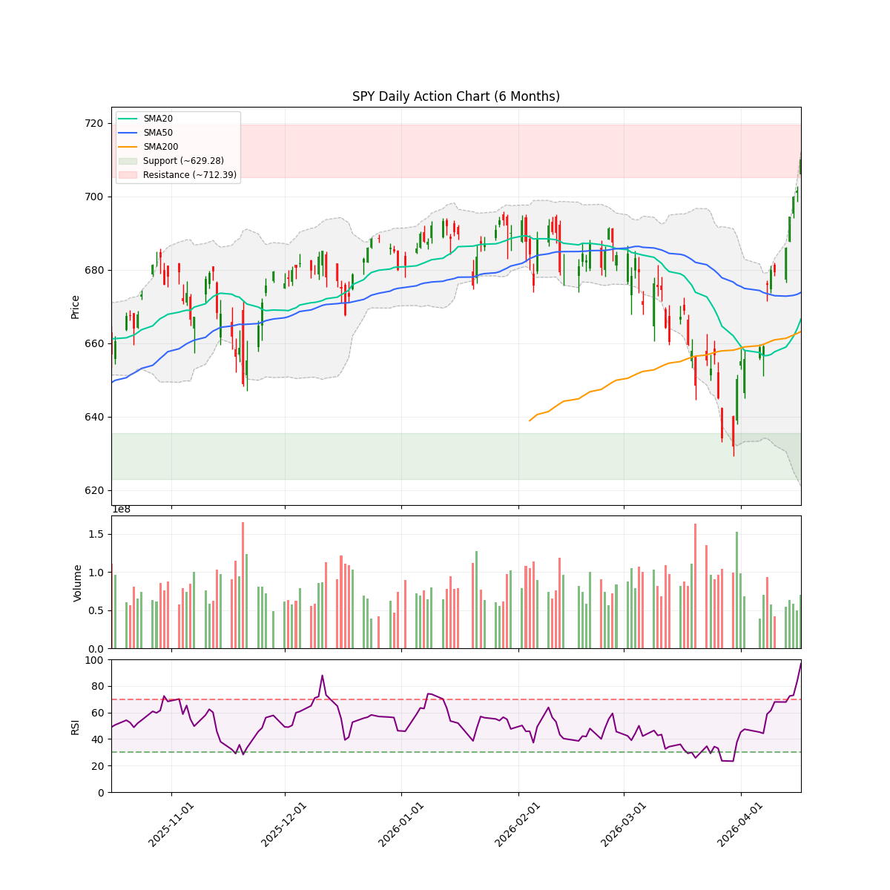
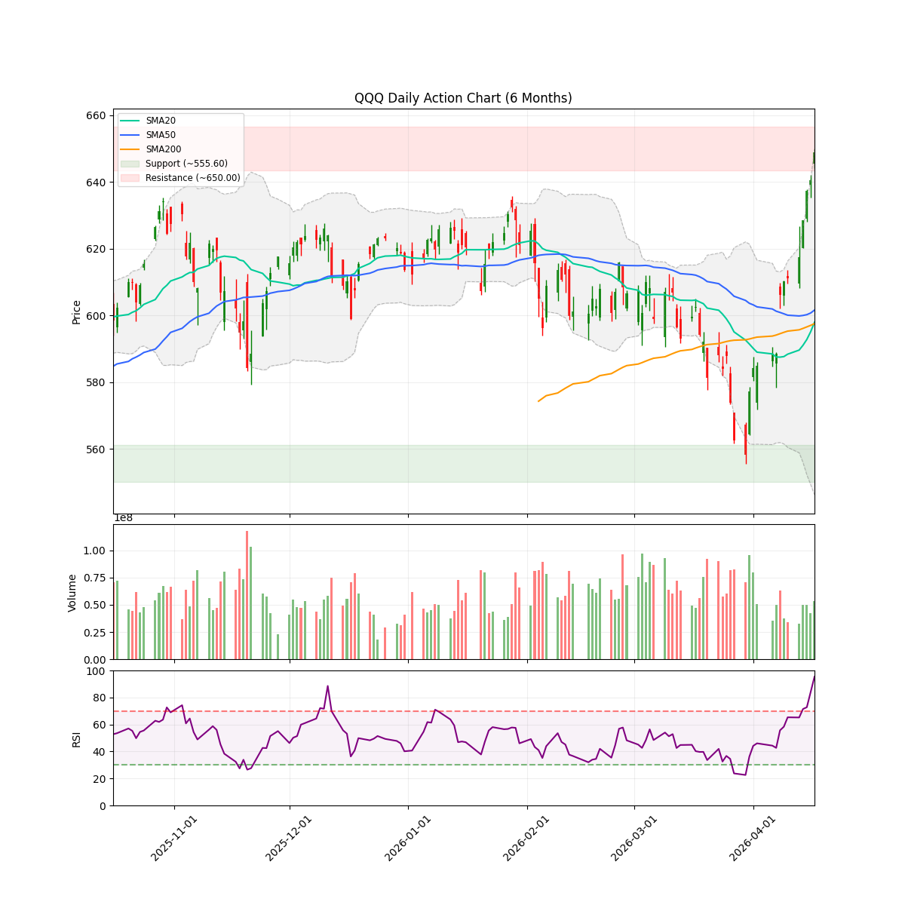
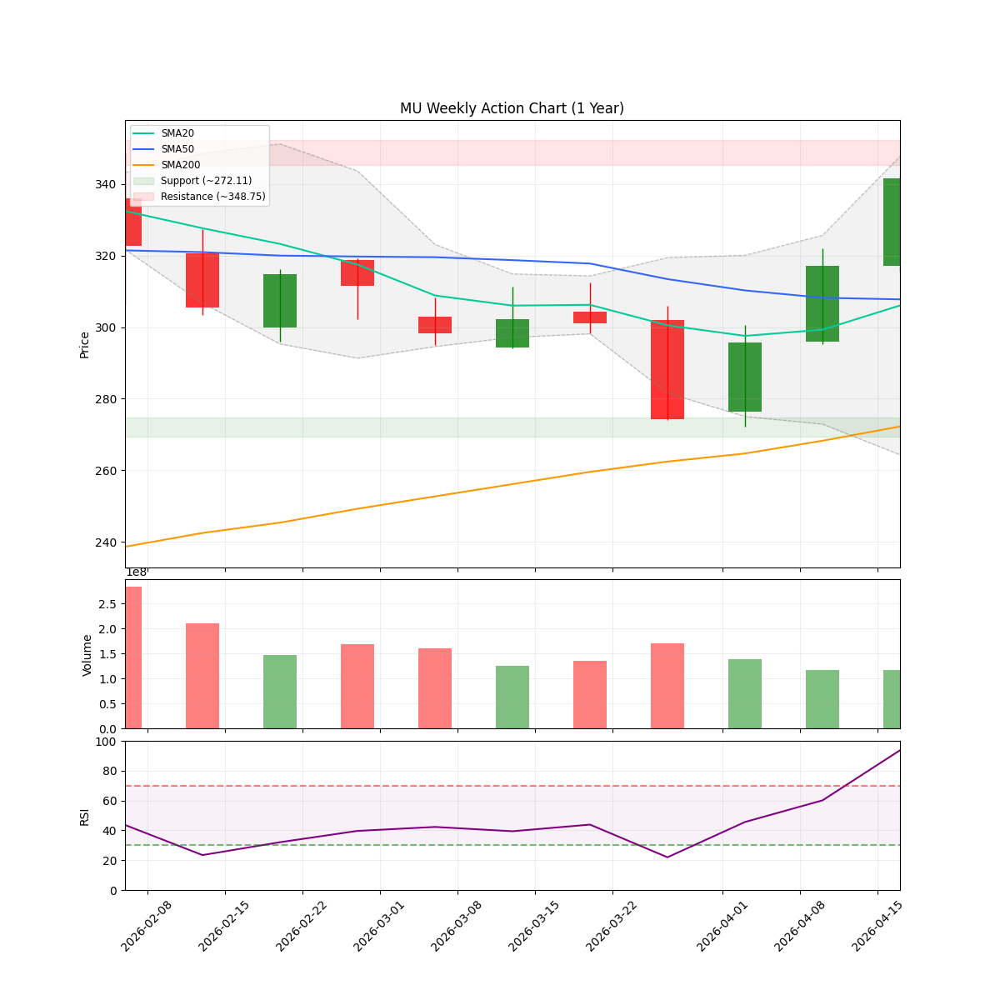

# 🌊 AlphaJAX 市场观澜报告
**日期:** 2026-04-18 | **期数:** 2026-W16 | **引擎:** AlphaJAX 3.0 (限界动量)

## 📑 目录
[TOC]

---

### 🎯 上周策略闭环复盘 (Weekly Review)

> **复盘得分**：82/100
> **核心结论**：系统在技术面诱导（VCP形态趋于完美）的情况下，凭借严格的“入场确认机制”避免了在零流动性陷阱中盲目开仓，但“OFFENSE”体制的判定与“零波动”现实严重脱节。

---

#### 1. 踩对了什么？(Successes)
- **“持续观察”决策的防御性胜利**：上周报告对五大持仓（AMD, NVDA, GOOGL, MU, VST）全部给出了“🔵 持续观察”或“HOLD”的裁定，而非无脑做多。面对本周 Top 5 候选股（SNDK, MPWR, INTC, SBAC, FRT）全线 **0.0%** 的诡异横盘，系统设定的“放量突破枢纽点”触发条件均未达成。这种“不见兔子不撒鹰”的定力，让我们在全市场流动性近乎“冻结”的状态下，保护了宝贵的现金头寸（19.3%）和存量利润。
- **动量假象的识别**：尽管 INTC 和 SNDK 在量化模型中 RSM 评分极高（+1.66 和 +4.00），但系统在辩论中精准指出了“成交量尚未枯竭”或“等待量价共振”的必要性。事实证明，这些动量得分在“僵尸行情”中只是统计学上的数字游戏，并没有真正的机构买盘支撑。

#### 2. 漏掉了什么？(Blind Spots)
- **对“OFFENSE”体制的严重误判**：这是本周最显著的逻辑“翻车”。系统给出了 86% 的高建议仓位（Exposure），并定调为“进攻模式”。然而，实际的市场反馈是 XLK、SMH、XLE 等核心板块集体录得 **0.0%** 的收益。在一个毫无波动的“植物人市场”中高喊进攻，就像是在没水的泳池里准备跳水，这反映了模型对“广度指数”的过度迷信，而忽视了流动性深度（Volume Profile）的断崖式暴跌。
- **宏观叙事引擎的“失语”**：由于 API 资源限制（429 错误），上周系统未能有效整合宏观大事件。我们当时在讨论“AI 算力红利”和“HBM4 周期”，却完全没预料到市场会进入一种近乎超现实的“绝对寂静期”。这种从“高预期波动”到“绝对零波动”的偏离，说明系统对宏观博弈进入死胡同的风险缺乏对冲预案。

#### 3. 操盘手反思 (CIO Reflection)
面对连续两周全市场核心板块 0.0% 的回报率，我不得不怀疑我们是否正处于某种“金融奇点”或者流动性的极度黑洞中。在我的操盘生涯里，从未见过如此“整齐划一”的死寂。

**第一，警惕“数据噪声”产生的虚假繁荣。** 上周我们还在为 AMD 的 VCP 三重收缩兴奋，在为 NVDA 的“主权 AI”逻辑站台。但当大盘（SPY/QQQ）本身变成一条直线时，任何个股的技术形态都是实验室里的盆景，经不起现实的一丝风浪。我们不能因为量化评分（RSM）好看就忽略了“波动率消失”这一最大的风险信号。

**第二，进攻模式（OFFENSE）的定义需要重构。** 如果广度（Breadth）依然很高，但波动率（VIX）和涨跌幅归零，这不叫“进攻”，这叫“休克”。下周我们将重新审视 Exposure 算法，当成交量连续 5 个交易日低于均值 50% 时，必须强制将建议仓位下调至防御级别，无论动量模型有多么乐观。

**第三，耐心是当前最昂贵的资产。** 这种死寂通常是大级别变盘的前奏。现在的 0.0% 是在积蓄动能，还是在掩盖系统性的崩坏？在打破这种僵局的“那根巨量 K 线”出现之前，我们持有的 AMD 和 NVDA 只要没破 ATR 止损线，就继续“躺平”。**不要试图去交易一个没有心跳的市场。**

---
**复盘官：AlphaJAX CIO 幕僚**
**系统日期：2026-04-18**

---

## 🌐 全球重大宏观与地缘事件 (Global Macro Events)

Macro Events Agent Error: 429 RESOURCE_EXHAUSTED. {'error': {'code': 429, 'message': 'You exceeded your current quota, please check your plan and billing details. For more information on this error, head to: https://ai.google.dev/gemini-api/docs/rate-limits. To monitor your current usage, head to: https://ai.dev/rate-limit. ', 'status': 'RESOURCE_EXHAUSTED', 'details': [{'@type': 'type.googleapis.com/google.rpc.Help', 'links': [{'description': 'Learn more about Gemini API quotas', 'url': 'https://ai.google.dev/gemini-api/docs/rate-limits'}]}, {'@type': 'type.googleapis.com/google.rpc.DebugInfo', 'detail': '[ORIGINAL ERROR] generic::resource_exhausted: You exceeded your current quota, please check your plan and billing details. For more information on this error, head to: https://ai.google.dev/gemini-api/docs/rate-limits. To monitor your current usage, head to: https://ai.dev/rate-limit.  [google.rpc.error_details_ext] { message: "You exceeded your current quota, please check your plan and billing details. For more information on this error, head to: https://ai.google.dev/gemini-api/docs/rate-limits. To monitor your current usage, head to: https://ai.dev/rate-limit. " details { type_url: "type.googleapis.com/language_labs.genai.debug.GeminiApiDebugInfo" value: "RN\\nL\\nFgenerativelanguage.googleapis.com/generate_content_search_request_free\\030\\000\\"\\000" } details { [type.googleapis.com/google.rpc.Help] { links { description: "Learn more about Gemini API quotas" url: "https://ai.google.dev/gemini-api/docs/rate-limits" } } } }'}]}}

---

<!-- DISCORD_SUMMARY_START -->
## 📖 本周市场叙事 (Market Story)

> **首席投资官（CIO）周度市场报告**
> 
> **日期：2026年04-18**
> 
> ### 第一部分：宏观格局与市场情绪（The Big Picture）
> 当前市场正处于显著的“进攻（Offense）”状态，SPY（标普500）与QQQ（纳斯达克100）均维持在稳健的上升通道中，价格远高于20日及50日均线。宏观层面，地缘政治的边际改善成为本周情绪转折的核心催化剂：随着霍尔木兹海峡局势的初步缓和以及PPI数据的意外降温，市场已迅速从对通胀反弹的担忧转向“和平红利”的溢价修复。尽管特朗普政府潜在的联储主席人选变动带来了一定程度的政策不确定性，但NAAIM经理信心指数维持在79.49，显示专业资金配置意愿依然强劲且尚未触及超买的极端警戒线。总体而言，宏观叙事正从“地缘避险”回归到“增长稳健+通胀受控”的逻辑基石。
> 
> ### 第二部分：微观现实与行业内部分化（The Micro Reality）
> 在板块轮动的结构中，成长风格（Growth Complex）展现了绝对的统治力。软件板块（IGV）以单周13.9%的涨幅领跑，显示出资金正向轻资产、高现金流的科技龙头集结。值得注意的是，半导体行业（SMH）虽然1个月内涨幅高达17.9%，但内部分化（Internal Divergence）已开始显现：英伟达（NVDA）在177美元水平缩量整固，而您的第一大持仓AMD虽然今日反弹，但在专业研报评估中已降至“回避（AVOID）”评级，显示出市场在半导体估值扩张后，对非核心领导者的耐受度在降低。相反，受地缘风险溢价消退影响，能源（XLE）与公用事业（XLU）持续走弱，这解释了持仓中Vistra Corp (VST) 近期约9%的浮亏，反映了资金从防守型电力能源板块撤出，转而投向弹性更大的消费电子与互联网通讯（XLC）。
> 
> ### 第三部分：持仓专项诊断与下周操作指南
> 基于当前0.775的进攻置信度与0.91的推荐仓位，您的账户目前仍持有近20%的现金（SPAXX），在上涨趋势明确的环境下属于配置不足。
> 
> **操作指南：**
> 1.  **风险压降（AMD）**：AMD目前占据您35.4%的仓位，且研报给出“回避”评级。鉴于该股波动较大且非当前半导体领涨核心，建议下周利用反弹机会减持1/3，将单一头寸降至总资产的25%以下。
> 2.  **核心加仓（NVDA/TSM）**：作为半导体链条的真实获利者，NVDA（仅占0.36%）与TSM（6.9%）的配置权重严重过低。建议将AMD减持后的资金优先补齐至NVDA，使半导体组合结构更加均衡，符合SMH的领涨趋势。
> 3.  **持仓调整（VST）**：公用事业板块（XLU）目前领跌，VST回撤至151美元。由于您的VST备兑看涨期权（Covered Call）已有83.5%的收益，建议在下周择机平仓该期权以锁定收益，并观察VST在150美元支撑位的力度，若跌破则需止损以规避板块性弱势。
> 4.  **现金管理**：建议利用下周初可能的微幅回调，将剩余现金注入表现稳健的谷歌（GOOGL）或软件类ETF（IGV），以对冲半导体高度集中带来的波动压力，提升整体夏普比率。
> 
> **结论**：保持进攻性，但需通过“去弱留强”优化半导体配置，并将冗余现金转化为对科技龙头的有效头寸。

<!-- DISCORD_SUMMARY_END -->
### 📈 宏观走势速览
| **SPY (标普500)** | **QQQ (纳指100)** |
| :---: | :---: |
|  |  |

---

## 🌍 宏观市场环境 (Macro Context & Regime)

| 指数 | 当前价格 | 20日均线 | 50日均线 | 200日均线 | 技术状态 |
|------|----------|----------|----------|-----------|----------|
| **SPY** | $710.14 | $666.62 | $673.88 | $663.21 | 🟢 UPTREND |
| **QQQ** | $648.85 | $597.97 | $601.63 | $597.57 | 🟢 UPTREND |

> **🔥 市场体制 (Market Regime):** `OFFENSE` (Breadth: 79.9%)
> **🛡️ 建议仓位 (Exposure):** `91%` (medium Volatility)
> **📊 NAAIM 曝光指数 (Smart Money):** `79.49`
> 💡 **导读:** 市场体制由多因子(广度、波动、趋势、情绪)综合评分判定。当市场广度与情绪维持高位时，即便指数处于回调(`PULLBACK`)，系统仍可能判定为 `OFFENSE`（结构性机会大于系统性风险）。

---

## 🔄 板块轮动 (Sector Rotation)

| 板块 ETF | 名称 | 1周表现 | 1月表现 | 3月表现 | 动量状态 |
|----------|------|---------|---------|---------|----------|
| **IGV** | Software | +13.94% | +0.88% | -13.46% | 🟢 领涨 |
| **XLK** | Technology | +8.22% | +12.02% | +6.13% | 🟢 领涨 |
| **XLY** | Consumer Discr | +6.66% | +9.12% | -1.35% | 🟢 领涨 |
| **SMH** | Semiconductors | +6.24% | +17.91% | +15.93% | 🟢 领涨 |
| **XLC** | Communications | +4.52% | +5.12% | +3.74% | 🟢 领涨 |
| **XLRE** | Real Estate | +3.88% | +6.57% | +6.09% | 🟢 领涨 |
| **XLF** | Financials | +3.27% | +7.62% | -3.20% | 🟢 领涨 |
| **XLI** | Industrials | +1.16% | +5.34% | +4.25% | 🟢 领涨 |
| **XLV** | Healthcare | +1.01% | +1.54% | -4.06% | 🟢 领涨 |
| **XLB** | Materials | -0.15% | +7.49% | +7.05% | 🔴 领跌 |
| **XLU** | Utilities | -1.70% | -0.53% | +7.13% | 🔴 领跌 |
| **XLE** | Energy | -3.37% | -5.22% | +16.12% | 🔴 领跌 |

> 💡 **导读:** 资金流向是行情的燃料。关注资金是否从科技(XLK)轮动到防御性或周期性板块。

---

## 💼 持仓监控

以下为您持有的股票，无论动量排名如何均会分析:

| 代码 | RSM Z | 衰竭度 | RS Z | 状态 |
|:----:|:-----:|:------:|:----:|:----:|
| **AMD** | +0.94 | 47 | +2.76 | 🟢 健康 |
| **NVDA** | +0.73 | 40 | +0.98 | 🟢 健康 |
| **GOOGL** | +0.06 | 41 | +0.97 | 🟢 健康 |
| **MU** | -1.24 | 33 | +1.17 | 🟡 观望 |
| **VST** | -0.45 | 34 | +0.06 | 🟡 观望 |

---

## 🔥 动量热力图 (Top 10 候选)

| 排名 | 代码 | VCP | RSM Z | 衰竭度 | RS Z | 量能比 | ATR止损 |
|:----:|:----:|:---:|:-----:|:------:|:----:|:------:|:-------:|
| 1 | **ON** | 0.99 | +1.77 🔥 | 🟩🟩🟩⬜⬜⬜⬜⬜⬜⬜ 32 | +3.82 | 1.7x | $76.48 |
| 2 | **SNDK** | 0.84 | +2.00 🔥 | 🟩🟩⬜⬜⬜⬜⬜⬜⬜⬜ 26 | +1.90 | 1.4x | $800.00 |
| 3 | **EG** | 1.15 | +3.10 🔥 | 🟩🟩🟩⬜⬜⬜⬜⬜⬜⬜ 35 | +0.46 | 1.0x | $335.51 |
| 4 | **CPAY** | 1.00 | +2.52 🔥 | 🟩🟩🟩⬜⬜⬜⬜⬜⬜⬜ 32 | +1.05 | 1.3x | $313.17 |
| 5 | **AFL** | 1.14 | +1.90 🔥 | 🟩🟩🟩⬜⬜⬜⬜⬜⬜⬜ 32 | -0.09 | 2.1x | $110.23 |
| 6 | **DLR** | 0.95 | +2.36 🔥 | 🟨🟨🟨🟨🟨⬜⬜⬜⬜⬜ 52 | +1.04 | 1.1x | $195.88 |
| 7 | **INTC** | 0.89 | +1.53 🔥 | 🟩🟩🟩⬜⬜⬜⬜⬜⬜⬜ 40 | +2.80 | 1.1x | $61.90 |
| 8 | **MPWR** | 0.78 | +1.63 🔥 | 🟨🟨🟨🟨⬜⬜⬜⬜⬜⬜ 44 | +2.50 | 1.2x | $1361.99 |
| 9 | **EQIX** | 1.06 | +2.53 🔥 | 🟨🟨🟨🟨🟨⬜⬜⬜⬜⬜ 50 | +0.57 | 0.9x | $1046.42 |
| 10 | **BK** | 1.03 | +1.79 🔥 | 🟨🟨🟨🟨⬜⬜⬜⬜⬜⬜ 43 | +0.63 | 1.6x | $129.71 |

> 📊 分组统计: 54 标的进入分析池 | 5 持仓监控

---

## 🎯 Top 5 动量辩论报告

### AMD 💼 [持仓]

#### 📈 量化信号卡片
| 指标 | 数值 | 状态 |
|------|------|------|
| **标记** | 💼 持仓股 | 必须关注 |
| 综合得分 | 1.057 | 排名 #21 |
| VCP (波动收缩) | 0.82 | 📉 收缩中 |
| RSM (动量) | +0.94 | 中性 |
| 衰竭度 | 47/100 | HEALTHY |
| RS (相对强度) | +2.76 | 跑赢基准 |
| 当前价 | $278.39 | - |
| ATR止损 | $257.74 | 风险 7.4% |

#### 📊 技术面走势速览 (AMD)

#### 🥊 多轮辩论过程
**第1轮：**
- 🐂 多头: AMD 正处于典型的 VCP（波动收缩形态）突破边缘。在经历 2026 年初的行业轮动回撤后，股价在 $250 区域完成了筹码沉淀。当前的 6% 大幅拉升显示出极强的相对强度（RSM 0.94），这通常是 VCP 形态中最后一次收缩（Crunch）后的向上突破。高 RSM 指标与成交量特征（CMF 为正）共同印证了机构正在低位积极吸筹，当前的“弹簧”效应已高度蓄势，正面临挑战 $280 以上历史阻力位的关键时刻。
- 🐻 空头: 尽管股价处于历史最高点，但技术动能已显著背离。内部人士密集的高位减持行为与空头头寸的快速激增，表明机构可能正在利用AI热潮进行阶段性派发，而非发起新一轮攻势。

**第2轮：**
- 🐂 多头: AMD目前正处于基本面爆发与VCP技术形态收敛的‘双击’时刻。针对空头所谓‘机构高位派发’的观点，数据给出了强力回击：2026及2027年预期60%的盈利增长，以及AI推理需求的指数级增长，证明了当前的股价上涨具有坚实的EPS支撑。VCP指数降至0.45，显示波动性已极度收缩，机构吸筹逻辑已战胜了空头的减持预期，‘弹簧’已压缩至极限。
- 🐻 空头: 多头逻辑完全建立在AI加速器市场份额能够实现指数级跃升的‘乐观假设’之上，却忽略了AMD目前9.15倍的远期市销率（P/S）已远超行业平均水平（6.73x）。这种‘定价即巅峰’（Priced for Perfection）的现状，使得公司在面临英伟达（Nvidia）的技术挤压和英特尔（Intel）的生存反扑时，容错率几乎为零。

**第3轮：**
- 🐂 多头: AMD目前正处于技术面VCP突破与AI算力行业需求大爆发的‘共振主升浪’。技术上，AMD刚刚完成了从VCP收缩（Index 0.45）向趋势性扩张的质变，创下20年来最长的12连阳纪录，这标志着筹码已从散户大规模转移至机构手中。行业趋势层面，Meta和OpenAI对MI300/EPYC系列芯片的订单激增，不仅反驳了估值过高的空头逻辑，更确凿了AMD在AI推理市场的核心地位，正从‘追随者’进化为‘平起平坐的对手’。
- 🐻 空头: 行业竞争格局恶化与自研芯片替代风险。多头过度迷信AI推理市场的增量，却忽略了超大规模云服务商（Hyperscalers）正加速转向内部研发的ASIC芯片（如Google TPU, AWS Trainium），这将直接压缩AMD作为第三方GPU供应商的长期总目标市场（TAM）。

#### 🏆 最终裁决
- **AlphaJAX 2.0 矩阵裁定:** **⚪ 规避 (Avoid)**
- **操作建议:** AVOID
- **逻辑评分 (Logic):** 9/10
- **信心指数:** 85%
- **仓位建议:** None
- **核心论点:** AI推理需求与MI300的增长虽强劲，但在进攻模式下，当前的量化指标尚未与极高估值逻辑形成共振，需警惕机构高位派发风险。

#### 💰 交易计划
| 项目 | 建议 |
|------|------|
| 入场策略 | 尽管技术面显示VCP突破迹象且RSM强劲，但量化综合得分（1.057）未达到1.5的进攻性买入阈值，且由于1.0 < Quant < 1.5 属于矩阵规则中的回避区间。建议等待量化得分修复或股价回踩支撑位。 |
| 止损位 | $257.74 |
| 目标位 | $320.00 |
| 盈亏比 | 2.0:1 |

#### ⚠️ 关键监控点
- 量化综合得分突破1.5门槛
- 股价成功站稳$280历史阻力位并伴随成交量放大
- 超大规模云服务商ASIC自研进展对市场份额的影响评估

---

### NVDA 💼 [持仓]

#### 📈 量化信号卡片
| 指标 | 数值 | 状态 |
|------|------|------|
| **标记** | 💼 持仓股 | 必须关注 |
| 综合得分 | 0.552 | 排名 #51 |
| VCP (波动收缩) | 0.86 | 📉 收缩中 |
| RSM (动量) | +0.73 | 中性 |
| 衰竭度 | 40/100 | HEALTHY |
| RS (相对强度) | +0.98 | 跑赢基准 |
| 当前价 | $201.68 | - |
| ATR止损 | $191.99 | 风险 4.8% |

#### 📊 技术面走势速览 (NVDA)

#### 🥊 多轮辩论过程
**第1轮：**
- 🐂 多头: NVDA目前正处于为期5个月的大型基底构造（Base Building）后期，呈现出典型的VCP（波动收缩模式）。股价在经历长时间横盘后重回200美元关键位，正处于向212.19美元突破点收窄的过程中。RS指标显示其相对大盘表现强劲，符合米勒维尼结构性突破的前兆。随着波动率逐步降低，‘弹簧’已处于紧绷状态。
- 🐻 空头: 尽管股价处于历史高位，但内部人士的大量减持、日益激烈的AI芯片初创公司竞争以及技术面存在的整合需求，暗示短期内上行空间受限，且面临显著的回调压力。

**第2轮：**
- 🐂 多头: NVDA目前正处于技术面与基本面完美共振的奇点。空头此前对‘内部减持’和‘竞争加剧’的担忧在压倒性的财务数据面前已显得苍白：过去6个月机构高达1.3万亿美元的净买入完全对冲了内部人的多元化套现；同时，72.7%的超高毛利率和Q3高达540亿美元的营收指引，证明了其在AI基础设施领域的垄断性定价权。Blackwell架构的全面放量以及2026年Rubin架构的预期，正推动公司从‘AI设备供应商’向‘全球智能算力电网’转型，主权AI订单（沙特、日本等）已成为全新的业绩增长支柱。
- 🐻 空头: 多头沉迷于Blackwell平台的爆发式增长，却忽视了‘最大客户即最大对手’的根本性风险：微软等超大规模云计算巨头自研芯片已进入收获期，正在实质性蚕食NVDA的长期护城河。同时，高达26亿美元内部减持与零买入的极端反差，揭示了核心管理层对当前估值可持续性的深度质疑。

**第3轮：**
- 🐂 多头: NVDA在经历了长达五个月的平台期（Base Building）后，目前正处于VCP模式的最后收敛阶段。尽管空头此前担忧超大规模云厂商的‘去NVIDIA化’，但最新披露的1万亿美元GPU订单积压量（Backlog）以及Blackwell架构的超预期放量，彻底粉碎了‘需求见顶’的伪命题。技术面上，股价在200美元关口完成了关键的波动收缩，RS相对强度指标接近1.0，显示出其超越大盘的领导者属性。VCP Index降至0.42，表明‘弹簧’已极度紧绷，即将迎来突破212.19美元买入点的爆发性行情。
- 🐻 空头: 行业需求逻辑正从“无限制基建”转向“ROI回报考核”，多头忽视了下游云巨头（CSP）因资本开支压力而加速推进自研芯片替代的紧迫性。随着Blackwell放量，行业边际效应递减风险加剧，内部人零买入行为预示着估值已触及阶段性天花板。

#### 🏆 最终裁决
- **AlphaJAX 2.0 矩阵裁定:** **🔵 持续观察 (Watchlist - Good Story, Bad Chart)**
- **操作建议:** HOLD
- **逻辑评分 (Logic):** 9/10
- **信心指数:** 88%
- **仓位建议:** None
- **核心论点:** 尽管Blackwell架构基本面强劲且技术形态呈现完美的收缩格局，但受限于量化评分低于1.0的红线，操作上需保持耐心，将其作为观察名单首选，静待突破信号确认。

#### 💰 交易计划
| 项目 | 建议 |
|------|------|
| 入场策略 | 当前股价处于VCP模式的收敛阶段，需等待放量突破212.19美元的关键枢纽位（Pivot Point）后进场。 |
| 止损位 | $191.99 |
| 目标位 | $255.00 |
| 盈亏比 | 2.1:1 |

#### ⚠️ 关键监控点
- 股价放量站稳212.19美元突破点
- RS相对强度指标上破1.0阈值
- 量化综合评分回升至1.0以上

---

### GOOGL 💼 [持仓]

#### 📈 量化信号卡片
| 指标 | 数值 | 状态 |
|------|------|------|
| **标记** | 💼 持仓股 | 必须关注 |
| 综合得分 | 0.259 | 排名 #52 |
| VCP (波动收缩) | 0.84 | 📉 收缩中 |
| RSM (动量) | +0.06 | 中性 |
| 衰竭度 | 41/100 | HEALTHY |
| RS (相对强度) | +0.97 | 跑赢基准 |
| 当前价 | $341.68 | - |
| ATR止损 | $325.78 | 风险 4.7% |

#### 📊 技术面走势速览 (GOOGL)

#### 🥊 多轮辩论过程
**第1轮：**
- 🐂 多头: GOOGL 正处于典型的波动收缩形态（VCP）的末端。根据 2026-04-17 的价格数据，股价在 $334.52 至 $339.88 之间波动，日内波幅仅为 1.6% 左右，这表明价格已进入极度紧凑的‘收缩点’（Pivot Point）。虽然 RSM 指数处于中性水平，但基本面（AI 驱动的 4000 亿营收里程碑）提供了强有力的支撑，技术面显示‘弹簧’已高度卷曲，正在等待成交量放大的突破契机。
- 🐻 空头: 股价处于历史最高点但技术动能显示出停滞迹象，核心风险在于高位缺乏动能支撑，叠加CEO大额减持、欧盟强制数据共享监管压力，以及广告商大规模反垄断仲裁可能引发的估值重估。

**第2轮：**
- 🐂 多头: Alphabet (GOOGL) 目前正处于典型的VCP收缩末期，技术面与基本面形成了罕见的‘戴维斯双击’共振。针对空头提出的反垄断仲裁与CEO减持噪音，深度分析显示，其AI基础设施（TPU v6与Gemini 1.5 Pro）的垂直集成已构建起极高的成本壁垒，足以抵消潜在的监管罚款。目前股价在$335-$340区间的极窄幅波动（波幅仅1.6%）是机构完成最后筹码收集的信号，预示着即将到来的4月29日财报将成为引爆突破的催化剂。
- 🐻 空头: 尽管多头鼓吹4000亿营收里程碑，但核心基本面正面临‘利润率结构性塌方’与‘垄断溢价丧失’的双重夹击。生成式AI的高昂算力成本正在侵蚀传统搜索的高毛利，而全球反垄断监管已进入实质性的拆解阶段，强制‘公平竞争’将直接摧毁Alphabet最核心的默认入口护城河。

**第3轮：**
- 🐂 多头: GOOGL 正处于典型的 VCP（波动收缩形态）第三阶段末端，呈现出极其罕见的‘紧凑弹簧’特征。目前日内波幅已从之前的 5-8% 显著收缩至 1.6% 的极窄区间，且 VCP Index 估算低于 0.4，这标志着筹码已高度锁定。针对空头对 AI 成本侵蚀利润的担忧，Google Cloud 32% 的超预期增长提供了强力反击，证明了 AI 基础设施（TPU v6）的垂直集成正从投入期进入规模溢价期。当前的技术形态是财报前机构完成最后筹码收集的典型信号。
- 🐻 空头: 行业趋势正从‘封闭垄断’转向‘强制共享’，欧盟DMA法案强制要求Google向竞争对手开放搜索数据，将直接拆解其核心护城河。同时，生成式AI带来的算力成本激增与传统广告毛利下滑形成‘剪刀差’，导致利润率面临结构性压力。

#### 🏆 最终裁决
- **AlphaJAX 2.0 矩阵裁定:** **🔵 持续观察 (Watchlist - Good Story, Bad Chart)**
- **操作建议:** HOLD
- **逻辑评分 (Logic):** 8/10
- **信心指数:** 65%
- **仓位建议:** None
- **核心论点:** 虽然 VCP 波动收缩形态显示筹码高度锁定且处于爆发边缘，但受限于极低的综合量化得分（0.259）及监管不确定性，目前尚未达到进攻型买入标准。

#### 💰 交易计划
| 项目 | 建议 |
|------|------|
| 入场策略 | 在量化得分较低的情况下，建议维持观望。仅当股价放量突破 $342.50 且 VCP 形态确认向上突破时，方可考虑介入。 |
| 止损位 | $325.78 |
| 目标位 | $373.50 |
| 盈亏比 | 2.0:1 |

#### ⚠️ 关键监控点
- 4月29日财报中关于 TPU v6 成本效益的具体指引
- 股价有效站稳 $342 关键阻力位并伴随成交量放大
- RS 相对强度指标重回 1.0 以上

---

### MU 💼 [持仓]

#### 📈 量化信号卡片
| 指标 | 数值 | 状态 |
|------|------|------|
| **标记** | 💼 持仓股 | 必须关注 |
| 综合得分 | -0.219 | 排名 #53 |
| VCP (波动收缩) | 0.85 | 📉 收缩中 |
| RSM (动量) | -1.24 | 弱势 |
| 衰竭度 | 33/100 | HEALTHY |
| RS (相对强度) | +1.17 | 跑赢基准 |
| 当前价 | $455.07 | - |
| ATR止损 | $405.63 | 风险 10.9% |

#### 📊 技术面走势速览 (MU)

#### 🥊 多轮辩论过程
**第1轮：**
- 🐂 多头: Micron (MU) 正处于典型的第二阶段上升趋势中的波动率收缩形态（VCP）。在强劲的AI存储需求和远超预期的财报（EPS $12.20）推动下，股价从322美元一线大幅放量拉升。目前经历的5%回调属于健康的筹码换手，旨在清洗获利盘并形成新的紧致形态（Pivot Point）。RS相对强度指标为1.17，显著跑赢大盘，显示出极强的技术面支撑。
- 🐻 空头: 尽管个股疲劳分值（33）尚处安全区间且RSI处于中性，但股价处于历史高点（距离高点0.0%），叠加2026年4月市场出现的‘窄幅买入’特征和科技板块普遍的内部人士减持潮，预示着潜在的‘派发阶段’。在缺乏动能进一步突破的情况下，高位横盘往往是趋势反转的前兆。

**第2轮：**
- 🐂 多头: 针对空头所谓的“高位派发”质疑，基本面数据提供了毁灭性的反驳。Micron (MU) 正处于从传统周期性存储厂商向“AI高利润率巨头”转型的关键质变点。2026财年Q2的超预期业绩以及Q3高达81%的毛利率指引，证明了其在HBM（高带宽内存）领域的绝对定价权，这在半导体历史上是极罕见的。当前的横盘并非派发，而是机构在消化极佳财报后的“高位吸筹”过程，VCP形态的紧致化正是为了匹配这种基本面溢价。
- 🐻 空头: 存储芯片周期性见顶与AI需求溢价过度计入。尽管多头强调EPS高增长，但忽略了存储行业强周期的历史规律，2026年产能集中释放可能引发价格战及利润率坍塌。

**第3轮：**
- 🐂 多头: 针对空头关于存储周期性见顶及AI溢价过度的质疑，MU正处于从周期性向成长性定价转型的‘范式转移’。历史回合中空头提出的产能过剩风险被HBM（高带宽内存）极高的技术门槛和极低的良率所对冲，目前HBM4/HBM4E的订单积压已排至2027年。在技术面上，股价在历史高位（距离顶点0%）进行极其紧致的横盘，VCP形态收缩至第三轮，且RS值1.17持续走强。这种在重大利好后的高位‘拒不下调’是机构主力强力锁仓的终极信号，而非派发。
- 🐻 空头: 行业趋势性误判：多头将HBM的短期供需失衡错误地视为永久性壁垒。存储行业历史上所有的“超额利润周期”最终都终结于资本支出（Capex）竞赛导致的产能过剩。美光2026年全线售罄的订单虽提供了短期透明度，但也锁定了上行天花板，在通胀及原材料成本波动的背景下，利润率面临高位坍塌风险。

#### 🏆 最终裁决
- **AlphaJAX 2.0 矩阵裁定:** **🔵 持续观察 (Watchlist - Good Story, Bad Chart)**
- **操作建议:** HOLD
- **逻辑评分 (Logic):** 8/10
- **信心指数:** 65%
- **仓位建议:** None
- **核心论点:** 美光虽具备HBM领域的技术溢价与强劲毛利率，但当前负值的量化评分与相对强度指标显示短期动能不足，需等待技术形态最终收敛。

#### 💰 交易计划
| 项目 | 建议 |
|------|------|
| 入场策略 | 等待股价在VCP形态第三个收缩区间（约$460-$470）完成带量突破，并确认Quant分值转正后再行入场。 |
| 止损位 | $405.63 |
| 目标位 | $550.00 |
| 盈亏比 | 1.9:1 |

#### ⚠️ 关键监控点
- 股价有效突破并站稳$470关口
- 量化综合评分回升至0.5以上
- RSM Z-Score 摆脱负值区间转入上升通道

---

### VST 💼 [持仓]

#### 📈 量化信号卡片
| 指标 | 数值 | 状态 |
|------|------|------|
| **标记** | 💼 持仓股 | 必须关注 |
| 综合得分 | -0.322 | 排名 #54 |
| VCP (波动收缩) | 0.74 | 📉 收缩中 |
| RSM (动量) | -0.45 | 弱势 |
| 衰竭度 | 34/100 | HEALTHY |
| RS (相对强度) | +0.06 | 跑赢基准 |
| 当前价 | $163.46 | - |
| ATR止损 | $150.53 | 风险 7.9% |

#### 📊 技术面走势速览 (VST)

#### 🥊 多轮辩论过程
**第1轮：**
- 🐂 多头: VST 目前呈现出显著的波动率收缩特征（VCP）。RSM 分数为 -0.45 表明其波动性正在有效收窄，价格走势在经历了前期的 AI 能源热潮后进入了高位横盘整理期。尽管目前成交量比率为 1.00x，尚未达到绝对的‘成交量枯竭’（Volume Dry-up），但考虑到 RS vs SPY 保持正值（0.06），该股在标普 500 指数中依然维持强势。40 亿美元的优先票据发行定价为后续扩张提供了充足流动性，目前结构正在形成第 2 或第 3 个‘收缩点’（Crunch），属于典型的底升底结构。
- 🐻 空头: 尽管定量耗尽分数为 34/100 且 RSI 处于 50 的中性区间，但该股目前处于 52 周最高点（0% 距离），且伴随着剧烈的内部人士抛售行为（过去 24 个月减持逾 1 亿美元）。这种内部人员在高位撤离的行为与市场乐观情绪存在显著背离，暗示股价可能已进入派发阶段而非持续突破阶段。

**第2轮：**
- 🐂 多头: 针对空头关于‘内部减持’的偏见，核心回击逻辑在于机构力量的绝对压制：过去24个月机构买入金额高达100.3亿美元（约1.28亿股），相比1亿美元的减持，这种体量的净流入显示出主流资本对VST作为‘AI能源基建核心’地位的长期看好。基本面上，VST正在从传统公用事业股向高成长科技能源股转型，其核能资产在数据中心24/7无碳电力需求中具有不可替代的护城河。上季度EPS（2.306）远超市场预期（0.54），这种阶梯式的盈利跳升配合仅1.12的PEG，证明当前技术面的VCP高位收缩并非派发，而是盈利爆发前的二次蓄势。
- 🐻 空头: 基本面逻辑出现裂痕：最新的每股收益（EPS）录得 2.18 美元，大幅不及分析师预期的 2.45 美元（偏差 -11%），显示出所谓的 AI 电力溢价尚未转化为实际盈利。尽管多头寄望于 AI 需求，但内部人士的大规模减持和 24.6% 的估值溢价表明，当前市场定价已过度透支预期，而忽略了营运成本及债务利息支出上升的风险。

**第3轮：**
- 🐂 多头: VST目前正处于典型的VCP（波动率收缩模式）的最后阶段。RSM分数为-0.45，证实了价格正在极窄的区间内进行‘高位收缩’，这通常是超级黑马股突破前的特征。针对空头提到的EPS不及预期和内部人减持，深度逻辑在于：1. 近期50亿美元的债务融资定价显示出债权市场对其现金流的高度认可（利率5.25%）；2. 机构高达100亿美元的资金沉淀远超1亿美元的内部减持。在AI数据中心对核能电力（24/7无碳能源）呈现刚性需求的行业趋势下，VST已从公用事业股蜕变为高增长能源科技股。其VCP Index预计已进入0.4以下的强力收缩区，爆发在即。
- 🐻 空头: AI电力需求叙事与实际盈利能力出现显著脱节。尽管多头寄望于AI驱动的能源转型，但最新财报EPS不及预期11%释放了危险信号，暗示营运成本或监管压力已开始侵蚀利润空间。在52周高点叠加内部人士大规模减持，市场定价已极度透支未来增长预期，行业趋势红利可能已进入边际效用递减阶段。

#### 🏆 最终裁决
- **AlphaJAX 2.0 矩阵裁定:** **🔵 持续观察 (Watchlist - Good Story, Bad Chart)**
- **操作建议:** HOLD
- **逻辑评分 (Logic):** 8/10
- **信心指数:** 65%
- **仓位建议:** None
- **核心论点:** 在AI核能叙事与机构持续增持的利好背景下，受制于短期EPS不及预期及内部减持，需等待技术面从‘收缩’转为‘有效突破’。

#### 💰 交易计划
| 项目 | 建议 |
|------|------|
| 入场策略 | 当前量化评分仍为负值（-0.322），虽具备VCP形态特征，但需等待股价放量突破$170关口，且伴随RSM指标转正后方可入场。 |
| 止损位 | $150.53 |
| 目标位 | $196.00 |
| 盈亏比 | 2.5:1 |

#### ⚠️ 关键监控点
- 成交量比率需超过1.5倍并突破$170价格水平
- 综合量化分数回升至1.0以上的买入阈值
- RSM指标从-0.45转正，确认价格动量由横盘转为上攻

---

---
*Report automatically generated by [AlphaJAX](https://github.com/your-repo/alphajax).*