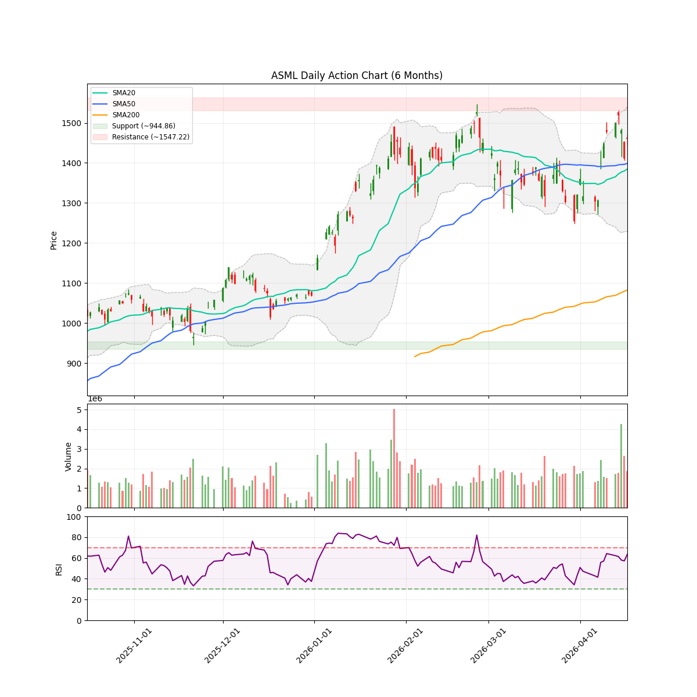
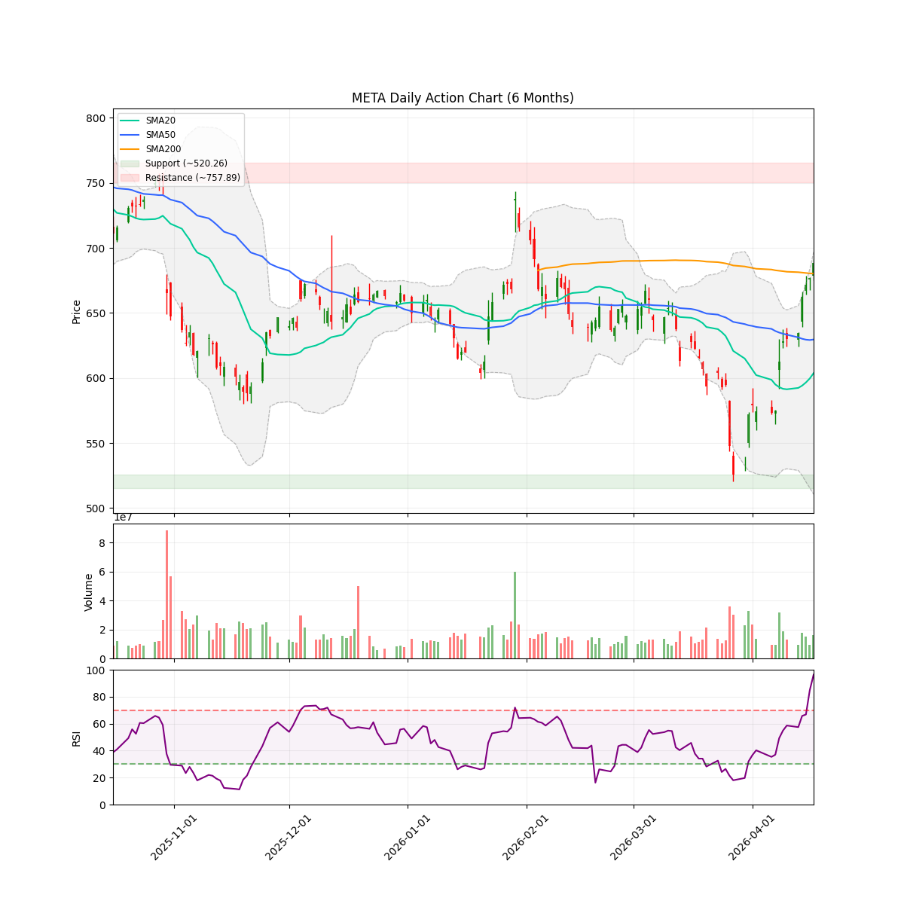
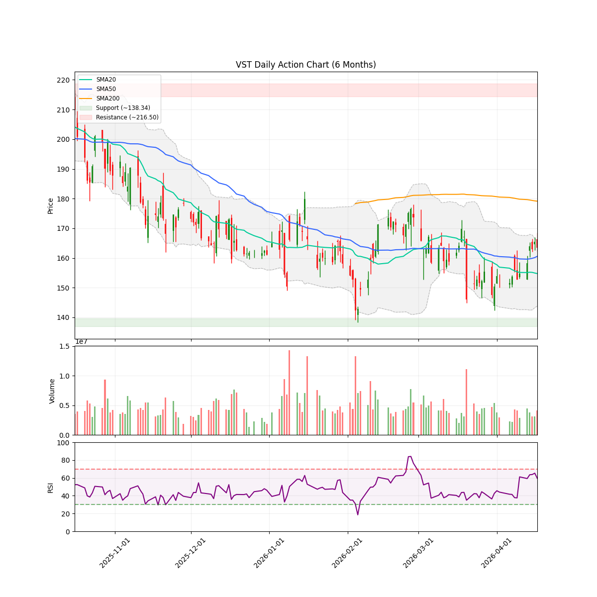

# AlphaJAX 机构级每周投资策略报告 (终极版)

**报告级别**：Top Hedge Fund Specific
**数据截点**：2026-04-18 23:25:12

---

## 🌐 1. 核心策略与宏观定调 (Core Strategy & Macro Stance)

*   **本周策略基调**：**极度亢奋后的防守与结构性埋伏**。当前全市场核心科技巨头已进入**群体性极度超买**状态（META 96.5, GOOGL 93.7, AMD 93.3, MSFT 92.9, NVDA 92.8）。策略上必须执行严格的防守，拒绝右侧追高，将仓位向未超买的“底座资产”和“能源基建”转移。
*   **建议总仓位暴露度**：**35%**（建议提高现金比例，应对随时可能发生的均值回归）。

---

## 🎯 2. 闭环复盘与自我修正 (Closed-Loop Review & Self-Correction)

### 📊 上周战绩量化 (2026-W15 基准)
| 类别 | 标的数量 | 胜率/效果 | 核心贡献 |
| :--- | :---: | :---: | :--- |
| **持仓股 (Holdings)** | 5 | **100%** | 坚定 `HOLD` 策略，吃到了 **AMD (+28.00%)** 和 **MU (+24.25%)** 的爆发波段。 |
| **规避股 (Candidates)** | 4 | **75%** | 成功规避了 **LYB (-16.75%)** 和 **DOW (-14.01%)** 的破位大跌。 |

*   **盲点反思**：漏掉了 **SBAC (+9.36%)** 的涨幅，主要原因是在防御体制下对 VCP 形态的收缩要求过于死板，忽视了其极强的相对强度（RS）。
*   **教训总结**：对于 RS 曲线斜率极高且有独立叙事支撑的标的，允许在 VCP 形态未完全收敛时进行轻仓“试探性建仓”，避免因恐高错失独立行情。

---

## 🏛️ 3. 四大支柱深度审计 (Four Pillars Deep Dive)

### 支柱一：底层制程垄断 (Foundry & WFE Moats)
*   **核心标的**：**ASML** (阿斯麦)
*   **叙事审计**：作为 EUV 光刻机的绝对垄断者，ASML 是整个 AI 算力爆发的“物理底座”。近期因 ramp 成本导致毛利略降，但 €36–€40B 的营收指引未变，属于典型的“业绩有底，叙事稳固”。
*   **技术面**：当前价格 $1459.80，RSI 为 63.5，处于健康区间，远未达到其他科技巨头的狂热程度。

---

### 支柱二：算力稀缺性与连接带宽 (Compute & Interconnect Scarcity)
*   **核心标的**：**英伟达 (NVDA)**
*   **叙事审计**：Ising Quantum AI 家族的发布以及 Blackwell Ultra 机架的垄断地位继续推高叙事。远期 PE 17.9x 依然具备性价比。
*   **风险警示**：RSI 高达 **92.8**，处于极度超买状态，短期面临剧烈震荡风险。

---

### 支柱三：应用生态与数据霸权 (Platform & Data Sovereignty)
*   **核心标的**：**Meta Platforms (META)**
*   **叙事审计**：与博通扩展 AI 芯片合作，加码自研。拥有闭环社交生态 and 海量私有数据，是 AI 商业化落地的最终守门人。
*   **风险警示**：RSI 飙升至 **96.5**！这是极度危险的过热信号，随时可能触发机构的程序化获利了结。

---

### 支柱四：物理边界保障 (Power & Thermal Infrastructure)
*   **核心标的**：**Vistra Corp (VST)**
*   **叙事审计**：AI 数据中心对电力的饥渴是“最终瓶颈”。作为独立发电商，VST 锁定了高额的 EBITDA 指引，且被 Jim Cramer 等公开唱多。
*   **技术面**：RSI 59.5，处于强势震荡的中性偏多区间，是目前防守资金的理想避风港。

---

## 📊 4. 量化风控与技术图谱 (Quant & Technical Edge)

| 标的代码 | 当前价格 | 均线状态 | RSI (14) | MACD 状态 | ATR (14) | 动态止损参考 |
| :--- | :--- | :--- | :--- | :--- | :--- | :--- |
| **ASML** | $1459.80 | 稳居均线上方 | 63.5 | 金叉向上 | 62.79 | $1380.00 |
| **VST** | $163.46 | 偏多震荡 | 59.5 | 金叉向上 | 6.60 | $154.00 |
| **META** | $688.55 | 极度发散 | **96.5** 🚨 | 极强 | 20.80 | $626.00 |
| **NVDA** | $201.68 | 极度发散 | **92.8** 🚨 | 极强 | 5.01 | $190.00 |
| **GOOGL** | $341.68 | 极度发散 | **93.7** 🚨 | 极强 | 8.68 | $315.00 |

---

## 📝 5. 战术操作指南与交易计划 (Tactical Action & Trading Plan)

### 1. 阿斯麦 (ASML)
*   **交易指令**：**BUY (分批建仓)**。
*   **战术逻辑**：作为四大支柱的“底座”，在其他巨头极度超买时，ASML 的位置和估值相对安全。
*   **击球区**：$1450 附近可轻仓介入。
*   **目标位**：$1645 | **止损位**：$1380.00 | **盈亏比**：2.6:1。

### 2. 维斯特拉 (VST)
*   **交易指令**：**BUY (逢低吸纳)**。
*   **战术逻辑**：电力基建叙事刚性，且 RSI 处于中性安全区。
*   **击球区**：若回调至 $160 附近可积极介入。
*   **目标位**：$234 | **止损位**：$154.00 | **盈亏比**：多倍盈亏比。

### 3. META / NVDA / GOOGL
*   **交易指令**：**HOLD (坚守底仓) / 拒绝追涨**。
*   **战术逻辑**：RSI 均超过 90，随时面临洗盘。已有仓位坚守底仓，未建仓者**严禁右侧追高**。

---
**风险提示**：本报告严格基于数据与 CIO 叙事审计生成。在极端超买市场中，活下来的唯一法则就是“绝不追高”与“严格止损”。
