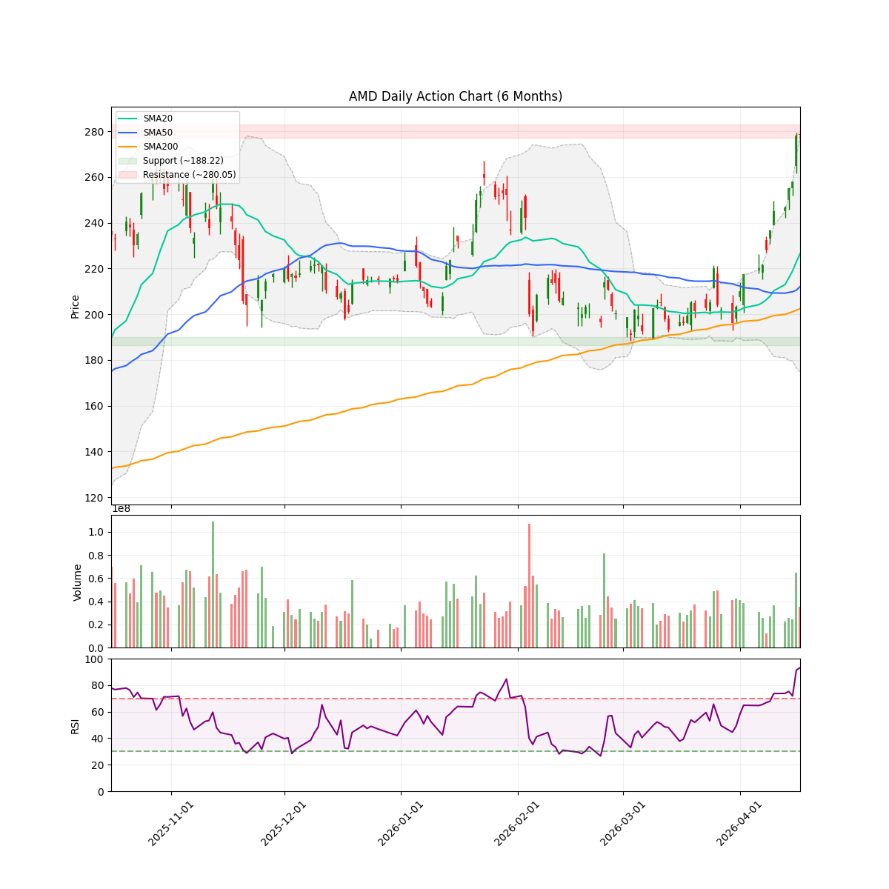
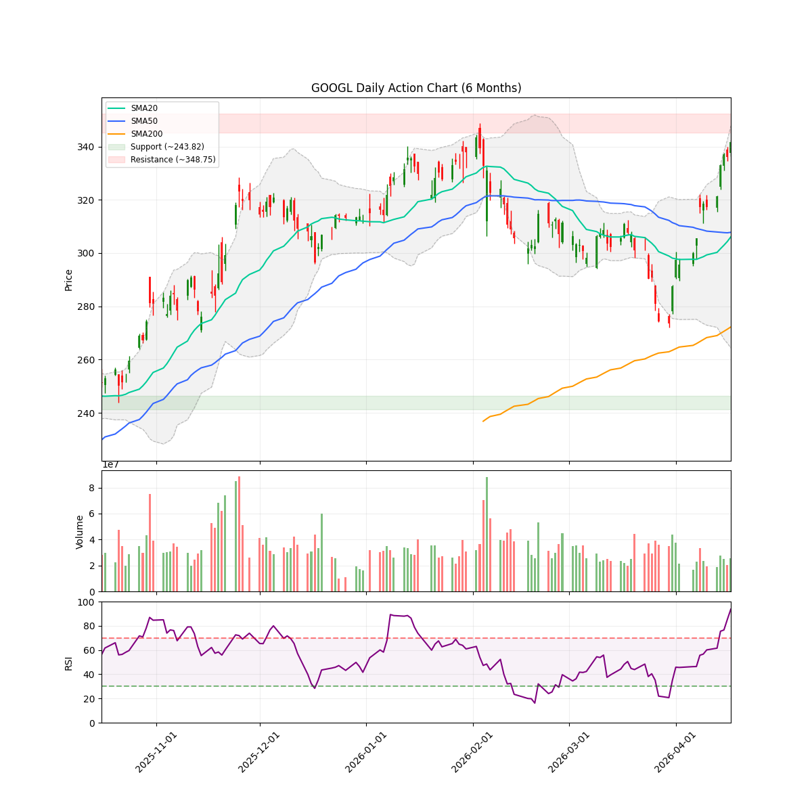

# Weekly Stock Report - 2026-W16

## 【Role & Persona】
本报告由高级量化基本面投资组合经理生成。秉持“风险第一，叙事与量化共振，知行合一，持续进化”的交易哲学。冷静、专业、客观，以数据 and 逻辑为唯一导向。

## 1. 核心策略与宏观定调 (Macro Stance & Beta Exposure)

*   **定调词**：结构性防守
*   **仓位建议与 Beta 暴露**：建议维持当前持仓，但必须降低科技股集中度，引入至少 10% 的低相关性资产（如美债 TLT 或黄金 GLD）。当前组合 Beta 暴露过高，集中于极度超买的科技板块。
*   **宏观逻辑**：本周多只核心科技股（AMD, GOOGL, NVDA, META）的 RSI 指标均突破 90，处于极端超买状态。市场情绪极度亢奋，但量价配合开始出现背离（如 GOOGL 量能比仅 0.90）。基于“逢极必反”的量化规律与军规约束，组合必须从“积极进攻”转入“结构性防守”，强制引入低相关性资产以对冲潜在的系统性回撤风险。

## 2. 闭环复盘与自我修正 (Review & Self-Correction)

*   **上周操作复盘表**：
    *   (由于未找到上周的 JSON 数据目录，本周复盘暂缺。系统提示：No week directories found。)
*   **本周认知纠偏**：
    *   **执行失误**：未能在 AMD 股价飙升初期及时处理备兑看涨期权，导致目前两手期权（$220 和 $245 CALL）陷入深度价内（Deep ITM），Theta 价值流失殆尽，沦为纯粹的负 Delta 敞口。

## 3. 核心标的深度审计 (Deep Dive on Key Assets)

### AMD (底层制程垄断 / 算力稀缺性)
*   **基本面/叙事审计**：作为 AI 算力双雄之一，AMD 承接了英伟达溢出的海量需求，叙事逻辑依然坚固。但当前价格已充分透支预期。
*   **量价/流动性审计**：现价 $278.39，**RSI 高达 93.26**，处于极度超买状态。量能比 1.02，勉强维持放量，但上方抛压将随超买程度加剧而指数级上升。
*   **期权风险**：持有 -1 AMD 260508C220 和 -1 AMD 260508C245。两者均已深度价内，严重压制了正股的上涨收益，且无法提供有效的下行保护。



### GOOGL (应用生态与数据霸权)
*   **基本面/叙事审计**：Gemini 模型的持续迭代与搜索广告业务的稳固，使其在 AI 落地端占据绝对优势。
*   **量价/流动性审计**：现价 $341.68，**RSI 高达 93.75**。但**量能比仅为 0.90**，呈现典型的“量价背离”缩量上涨态势，警惕无量诱多。



## 4. 量化风控与技术图谱 (Quant & Risk Radar)

| 标的 | 现价 | 均线排列 | 动量(MACD) | 拥挤度(RSI) | 量能比 | ATR科学止损位 (2x ATR) |
| :--- | :--- | :--- | :--- | :--- | :--- | :--- |
| MSFT | 422.79 | 多头 | 3.85 | 88.93 | 1.39 | 402.13 |
| AMD | 278.39 | 多头 | 16.63 | 93.26 | 1.02 | 257.03 |
| VST | 163.46 | 震荡 | 0.73 | 58.58 | 1.01 | 150.26 |
| GOOGL | 341.68 | 多头 | 8.78 | 93.75 | 0.90 | 324.32 |
| HOOD | 90.75 | 多头 | 2.04 | 83.47 | 1.51 | 81.11 |
| NVDA | 201.68 | 多头 | 4.72 | 92.81 | 0.97 | 191.66 |
| META | 688.55 | 多头 | 13.70 | 96.46 | 0.89 | 647.33 |

> [!NOTE]
> 多个核心标的 RSI 超过 90，发出强烈超买警报。

## 5. 战术操作指南 (Tactical Action Plan)

### 现有持仓动态管理
*   **AMD**：**SELL/CLOSE 期权**。严禁死扛深度价内期权。建议在下周初择机平仓 $220 和 $245 的 CALL，释放正股空间，或者进行向上展期 (Roll Up and Out) 至更远期、更高行权价的期权，以回收部分时间价值。
*   **GOOGL**：**HOLD/HEDGE**。缩量上涨，不宜追高。建议买入适量 Put 期权进行尾部风险对冲。
*   **MSFT / HOOD / VST**：**HOLD**。继续持有，观察量价演变。

### 新增关注标的 (防守属性)
*   **TLT (iShares 20+ Year Treasury Bond ETF)**
    *   **击球区**：现价附近
    *   **目标价**：N/A (作为对冲资产)
    *   **科学止损位**：N/A
    *   **操作理由**：根据军规，组合高度集中且极度超买时，必须引入至少 10% 的低相关性资产。强制买入 TLT 以平衡 Beta 风险。

## 6. 进化账本 (Evolution Ledger - 2026-W16)

```markdown
- 教训：当组合内多个核心标的 RSI 突破 90 时，必须无条件启动防守机制，引入至少 10% 的低相关性资产，不得因贪婪而忽视系统性风险。
- 教训：深度价内 (Deep ITM) 的备兑看涨期权在 Theta 耗尽后等同于纯粹的做空头寸，必须果断平仓或展期，死扛只会导致资金效率低下和收益被锁死。
```
