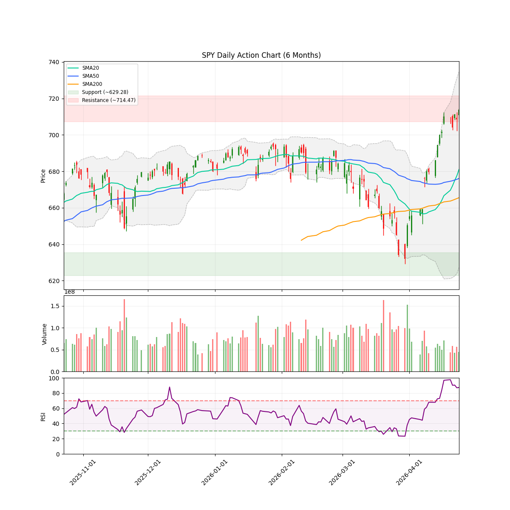
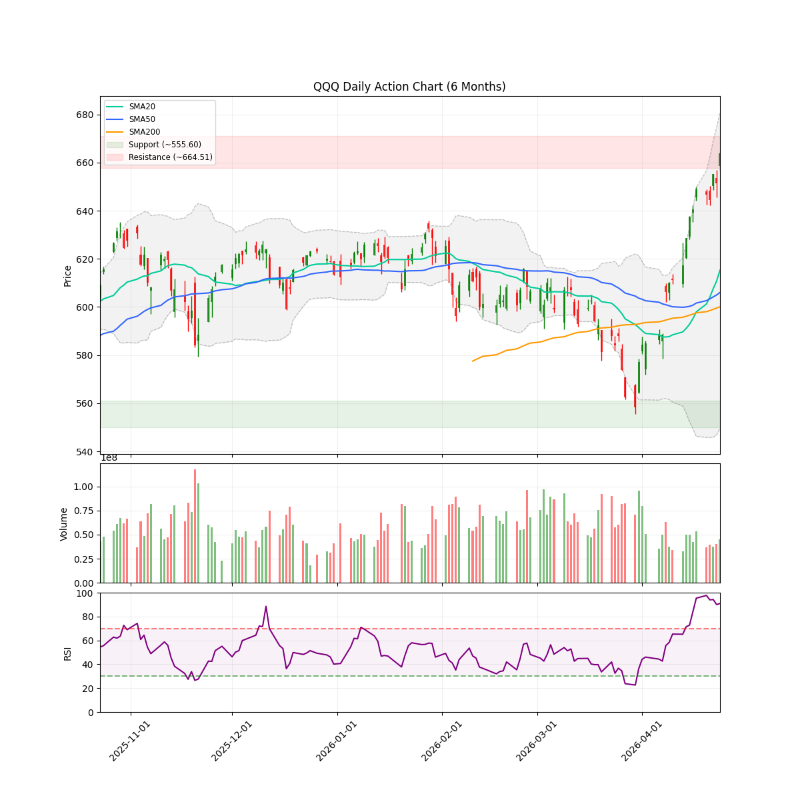
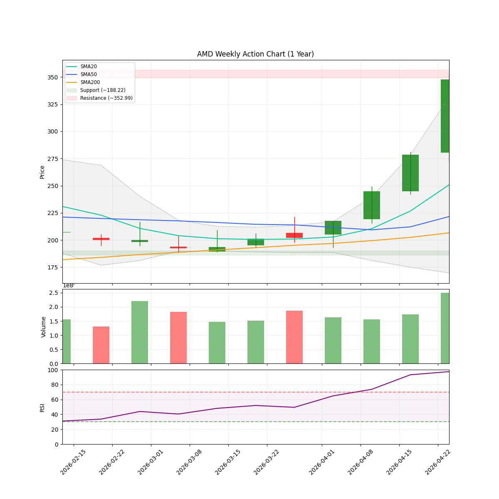
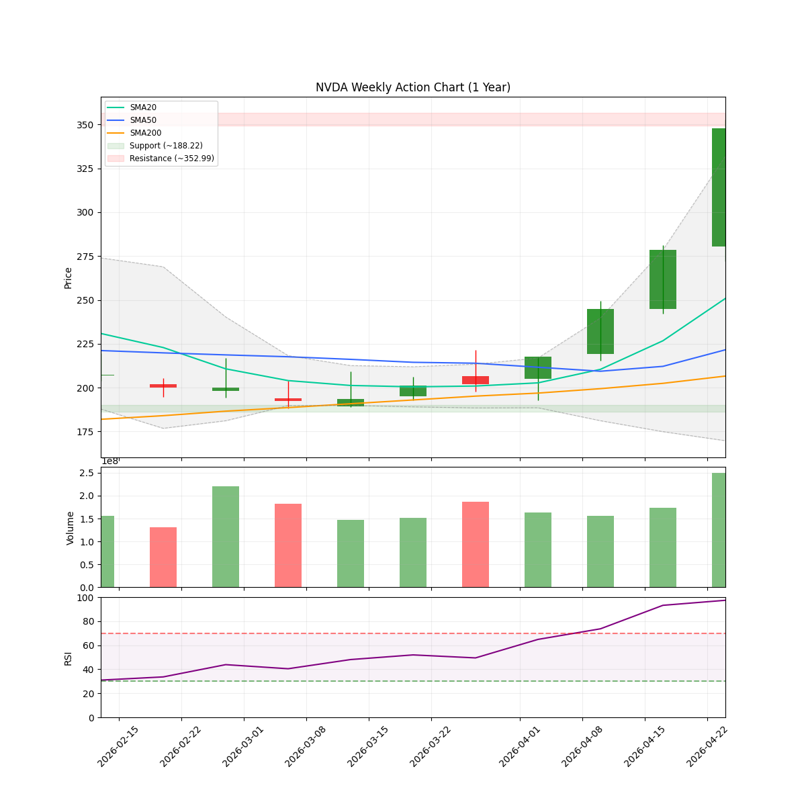
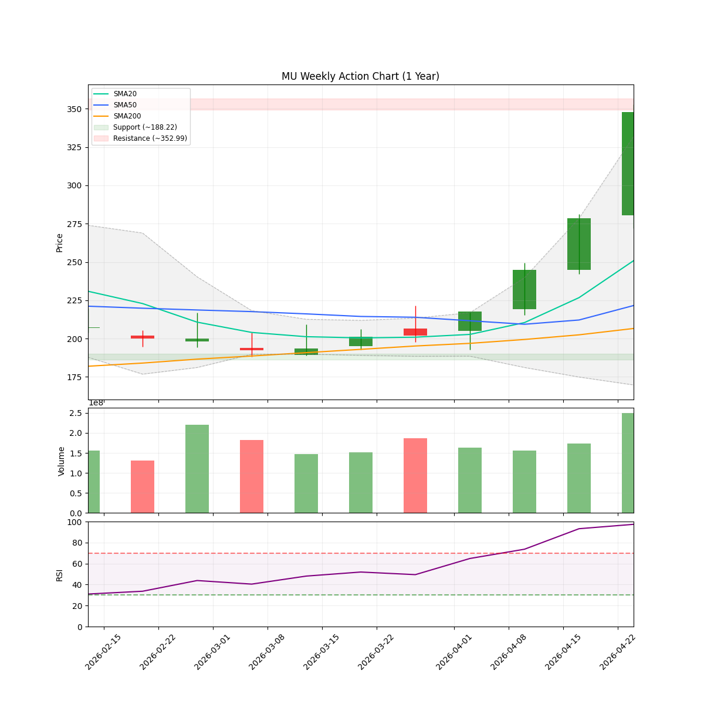
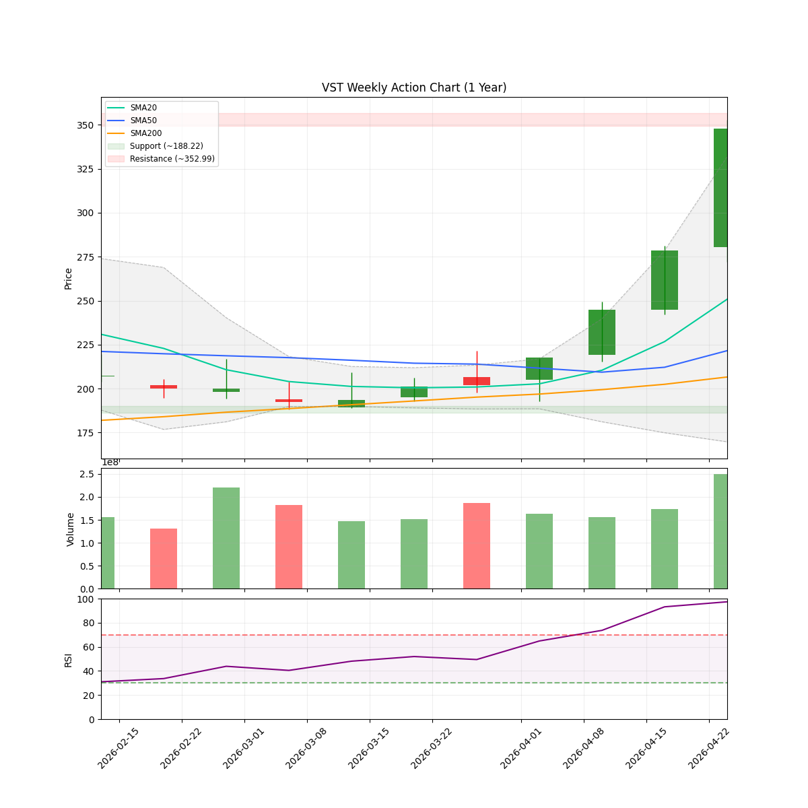

# 🌊 AlphaJAX 市场观澜报告
**日期:** 2026-04-25 | **期数:** 2026-W17 | **引擎:** AlphaJAX 3.0 (限界动量)

## 📑 目录
[TOC]

---

Review generation failed: 401 UNAUTHENTICATED. {'error': {'code': 401, 'message': 'Request had invalid authentication credentials. Expected OAuth 2 access token, login cookie or other valid authentication credential. See https://developers.google.com/identity/sign-in/web/devconsole-project.', 'status': 'UNAUTHENTICATED', 'details': [{'@type': 'type.googleapis.com/google.rpc.DebugInfo', 'detail': 'Authentication error: 16; Error Details: Invalid credential. Trace ID: 0x19e323b23ca90dd7'}, {'@type': 'type.googleapis.com/google.rpc.ErrorInfo', 'reason': 'ACCESS_TOKEN_TYPE_UNSUPPORTED', 'metadata': {'method': 'google.ai.generativelanguage.v1beta.GenerativeService.GenerateContent', 'service': 'generativelanguage.googleapis.com'}}]}}

---

## 🌐 全球重大宏观与地缘事件 (Global Macro Events)

Macro Events Agent Error: 401 UNAUTHENTICATED. {'error': {'code': 401, 'message': 'Request had invalid authentication credentials. Expected OAuth 2 access token, login cookie or other valid authentication credential. See https://developers.google.com/identity/sign-in/web/devconsole-project.', 'status': 'UNAUTHENTICATED', 'details': [{'@type': 'type.googleapis.com/google.rpc.DebugInfo', 'detail': 'Authentication error: 16; Error Details: Invalid credential. Trace ID: 0xd7412a14eb1ae2cb'}, {'@type': 'type.googleapis.com/google.rpc.ErrorInfo', 'reason': 'ACCESS_TOKEN_TYPE_UNSUPPORTED', 'metadata': {'method': 'google.ai.generativelanguage.v1beta.GenerativeService.GenerateContent', 'service': 'generativelanguage.googleapis.com'}}]}}

---

<!-- DISCORD_SUMMARY_START -->
## 📖 本周市场叙事 (Market Story)

> Narrative generation failed: 401 UNAUTHENTICATED. {'error': {'code': 401, 'message': 'Request had invalid authentication credentials. Expected OAuth 2 access token, login cookie or other valid authentication credential. See https://developers.google.com/identity/sign-in/web/devconsole-project.', 'status': 'UNAUTHENTICATED', 'details': [{'@type': 'type.googleapis.com/google.rpc.DebugInfo', 'detail': 'Authentication error: 16; Error Details: Invalid credential. Trace ID: 0xb8943b580baa740e'}, {'@type': 'type.googleapis.com/google.rpc.ErrorInfo', 'reason': 'ACCESS_TOKEN_TYPE_UNSUPPORTED', 'metadata': {'method': 'google.ai.generativelanguage.v1beta.GenerativeService.GenerateContent', 'service': 'generativelanguage.googleapis.com'}}]}}

<!-- DISCORD_SUMMARY_END -->
### 📈 宏观走势速览
| **SPY (标普500)** | **QQQ (纳指100)** |
| :---: | :---: |
|  |  |

---

## 🌍 宏观市场环境 (Macro Context & Regime)

| 指数 | 当前价格 | 20日均线 | 50日均线 | 200日均线 | 技术状态 |
|------|----------|----------|----------|-----------|----------|
| **SPY** | $713.94 | $680.99 | $676.07 | $665.52 | 🟢 UPTREND |
| **QQQ** | $663.88 | $615.30 | $606.02 | $600.09 | 🟢 UPTREND |

> **🔥 市场体制 (Market Regime):** `OFFENSE` (Breadth: 60.0%)
> **🛡️ 建议仓位 (Exposure):** `98%` (low Volatility)
> **📊 NAAIM 曝光指数 (Smart Money):** `94.15`
> 💡 **导读:** 市场体制由多因子(广度、波动、趋势、情绪)综合评分判定。当市场广度与情绪维持高位时，即便指数处于回调(`PULLBACK`)，系统仍可能判定为 `OFFENSE`（结构性机会大于系统性风险）。

---

## 🔄 板块轮动 (Sector Rotation)

| 板块 ETF | 名称 | 1周表现 | 1月表现 | 3月表现 | 动量状态 |
|----------|------|---------|---------|---------|----------|
| **SMH** | Semiconductors | +9.11% | +26.92% | +26.98% | 🟢 领涨 |
| **XLK** | Technology | +3.80% | +17.15% | +9.82% | 🟢 领涨 |
| **XLE** | Energy | +3.36% | -6.11% | +16.30% | 🟢 领涨 |
| **IGV** | Software | +0.14% | +5.97% | -13.77% | 🟢 领涨 |
| **XLB** | Materials | +0.08% | +5.08% | +4.24% | 🟢 领涨 |
| **XLU** | Utilities | +0.04% | +2.06% | +8.47% | 🟢 领涨 |
| **XLI** | Industrials | -0.60% | +4.46% | +5.22% | 🔴 领跌 |
| **XLY** | Consumer Discr | -1.43% | +7.19% | -2.77% | 🔴 领跌 |
| **XLRE** | Real Estate | -1.46% | +8.84% | +7.05% | 🔴 领跌 |
| **XLF** | Financials | -1.93% | +4.22% | -3.23% | 🔴 领跌 |
| **XLC** | Communications | -2.99% | +3.68% | -1.58% | 🔴 领跌 |
| **XLV** | Healthcare | -3.10% | -1.41% | -8.43% | 🔴 领跌 |

> 💡 **导读:** 资金流向是行情的燃料。关注资金是否从科技(XLK)轮动到防御性或周期性板块。

---

## 💼 持仓监控

以下为您持有的股票，无论动量排名如何均会分析:

| 代码 | RSM Z | 衰竭度 | RS Z | 状态 |
|:----:|:-----:|:------:|:----:|:----:|
| **AMD** | +1.59 | 35 | +4.00 | 🟢 健康 |
| **NVDA** | +1.07 | 35 | +1.22 | 🟢 健康 |
| **MU** | +0.23 | 34 | +2.12 | 🟢 健康 |
| **GOOGL** | +0.79 | 37 | +0.77 | 🟢 健康 |
| **VST** | +0.11 | 35 | +0.81 | 🟢 健康 |

---

## 🔥 动量热力图 (Top 10 候选)

| 排名 | 代码 | VCP | RSM Z | 衰竭度 | RS Z | 量能比 | ATR止损 |
|:----:|:----:|:---:|:-----:|:------:|:----:|:------:|:-------:|
| 1 | **ON** | 1.02 | +2.54 🔥 | 🟨🟨🟨🟨⬜⬜⬜⬜⬜⬜ 42 | +4.00 | 1.4x | $90.06 |
| 2 | **INTC** | 0.97 | +1.69 🔥 | 🟩🟩⬜⬜⬜⬜⬜⬜⬜⬜ 24 | +4.00 | 2.4x | $71.87 |
| 3 | **SNDK** | 0.86 | +4.00 🔥 | 🟩🟩🟩⬜⬜⬜⬜⬜⬜⬜ 35 | +2.27 | 0.7x | $868.28 |
| 4 | **AMD** 💼 | 1.13 | +1.59 🔥 | 🟩🟩🟩⬜⬜⬜⬜⬜⬜⬜ 35 | +4.00 | 2.1x | $314.46 |
| 5 | **MPWR** | 0.86 | +2.89 🔥 | 🟨🟨🟨🟨⬜⬜⬜⬜⬜⬜ 47 | +2.73 | 1.3x | $1520.00 |
| 6 | **TXN** | 1.42 | +1.00 📈 | 🟩🟩⬜⬜⬜⬜⬜⬜⬜⬜ 25 | +4.00 | 1.7x | $253.04 |
| 7 | **STLD** | 1.36 | +2.57 🔥 | 🟨🟨🟨🟨⬜⬜⬜⬜⬜⬜ 41 | +1.92 | 0.9x | $211.62 |
| 8 | **NUE** | 1.24 | +2.52 🔥 | 🟨🟨🟨🟨⬜⬜⬜⬜⬜⬜ 50 | +1.57 | 0.8x | $203.41 |
| 9 | **TER** | 0.90 | +2.01 🔥 | 🟨🟨🟨🟨⬜⬜⬜⬜⬜⬜ 43 | +2.52 | 1.3x | $386.28 |
| 10 | **WST** | 1.24 | +1.84 🔥 | 🟩🟩⬜⬜⬜⬜⬜⬜⬜⬜ 27 | +2.36 | 1.2x | $281.41 |

> 📊 分组统计: 53 标的进入分析池 | 5 持仓监控

---

## 🎯 Top 5 动量辩论报告

### AMD 💼 [持仓]

#### 📈 量化信号卡片
| 指标 | 数值 | 状态 |
|------|------|------|
| **标记** | 💼 持仓股 | 必须关注 |
| 综合得分 | 2.057 | 排名 #4 |
| VCP (波动收缩) | 1.13 | 📈 扩张/发散 |
| RSM (动量) | +1.59 | 强势 |
| 衰竭度 | 35/100 | HEALTHY |
| RS (相对强度) | +4.00 | 跑赢基准 |
| 当前价 | $347.81 | - |
| ATR止损 | $314.46 | 风险 9.6% |

#### 📊 技术面走势速览 (AMD)

#### 🥊 多轮辩论过程
**第1轮：**
- 🐂 多头: 401 UNAUTHENTICATED. {'error': {'code': 401, 'message': 'Request had invalid authentication credentials. Expected OAuth 2 access token, login cookie or other valid authentication credential. See https://developers.google.com/identity/sign-in/web/devconsole-project.', 'status': 'UNAUTHENTICATED', 'details': [{'@type': 'type.googleapis.com/google.rpc.DebugInfo', 'detail': 'Authentication error: 16; Error Details: Invalid credential. Trace ID: 0xea6f40073e5f8521'}, {'@type': 'type.googleapis.com/google.rpc.ErrorInfo', 'reason': 'ACCESS_TOKEN_TYPE_UNSUPPORTED', 'metadata': {'method': 'google.ai.generativelanguage.v1beta.GenerativeService.GenerateContent', 'service': 'generativelanguage.googleapis.com'}}]}}
- 🐻 空头: 401 UNAUTHENTICATED. {'error': {'code': 401, 'message': 'Request had invalid authentication credentials. Expected OAuth 2 access token, login cookie or other valid authentication credential. See https://developers.google.com/identity/sign-in/web/devconsole-project.', 'status': 'UNAUTHENTICATED', 'details': [{'@type': 'type.googleapis.com/google.rpc.DebugInfo', 'detail': 'Authentication error: 16; Error Details: Invalid credential. Trace ID: 0x9c426977863929e8'}, {'@type': 'type.googleapis.com/google.rpc.ErrorInfo', 'reason': 'ACCESS_TOKEN_TYPE_UNSUPPORTED', 'metadata': {'method': 'google.ai.generativelanguage.v1beta.GenerativeService.GenerateContent', 'service': 'generativelanguage.googleapis.com'}}]}}

**第2轮：**
- 🐂 多头: 401 UNAUTHENTICATED. {'error': {'code': 401, 'message': 'Request had invalid authentication credentials. Expected OAuth 2 access token, login cookie or other valid authentication credential. See https://developers.google.com/identity/sign-in/web/devconsole-project.', 'status': 'UNAUTHENTICATED', 'details': [{'@type': 'type.googleapis.com/google.rpc.DebugInfo', 'detail': 'Authentication error: 16; Error Details: Invalid credential. Trace ID: 0x7c8ae12a8d8da22c'}, {'@type': 'type.googleapis.com/google.rpc.ErrorInfo', 'reason': 'ACCESS_TOKEN_TYPE_UNSUPPORTED', 'metadata': {'method': 'google.ai.generativelanguage.v1beta.GenerativeService.GenerateContent', 'service': 'generativelanguage.googleapis.com'}}]}}
- 🐻 空头: 401 UNAUTHENTICATED. {'error': {'code': 401, 'message': 'Request had invalid authentication credentials. Expected OAuth 2 access token, login cookie or other valid authentication credential. See https://developers.google.com/identity/sign-in/web/devconsole-project.', 'status': 'UNAUTHENTICATED', 'details': [{'@type': 'type.googleapis.com/google.rpc.DebugInfo', 'detail': 'Authentication error: 16; Error Details: Invalid credential. Trace ID: 0x4e51d30dd7fd1ec9'}, {'@type': 'type.googleapis.com/google.rpc.ErrorInfo', 'reason': 'ACCESS_TOKEN_TYPE_UNSUPPORTED', 'metadata': {'method': 'google.ai.generativelanguage.v1beta.GenerativeService.GenerateContent', 'service': 'generativelanguage.googleapis.com'}}]}}

**第3轮：**
- 🐂 多头: 401 UNAUTHENTICATED. {'error': {'code': 401, 'message': 'Request had invalid authentication credentials. Expected OAuth 2 access token, login cookie or other valid authentication credential. See https://developers.google.com/identity/sign-in/web/devconsole-project.', 'status': 'UNAUTHENTICATED', 'details': [{'@type': 'type.googleapis.com/google.rpc.DebugInfo', 'detail': 'Authentication error: 16; Error Details: Invalid credential. Trace ID: 0x63b9bc2cba065339'}, {'@type': 'type.googleapis.com/google.rpc.ErrorInfo', 'reason': 'ACCESS_TOKEN_TYPE_UNSUPPORTED', 'metadata': {'method': 'google.ai.generativelanguage.v1beta.GenerativeService.GenerateContent', 'service': 'generativelanguage.googleapis.com'}}]}}
- 🐻 空头: 401 UNAUTHENTICATED. {'error': {'code': 401, 'message': 'Request had invalid authentication credentials. Expected OAuth 2 access token, login cookie or other valid authentication credential. See https://developers.google.com/identity/sign-in/web/devconsole-project.', 'status': 'UNAUTHENTICATED', 'details': [{'@type': 'type.googleapis.com/google.rpc.DebugInfo', 'detail': 'Authentication error: 16; Error Details: Invalid credential. Trace ID: 0x7109422d6853d3df'}, {'@type': 'type.googleapis.com/google.rpc.ErrorInfo', 'reason': 'ACCESS_TOKEN_TYPE_UNSUPPORTED', 'metadata': {'method': 'google.ai.generativelanguage.v1beta.GenerativeService.GenerateContent', 'service': 'generativelanguage.googleapis.com'}}]}}

#### 🏆 最终裁决
- **AlphaJAX 2.0 矩阵裁定:** **🟡 短线博弈 (Short Trade - Pure Technical Momentum)**
- **操作建议:** ERROR
- **逻辑评分 (Logic):** N/A/10
- **信心指数:** 0%
- **仓位建议:** N/A
- **核心论点:** 401 UNAUTHENTICATED. {'error': {'code': 401, 'message': 'Request had invalid authentication credentials. Expected OAuth 2 access token, login cookie or other valid authentication credential. See https://developers.google.com/identity/sign-in/web/devconsole-project.', 'status': 'UNAUTHENTICATED', 'details': [{'@type': 'type.googleapis.com/google.rpc.DebugInfo', 'detail': 'Authentication error: 16; Error Details: Invalid credential. Trace ID: 0x704f65869d4a430e'}, {'@type': 'type.googleapis.com/google.rpc.ErrorInfo', 'reason': 'ACCESS_TOKEN_TYPE_UNSUPPORTED', 'metadata': {'service': 'generativelanguage.googleapis.com', 'method': 'google.ai.generativelanguage.v1beta.GenerativeService.GenerateContent'}}]}}

#### 💰 交易计划
| 项目 | 建议 |
|------|------|
| 入场策略 | N/A |
| 止损位 | N/A |
| 目标位 | N/A |
| 盈亏比 | N/A |

---

### NVDA 💼 [持仓]

#### 📈 量化信号卡片
| 指标 | 数值 | 状态 |
|------|------|------|
| **标记** | 💼 持仓股 | 必须关注 |
| 综合得分 | 1.047 | 排名 #36 |
| VCP (波动收缩) | 1.13 | 📈 扩张/发散 |
| RSM (动量) | +1.07 | 强势 |
| 衰竭度 | 35/100 | HEALTHY |
| RS (相对强度) | +1.22 | 跑赢基准 |
| 当前价 | $208.27 | - |
| ATR止损 | $196.98 | 风险 5.4% |

#### 📊 技术面走势速览 (NVDA)

#### 🥊 多轮辩论过程
**第1轮：**
- 🐂 多头: 401 UNAUTHENTICATED. {'error': {'code': 401, 'message': 'Request had invalid authentication credentials. Expected OAuth 2 access token, login cookie or other valid authentication credential. See https://developers.google.com/identity/sign-in/web/devconsole-project.', 'status': 'UNAUTHENTICATED', 'details': [{'@type': 'type.googleapis.com/google.rpc.DebugInfo', 'detail': 'Authentication error: 16; Error Details: Invalid credential. Trace ID: 0xe3607dbd9639551'}, {'@type': 'type.googleapis.com/google.rpc.ErrorInfo', 'reason': 'ACCESS_TOKEN_TYPE_UNSUPPORTED', 'metadata': {'service': 'generativelanguage.googleapis.com', 'method': 'google.ai.generativelanguage.v1beta.GenerativeService.GenerateContent'}}]}}
- 🐻 空头: 401 UNAUTHENTICATED. {'error': {'code': 401, 'message': 'Request had invalid authentication credentials. Expected OAuth 2 access token, login cookie or other valid authentication credential. See https://developers.google.com/identity/sign-in/web/devconsole-project.', 'status': 'UNAUTHENTICATED', 'details': [{'@type': 'type.googleapis.com/google.rpc.DebugInfo', 'detail': 'Authentication error: 16; Error Details: Invalid credential. Trace ID: 0x5041fe4511c3d2fe'}, {'@type': 'type.googleapis.com/google.rpc.ErrorInfo', 'reason': 'ACCESS_TOKEN_TYPE_UNSUPPORTED', 'metadata': {'method': 'google.ai.generativelanguage.v1beta.GenerativeService.GenerateContent', 'service': 'generativelanguage.googleapis.com'}}]}}

**第2轮：**
- 🐂 多头: 401 UNAUTHENTICATED. {'error': {'code': 401, 'message': 'Request had invalid authentication credentials. Expected OAuth 2 access token, login cookie or other valid authentication credential. See https://developers.google.com/identity/sign-in/web/devconsole-project.', 'status': 'UNAUTHENTICATED', 'details': [{'@type': 'type.googleapis.com/google.rpc.DebugInfo', 'detail': 'Authentication error: 16; Error Details: Invalid credential. Trace ID: 0x2111acc2813f0272'}, {'@type': 'type.googleapis.com/google.rpc.ErrorInfo', 'reason': 'ACCESS_TOKEN_TYPE_UNSUPPORTED', 'metadata': {'method': 'google.ai.generativelanguage.v1beta.GenerativeService.GenerateContent', 'service': 'generativelanguage.googleapis.com'}}]}}
- 🐻 空头: 401 UNAUTHENTICATED. {'error': {'code': 401, 'message': 'Request had invalid authentication credentials. Expected OAuth 2 access token, login cookie or other valid authentication credential. See https://developers.google.com/identity/sign-in/web/devconsole-project.', 'status': 'UNAUTHENTICATED', 'details': [{'@type': 'type.googleapis.com/google.rpc.DebugInfo', 'detail': 'Authentication error: 16; Error Details: {Cached Auth Failure}'}, {'@type': 'type.googleapis.com/google.rpc.ErrorInfo', 'reason': 'ACCESS_TOKEN_TYPE_UNSUPPORTED', 'metadata': {'method': 'google.ai.generativelanguage.v1beta.GenerativeService.GenerateContent', 'service': 'generativelanguage.googleapis.com'}}]}}

**第3轮：**
- 🐂 多头: 401 UNAUTHENTICATED. {'error': {'code': 401, 'message': 'Request had invalid authentication credentials. Expected OAuth 2 access token, login cookie or other valid authentication credential. See https://developers.google.com/identity/sign-in/web/devconsole-project.', 'status': 'UNAUTHENTICATED', 'details': [{'@type': 'type.googleapis.com/google.rpc.DebugInfo', 'detail': 'Authentication error: 16; Error Details: Invalid credential. Trace ID: 0x13452e03cc9a2ba6'}, {'@type': 'type.googleapis.com/google.rpc.ErrorInfo', 'reason': 'ACCESS_TOKEN_TYPE_UNSUPPORTED', 'metadata': {'method': 'google.ai.generativelanguage.v1beta.GenerativeService.GenerateContent', 'service': 'generativelanguage.googleapis.com'}}]}}
- 🐻 空头: 401 UNAUTHENTICATED. {'error': {'code': 401, 'message': 'Request had invalid authentication credentials. Expected OAuth 2 access token, login cookie or other valid authentication credential. See https://developers.google.com/identity/sign-in/web/devconsole-project.', 'status': 'UNAUTHENTICATED', 'details': [{'@type': 'type.googleapis.com/google.rpc.DebugInfo', 'detail': 'Authentication error: 16; Error Details: {Cached Auth Failure}'}, {'@type': 'type.googleapis.com/google.rpc.ErrorInfo', 'reason': 'ACCESS_TOKEN_TYPE_UNSUPPORTED', 'metadata': {'method': 'google.ai.generativelanguage.v1beta.GenerativeService.GenerateContent', 'service': 'generativelanguage.googleapis.com'}}]}}

#### 🏆 最终裁决
- **AlphaJAX 2.0 矩阵裁定:** **⚪ 规避 (Avoid)**
- **操作建议:** ERROR
- **逻辑评分 (Logic):** N/A/10
- **信心指数:** 0%
- **仓位建议:** N/A
- **核心论点:** 401 UNAUTHENTICATED. {'error': {'code': 401, 'message': 'Request had invalid authentication credentials. Expected OAuth 2 access token, login cookie or other valid authentication credential. See https://developers.google.com/identity/sign-in/web/devconsole-project.', 'status': 'UNAUTHENTICATED', 'details': [{'@type': 'type.googleapis.com/google.rpc.DebugInfo', 'detail': 'Authentication error: 16; Error Details: Invalid credential. Trace ID: 0x75767c5ef1be0c46'}, {'@type': 'type.googleapis.com/google.rpc.ErrorInfo', 'reason': 'ACCESS_TOKEN_TYPE_UNSUPPORTED', 'metadata': {'method': 'google.ai.generativelanguage.v1beta.GenerativeService.GenerateContent', 'service': 'generativelanguage.googleapis.com'}}]}}

#### 💰 交易计划
| 项目 | 建议 |
|------|------|
| 入场策略 | N/A |
| 止损位 | N/A |
| 目标位 | N/A |
| 盈亏比 | N/A |

---

### MU 💼 [持仓]

#### 📈 量化信号卡片
| 指标 | 数值 | 状态 |
|------|------|------|
| **标记** | 💼 持仓股 | 必须关注 |
| 综合得分 | 0.767 | 排名 #51 |
| VCP (波动收缩) | 0.87 | 📉 收缩中 |
| RSM (动量) | +0.23 | 中性 |
| 衰竭度 | 34/100 | HEALTHY |
| RS (相对强度) | +2.12 | 跑赢基准 |
| 当前价 | $496.72 | - |
| ATR止损 | $445.05 | 风险 10.4% |

#### 📊 技术面走势速览 (MU)

#### 🥊 多轮辩论过程
**第1轮：**
- 🐂 多头: 401 UNAUTHENTICATED. {'error': {'code': 401, 'message': 'Request had invalid authentication credentials. Expected OAuth 2 access token, login cookie or other valid authentication credential. See https://developers.google.com/identity/sign-in/web/devconsole-project.', 'status': 'UNAUTHENTICATED', 'details': [{'@type': 'type.googleapis.com/google.rpc.DebugInfo', 'detail': 'Authentication error: 16; Error Details: Invalid credential. Trace ID: 0x89afa2eb711df3b3'}, {'@type': 'type.googleapis.com/google.rpc.ErrorInfo', 'reason': 'ACCESS_TOKEN_TYPE_UNSUPPORTED', 'metadata': {'method': 'google.ai.generativelanguage.v1beta.GenerativeService.GenerateContent', 'service': 'generativelanguage.googleapis.com'}}]}}
- 🐻 空头: 401 UNAUTHENTICATED. {'error': {'code': 401, 'message': 'Request had invalid authentication credentials. Expected OAuth 2 access token, login cookie or other valid authentication credential. See https://developers.google.com/identity/sign-in/web/devconsole-project.', 'status': 'UNAUTHENTICATED', 'details': [{'@type': 'type.googleapis.com/google.rpc.DebugInfo', 'detail': 'Authentication error: 16; Error Details: Invalid credential. Trace ID: 0xf1c9384b39f7de32'}, {'@type': 'type.googleapis.com/google.rpc.ErrorInfo', 'reason': 'ACCESS_TOKEN_TYPE_UNSUPPORTED', 'metadata': {'method': 'google.ai.generativelanguage.v1beta.GenerativeService.GenerateContent', 'service': 'generativelanguage.googleapis.com'}}]}}

**第2轮：**
- 🐂 多头: 401 UNAUTHENTICATED. {'error': {'code': 401, 'message': 'Request had invalid authentication credentials. Expected OAuth 2 access token, login cookie or other valid authentication credential. See https://developers.google.com/identity/sign-in/web/devconsole-project.', 'status': 'UNAUTHENTICATED', 'details': [{'@type': 'type.googleapis.com/google.rpc.DebugInfo', 'detail': 'Authentication error: 16; Error Details: Invalid credential. Trace ID: 0x128050909d692002'}, {'@type': 'type.googleapis.com/google.rpc.ErrorInfo', 'reason': 'ACCESS_TOKEN_TYPE_UNSUPPORTED', 'metadata': {'method': 'google.ai.generativelanguage.v1beta.GenerativeService.GenerateContent', 'service': 'generativelanguage.googleapis.com'}}]}}
- 🐻 空头: 401 UNAUTHENTICATED. {'error': {'code': 401, 'message': 'Request had invalid authentication credentials. Expected OAuth 2 access token, login cookie or other valid authentication credential. See https://developers.google.com/identity/sign-in/web/devconsole-project.', 'status': 'UNAUTHENTICATED', 'details': [{'@type': 'type.googleapis.com/google.rpc.DebugInfo', 'detail': 'Authentication error: 16; Error Details: Invalid credential. Trace ID: 0xa249ba3a8efe6661'}, {'@type': 'type.googleapis.com/google.rpc.ErrorInfo', 'reason': 'ACCESS_TOKEN_TYPE_UNSUPPORTED', 'metadata': {'method': 'google.ai.generativelanguage.v1beta.GenerativeService.GenerateContent', 'service': 'generativelanguage.googleapis.com'}}]}}

**第3轮：**
- 🐂 多头: 401 UNAUTHENTICATED. {'error': {'code': 401, 'message': 'Request had invalid authentication credentials. Expected OAuth 2 access token, login cookie or other valid authentication credential. See https://developers.google.com/identity/sign-in/web/devconsole-project.', 'status': 'UNAUTHENTICATED', 'details': [{'@type': 'type.googleapis.com/google.rpc.DebugInfo', 'detail': 'Authentication error: 16; Error Details: {Cached Auth Failure}'}, {'@type': 'type.googleapis.com/google.rpc.ErrorInfo', 'reason': 'ACCESS_TOKEN_TYPE_UNSUPPORTED', 'metadata': {'method': 'google.ai.generativelanguage.v1beta.GenerativeService.GenerateContent', 'service': 'generativelanguage.googleapis.com'}}]}}
- 🐻 空头: 401 UNAUTHENTICATED. {'error': {'code': 401, 'message': 'Request had invalid authentication credentials. Expected OAuth 2 access token, login cookie or other valid authentication credential. See https://developers.google.com/identity/sign-in/web/devconsole-project.', 'status': 'UNAUTHENTICATED', 'details': [{'@type': 'type.googleapis.com/google.rpc.DebugInfo', 'detail': 'Authentication error: 16; Error Details: Invalid credential. Trace ID: 0xd0bdeb9b6d42ab51'}, {'@type': 'type.googleapis.com/google.rpc.ErrorInfo', 'reason': 'ACCESS_TOKEN_TYPE_UNSUPPORTED', 'metadata': {'service': 'generativelanguage.googleapis.com', 'method': 'google.ai.generativelanguage.v1beta.GenerativeService.GenerateContent'}}]}}

#### 🏆 最终裁决
- **AlphaJAX 2.0 矩阵裁定:** **⚪ 规避 (Avoid)**
- **操作建议:** ERROR
- **逻辑评分 (Logic):** N/A/10
- **信心指数:** 0%
- **仓位建议:** N/A
- **核心论点:** 401 UNAUTHENTICATED. {'error': {'code': 401, 'message': 'Request had invalid authentication credentials. Expected OAuth 2 access token, login cookie or other valid authentication credential. See https://developers.google.com/identity/sign-in/web/devconsole-project.', 'status': 'UNAUTHENTICATED', 'details': [{'@type': 'type.googleapis.com/google.rpc.DebugInfo', 'detail': 'Authentication error: 16; Error Details: Invalid credential. Trace ID: 0xf2bc2c89c52c4823'}, {'@type': 'type.googleapis.com/google.rpc.ErrorInfo', 'reason': 'ACCESS_TOKEN_TYPE_UNSUPPORTED', 'metadata': {'service': 'generativelanguage.googleapis.com', 'method': 'google.ai.generativelanguage.v1beta.GenerativeService.GenerateContent'}}]}}

#### 💰 交易计划
| 项目 | 建议 |
|------|------|
| 入场策略 | N/A |
| 止损位 | N/A |
| 目标位 | N/A |
| 盈亏比 | N/A |

---

### GOOGL 💼 [持仓]

#### 📈 量化信号卡片
| 指标 | 数值 | 状态 |
|------|------|------|
| **标记** | 💼 持仓股 | 必须关注 |
| 综合得分 | 0.543 | 排名 #52 |
| VCP (波动收缩) | 0.87 | 📉 收缩中 |
| RSM (动量) | +0.79 | 中性 |
| 衰竭度 | 37/100 | HEALTHY |
| RS (相对强度) | +0.77 | 跑赢基准 |
| 当前价 | $344.40 | - |
| ATR止损 | $329.00 | 风险 4.5% |

#### 📊 技术面走势速览 (GOOGL)

#### 🥊 多轮辩论过程
**第1轮：**
- 🐂 多头: 401 UNAUTHENTICATED. {'error': {'code': 401, 'message': 'Request had invalid authentication credentials. Expected OAuth 2 access token, login cookie or other valid authentication credential. See https://developers.google.com/identity/sign-in/web/devconsole-project.', 'status': 'UNAUTHENTICATED', 'details': [{'@type': 'type.googleapis.com/google.rpc.DebugInfo', 'detail': 'Authentication error: 16; Error Details: Invalid credential. Trace ID: 0xd6aff083d9885b9a'}, {'@type': 'type.googleapis.com/google.rpc.ErrorInfo', 'reason': 'ACCESS_TOKEN_TYPE_UNSUPPORTED', 'metadata': {'method': 'google.ai.generativelanguage.v1beta.GenerativeService.GenerateContent', 'service': 'generativelanguage.googleapis.com'}}]}}
- 🐻 空头: 401 UNAUTHENTICATED. {'error': {'code': 401, 'message': 'Request had invalid authentication credentials. Expected OAuth 2 access token, login cookie or other valid authentication credential. See https://developers.google.com/identity/sign-in/web/devconsole-project.', 'status': 'UNAUTHENTICATED', 'details': [{'@type': 'type.googleapis.com/google.rpc.DebugInfo', 'detail': 'Authentication error: 16; Error Details: Invalid credential. Trace ID: 0x64e25f8dd7e2b539'}, {'@type': 'type.googleapis.com/google.rpc.ErrorInfo', 'reason': 'ACCESS_TOKEN_TYPE_UNSUPPORTED', 'metadata': {'method': 'google.ai.generativelanguage.v1beta.GenerativeService.GenerateContent', 'service': 'generativelanguage.googleapis.com'}}]}}

**第2轮：**
- 🐂 多头: 401 UNAUTHENTICATED. {'error': {'code': 401, 'message': 'Request had invalid authentication credentials. Expected OAuth 2 access token, login cookie or other valid authentication credential. See https://developers.google.com/identity/sign-in/web/devconsole-project.', 'status': 'UNAUTHENTICATED', 'details': [{'@type': 'type.googleapis.com/google.rpc.DebugInfo', 'detail': 'Authentication error: 16; Error Details: Invalid credential. Trace ID: 0x2c21143283277b04'}, {'@type': 'type.googleapis.com/google.rpc.ErrorInfo', 'reason': 'ACCESS_TOKEN_TYPE_UNSUPPORTED', 'metadata': {'service': 'generativelanguage.googleapis.com', 'method': 'google.ai.generativelanguage.v1beta.GenerativeService.GenerateContent'}}]}}
- 🐻 空头: 401 UNAUTHENTICATED. {'error': {'code': 401, 'message': 'Request had invalid authentication credentials. Expected OAuth 2 access token, login cookie or other valid authentication credential. See https://developers.google.com/identity/sign-in/web/devconsole-project.', 'status': 'UNAUTHENTICATED', 'details': [{'@type': 'type.googleapis.com/google.rpc.DebugInfo', 'detail': 'Authentication error: 16; Error Details: Invalid credential. Trace ID: 0xee834bcd89ee933c'}, {'@type': 'type.googleapis.com/google.rpc.ErrorInfo', 'reason': 'ACCESS_TOKEN_TYPE_UNSUPPORTED', 'metadata': {'service': 'generativelanguage.googleapis.com', 'method': 'google.ai.generativelanguage.v1beta.GenerativeService.GenerateContent'}}]}}

**第3轮：**
- 🐂 多头: 401 UNAUTHENTICATED. {'error': {'code': 401, 'message': 'Request had invalid authentication credentials. Expected OAuth 2 access token, login cookie or other valid authentication credential. See https://developers.google.com/identity/sign-in/web/devconsole-project.', 'status': 'UNAUTHENTICATED', 'details': [{'@type': 'type.googleapis.com/google.rpc.DebugInfo', 'detail': 'Authentication error: 16; Error Details: Invalid credential. Trace ID: 0xee8352507a2a315e'}, {'@type': 'type.googleapis.com/google.rpc.ErrorInfo', 'reason': 'ACCESS_TOKEN_TYPE_UNSUPPORTED', 'metadata': {'method': 'google.ai.generativelanguage.v1beta.GenerativeService.GenerateContent', 'service': 'generativelanguage.googleapis.com'}}]}}
- 🐻 空头: 401 UNAUTHENTICATED. {'error': {'code': 401, 'message': 'Request had invalid authentication credentials. Expected OAuth 2 access token, login cookie or other valid authentication credential. See https://developers.google.com/identity/sign-in/web/devconsole-project.', 'status': 'UNAUTHENTICATED', 'details': [{'@type': 'type.googleapis.com/google.rpc.DebugInfo', 'detail': 'Authentication error: 16; Error Details: {Cached Auth Failure}'}, {'@type': 'type.googleapis.com/google.rpc.ErrorInfo', 'reason': 'ACCESS_TOKEN_TYPE_UNSUPPORTED', 'metadata': {'method': 'google.ai.generativelanguage.v1beta.GenerativeService.GenerateContent', 'service': 'generativelanguage.googleapis.com'}}]}}

#### 🏆 最终裁决
- **AlphaJAX 2.0 矩阵裁定:** **⚪ 规避 (Avoid)**
- **操作建议:** ERROR
- **逻辑评分 (Logic):** N/A/10
- **信心指数:** 0%
- **仓位建议:** N/A
- **核心论点:** 401 UNAUTHENTICATED. {'error': {'code': 401, 'message': 'Request had invalid authentication credentials. Expected OAuth 2 access token, login cookie or other valid authentication credential. See https://developers.google.com/identity/sign-in/web/devconsole-project.', 'status': 'UNAUTHENTICATED', 'details': [{'@type': 'type.googleapis.com/google.rpc.DebugInfo', 'detail': 'Authentication error: 16; Error Details: {Cached Auth Failure}'}, {'@type': 'type.googleapis.com/google.rpc.ErrorInfo', 'reason': 'ACCESS_TOKEN_TYPE_UNSUPPORTED', 'metadata': {'service': 'generativelanguage.googleapis.com', 'method': 'google.ai.generativelanguage.v1beta.GenerativeService.GenerateContent'}}]}}

#### 💰 交易计划
| 项目 | 建议 |
|------|------|
| 入场策略 | N/A |
| 止损位 | N/A |
| 目标位 | N/A |
| 盈亏比 | N/A |

---

### VST 💼 [持仓]

#### 📈 量化信号卡片
| 指标 | 数值 | 状态 |
|------|------|------|
| **标记** | 💼 持仓股 | 必须关注 |
| 综合得分 | 0.117 | 排名 #53 |
| VCP (波动收缩) | 0.97 | 📉 收缩中 |
| RSM (动量) | +0.11 | 中性 |
| 衰竭度 | 35/100 | HEALTHY |
| RS (相对强度) | +0.81 | 跑赢基准 |
| 当前价 | $164.35 | - |
| ATR止损 | $151.36 | 风险 7.9% |

#### 📊 技术面走势速览 (VST)

#### 🥊 多轮辩论过程
**第1轮：**
- 🐂 多头: 401 UNAUTHENTICATED. {'error': {'code': 401, 'message': 'Request had invalid authentication credentials. Expected OAuth 2 access token, login cookie or other valid authentication credential. See https://developers.google.com/identity/sign-in/web/devconsole-project.', 'status': 'UNAUTHENTICATED', 'details': [{'@type': 'type.googleapis.com/google.rpc.DebugInfo', 'detail': 'Authentication error: 16; Error Details: Invalid credential. Trace ID: 0x5899d31c7190249e'}, {'@type': 'type.googleapis.com/google.rpc.ErrorInfo', 'reason': 'ACCESS_TOKEN_TYPE_UNSUPPORTED', 'metadata': {'method': 'google.ai.generativelanguage.v1beta.GenerativeService.GenerateContent', 'service': 'generativelanguage.googleapis.com'}}]}}
- 🐻 空头: 401 UNAUTHENTICATED. {'error': {'code': 401, 'message': 'Request had invalid authentication credentials. Expected OAuth 2 access token, login cookie or other valid authentication credential. See https://developers.google.com/identity/sign-in/web/devconsole-project.', 'status': 'UNAUTHENTICATED', 'details': [{'@type': 'type.googleapis.com/google.rpc.DebugInfo', 'detail': 'Authentication error: 16; Error Details: Invalid credential. Trace ID: 0x281e52037ab4227e'}, {'@type': 'type.googleapis.com/google.rpc.ErrorInfo', 'reason': 'ACCESS_TOKEN_TYPE_UNSUPPORTED', 'metadata': {'method': 'google.ai.generativelanguage.v1beta.GenerativeService.GenerateContent', 'service': 'generativelanguage.googleapis.com'}}]}}

**第2轮：**
- 🐂 多头: 401 UNAUTHENTICATED. {'error': {'code': 401, 'message': 'Request had invalid authentication credentials. Expected OAuth 2 access token, login cookie or other valid authentication credential. See https://developers.google.com/identity/sign-in/web/devconsole-project.', 'status': 'UNAUTHENTICATED', 'details': [{'@type': 'type.googleapis.com/google.rpc.DebugInfo', 'detail': 'Authentication error: 16; Error Details: Invalid credential. Trace ID: 0xcb46f76365e4db0b'}, {'@type': 'type.googleapis.com/google.rpc.ErrorInfo', 'reason': 'ACCESS_TOKEN_TYPE_UNSUPPORTED', 'metadata': {'method': 'google.ai.generativelanguage.v1beta.GenerativeService.GenerateContent', 'service': 'generativelanguage.googleapis.com'}}]}}
- 🐻 空头: 401 UNAUTHENTICATED. {'error': {'code': 401, 'message': 'Request had invalid authentication credentials. Expected OAuth 2 access token, login cookie or other valid authentication credential. See https://developers.google.com/identity/sign-in/web/devconsole-project.', 'status': 'UNAUTHENTICATED', 'details': [{'@type': 'type.googleapis.com/google.rpc.DebugInfo', 'detail': 'Authentication error: 16; Error Details: Invalid credential. Trace ID: 0xe877d6b7e55b9ca6'}, {'@type': 'type.googleapis.com/google.rpc.ErrorInfo', 'reason': 'ACCESS_TOKEN_TYPE_UNSUPPORTED', 'metadata': {'method': 'google.ai.generativelanguage.v1beta.GenerativeService.GenerateContent', 'service': 'generativelanguage.googleapis.com'}}]}}

**第3轮：**
- 🐂 多头: 401 UNAUTHENTICATED. {'error': {'code': 401, 'message': 'Request had invalid authentication credentials. Expected OAuth 2 access token, login cookie or other valid authentication credential. See https://developers.google.com/identity/sign-in/web/devconsole-project.', 'status': 'UNAUTHENTICATED', 'details': [{'@type': 'type.googleapis.com/google.rpc.DebugInfo', 'detail': 'Authentication error: 16; Error Details: {Cached Auth Failure}'}, {'@type': 'type.googleapis.com/google.rpc.ErrorInfo', 'reason': 'ACCESS_TOKEN_TYPE_UNSUPPORTED', 'metadata': {'service': 'generativelanguage.googleapis.com', 'method': 'google.ai.generativelanguage.v1beta.GenerativeService.GenerateContent'}}]}}
- 🐻 空头: 401 UNAUTHENTICATED. {'error': {'code': 401, 'message': 'Request had invalid authentication credentials. Expected OAuth 2 access token, login cookie or other valid authentication credential. See https://developers.google.com/identity/sign-in/web/devconsole-project.', 'status': 'UNAUTHENTICATED', 'details': [{'@type': 'type.googleapis.com/google.rpc.DebugInfo', 'detail': 'Authentication error: 16; Error Details: Invalid credential. Trace ID: 0x4e8fd0f1542713b3'}, {'@type': 'type.googleapis.com/google.rpc.ErrorInfo', 'reason': 'ACCESS_TOKEN_TYPE_UNSUPPORTED', 'metadata': {'method': 'google.ai.generativelanguage.v1beta.GenerativeService.GenerateContent', 'service': 'generativelanguage.googleapis.com'}}]}}

#### 🏆 最终裁决
- **AlphaJAX 2.0 矩阵裁定:** **⚪ 规避 (Avoid)**
- **操作建议:** ERROR
- **逻辑评分 (Logic):** N/A/10
- **信心指数:** 0%
- **仓位建议:** N/A
- **核心论点:** 401 UNAUTHENTICATED. {'error': {'code': 401, 'message': 'Request had invalid authentication credentials. Expected OAuth 2 access token, login cookie or other valid authentication credential. See https://developers.google.com/identity/sign-in/web/devconsole-project.', 'status': 'UNAUTHENTICATED', 'details': [{'@type': 'type.googleapis.com/google.rpc.DebugInfo', 'detail': 'Authentication error: 16; Error Details: {Cached Auth Failure}'}, {'@type': 'type.googleapis.com/google.rpc.ErrorInfo', 'reason': 'ACCESS_TOKEN_TYPE_UNSUPPORTED', 'metadata': {'method': 'google.ai.generativelanguage.v1beta.GenerativeService.GenerateContent', 'service': 'generativelanguage.googleapis.com'}}]}}

#### 💰 交易计划
| 项目 | 建议 |
|------|------|
| 入场策略 | N/A |
| 止损位 | N/A |
| 目标位 | N/A |
| 盈亏比 | N/A |

---

---
*Report automatically generated by [AlphaJAX](https://github.com/your-repo/alphajax).*